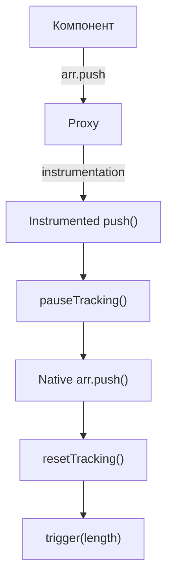

# Array Instrumentations (Инструментирование массивов)

## 1. Концепция и Архитектура (Mental Model)

Массивы в JS — это объекты с магическим свойством `length` и кучей встроенных методов. Простой Proxy неплохо работает с чтением/записью индексов, но ломается на специфичных операциях.

**Проблема 1: Identity.** Метод `indexOf` сравнивает по ссылке (`===`). Если вы положите объект в реактивный массив, он обернётся в Proxy. Поиск `array.indexOf(rawObj)` вернёт `-1`.
**Проблема 2: Infinite Loops.** Мутирующие методы, такие как `push`, читают `length`, а затем устанавливают новый индекс и обновляют `length`. Если несколько эффектов делают `push` одновременно, они зациклят `track(length)` и `trigger(length)`.

Vue решает это, подменяя (instrumenting) методы массивов.

## 2. Визуализация (Mermaid)



## 3. Ссылки на исходный код
- `packages/reactivity/src/arrayInstrumentations.ts`

## 4. Разбор реализации (Code Deep Dive)

В Vue есть специальный объект, который перехватывает вызовы методов массивов до того, как они дойдут до нативного `Array.prototype`.

```typescript
// packages/reactivity/src/arrayInstrumentations.ts

const arrayInstrumentations: Record<string, Function> = {}

// 1. Поиск: indexOf, lastIndexOf, includes
;(['includes', 'indexOf', 'lastIndexOf'] as const).forEach(key => {
  arrayInstrumentations[key] = function (this: unknown[], ...args: unknown[]) {
    const arr = toRaw(this) // Берем сырой массив
    for (let i = 0, l = this.length; i < l; i++) {
      track(arr, TrackOpTypes.GET, i + '') // Трекаем индексы
    }
    // Сначала ищем по реактивным аргументам
    const res = (arr as any)[key](...args)
    if (res === -1 || res === false) {
      // Если не нашли - ищем по "сырым" аргументам
      return (arr as any)[key](...args.map(toRaw))
    }
    return res
  }
})

// 2. Мутации: push, pop, shift, unshift, splice
;(['push', 'pop', 'shift', 'unshift', 'splice'] as const).forEach(key => {
  arrayInstrumentations[key] = function (this: unknown[], ...args: unknown[]) {
    // ВАЖНО: Останавливаем сбор зависимостей!
    pauseTracking()
    const res = (toRaw(this) as any)[key].apply(this, args)
    resetTracking()
    return res
  }
})
```

## 5. Оптимизации и Edge Cases (Подводные камни)

- **Почему `pauseTracking()` важен для `push`:** Внутри движка V8 метод `push` выполняет два действия: 1) Читает текущий `length` 2) Записывает `length + 1`. Если мы находимся внутри `effect()`, шаг 1 добавит `length` в зависимости. Это означает, что ЛЮБОЙ другой `push` вызовет триггер этого эффекта. Приостанавливая трекинг, мы говорим: "Вызов push — это явная мутация, а не чтение, нам не нужно отслеживать `length` в этом контексте".
- **Свойство `length`:** Изменение длины массива напрямую (например, `arr.length = 0`) обрабатывается в основном `set` хендлере. Там есть специальный блок: если свойство ключа это `'length'`, триггерятся все индексы, которые оказались удалены в результате усечения массива.
