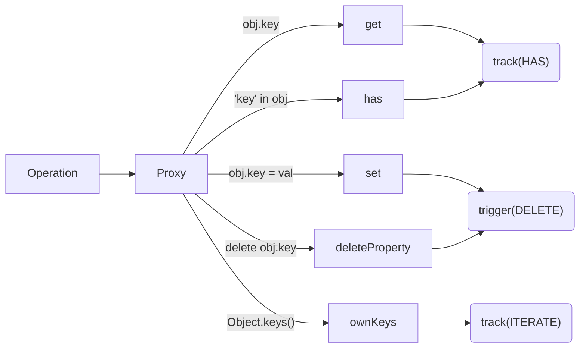

# Base Handlers (Объекты)

## 1. Концепция и Архитектура (Mental Model)

Когда вы вызываете `reactive(obj)` на обычном объекте, создается Proxy с "базовыми перехватчиками" (`baseHandlers`). Эти перехватчики ответственны за то, чтобы сделать реактивными не только прямое чтение (`obj.foo`), но и другие операции: оператор `in` (`'foo' in obj`), итерацию ключей (`Object.keys(obj)`) и удаление свойств (`delete obj.foo`).

## 2. Визуализация (Mermaid)



## 3. Ссылки на исходный код
- `packages/reactivity/src/baseHandlers.ts`

## 4. Разбор реализации (Code Deep Dive)

Помимо классических `get` и `set`, важно понимать, как перехватываются "косвенные" операции.

```typescript
// packages/reactivity/src/baseHandlers.ts

const mutableHandlers: ProxyHandler<object> = {
  get(target, key, receiver) { /* track + Reflect.get */ },
  
  set(target, key, value, receiver) { /* trigger + Reflect.set */ },

  // Оператор "in"
  has(target, key) {
    const result = Reflect.has(target, key)
    if (!isSymbol(key) || !builtInSymbols.has(key)) {
      track(target, TrackOpTypes.HAS, key) // Регистрируем подписку
    }
    return result
  },

  // Итерация Object.keys(obj) или for...in
  ownKeys(target) {
    // В отличие от обычных свойств, итерация не имеет конкретного ключа.
    // Поэтому Vue использует специальный символ ITERATE_KEY.
    track(target, TrackOpTypes.ITERATE, ITERATE_KEY)
    return Reflect.ownKeys(target)
  },

  deleteProperty(target, key) {
    const hadKey = hasOwn(target, key)
    const result = Reflect.deleteProperty(target, key)
    if (result && hadKey) {
      trigger(target, TriggerOpTypes.DELETE, key, undefined)
    }
    return result
  }
}
```

## 5. Оптимизации и Edge Cases (Подводные камни)

- **Проблема `ITERATE_KEY`:** Когда мы вызываем `Object.keys(obj)`, мы подписываемся на `ITERATE_KEY` объекта. Позже, когда мы добавляем НОВОЕ свойство в объект (например `obj.newProp = 1`), `set` ловушка увидит, что это не просто изменение существующего, а *добавление* нового свойства (ADD). В этом случае триггерится не только `newProp`, но и `ITERATE_KEY`, что заставит заново перерисоваться списки `v-for`!
- **Встроенные символы:** Вы могли заметить проверку `!builtInSymbols.has(key)` внутри `has` и `get`. Vue игнорирует трекинг для встроенных символов JS (например, `Symbol.iterator`, `Symbol.toStringTag`), чтобы не ломать нативную работу движка при использовании реактивных объектов в `for...of` или `toString()`.
