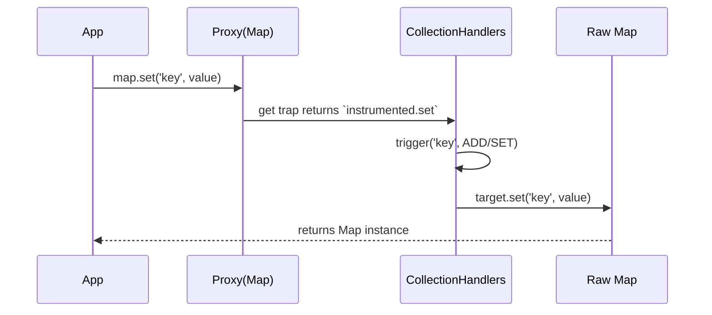

# Collection Handlers (Set, Map)

## 1. Концепция и Архитектура (Mental Model)

Встроенные коллекции JavaScript (`Map`, `Set`, `WeakMap`, `WeakSet`) устроены не как обычные объекты. Они хранят данные во внутренних слотах движка (internal slots, например `[[MapData]]`). Нативный Proxy, попытавшись вызвать методы `map.get()` или `set.add()`, выбросит ошибку "Method called on incompatible receiver", так как `this` внутри этих методов указывает на Proxy, а не на оригинальный объект с нужными слотами.

Поэтому для коллекций Vue использует паттерн **"Monkey Patching"** (или Instrumentations). Proxy просто возвращает подменённые методы (instrumented methods), внутри которых Vue вручную вызывает `track` и `trigger`, а затем делегирует работу оригинальному `target`.

## 2. Визуализация (Mermaid)



## 3. Ссылки на исходный код
- `packages/reactivity/src/collectionHandlers.ts`

## 4. Разбор реализации (Code Deep Dive)

В `collectionHandlers` Proxy ловушка `get` просто перенаправляет вызов на словарь кастомных методов (`instrumentations`):

```typescript
// Упрощенный код из packages/reactivity/src/collectionHandlers.ts

const mutableInstrumentations: Record<string, Function> = {
  get(this: MapTypes, key: unknown) {
    const target = toRaw(this)
    track(target, TrackOpTypes.GET, key) // Вручную трекаем
    return target.get(key) // Вызываем на сыром объекте!
  },
  
  set(this: MapTypes, key: unknown, value: unknown) {
    const target = toRaw(this)
    const hadKey = target.has(key)
    const oldValue = target.get(key)
    
    // Внимание: перед вставкой значения в Map мы должны 
    // превратить его в сырой объект, чтобы избежать "реактивной матрешки"
    const rawValue = toRaw(value)
    const result = target.set(key, rawValue)
    
    if (!hadKey) {
      trigger(target, TriggerOpTypes.ADD, key, value)
    } else if (hasChanged(value, oldValue)) {
      trigger(target, TriggerOpTypes.SET, key, value, oldValue)
    }
    return this // Возвращаем Proxy (chaining)
  }
}

export const mutableCollectionHandlers: ProxyHandler<CollectionTypes> = {
  get: (target, key, receiver) => {
    if (hasOwn(mutableInstrumentations, key)) {
      return Reflect.get(mutableInstrumentations, key, receiver)
    }
    return Reflect.get(target, key, receiver)
  }
}
```

## 5. Оптимизации и Edge Cases (Подводные камни)

- **Identity Hazzard (Проблема идентичности):** Вы можете добавить `reactive(obj)` в `Set`. Но что если вы потом попытаетесь удалить сырой объект `set.delete(obj)`? Vue переопределяет методы поиска (`has`, `delete`), чтобы они искали как по реактивному объекту, так и по его "сырому" оригиналу.
- **Итераторы (entries, keys, values, forEach):** Для коллекций это особенно сложно. Если вы итерируете `Map`, каждый возвращаемый ключ и значение должны лениво оборачиваться в реактивный `Proxy`. Для этого Vue пишет кастомные генераторы, которые подменяют оригинальные итераторы.
- **Weak-коллекции:** `WeakMap` и `WeakSet` отслеживают `track` и `trigger` по ключу. Однако они не поддаются итерации и не имеют операторов очистки (`clear`), поэтому их `instrumentations` значительно проще.
