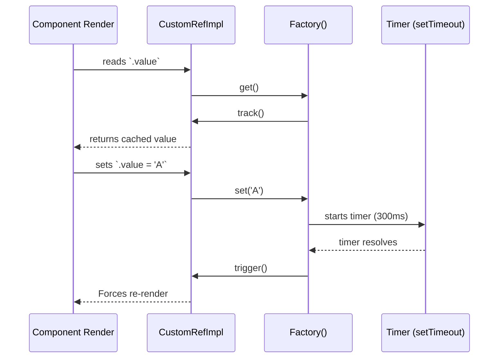

# Custom Ref (Пользовательские рефы)

## 1. Концепция и Архитектура (Mental Model)

Обычно Vue полностью скрывает от нас вызовы `track` (подписка) и `trigger` (оповещение). Мы просто читаем или пишем в `.value`. Но что если мы хотим контролировать *когда именно* происходит оповещение об изменении? Например, мы хотим сделать `debouncedRef`, который игнорирует частые изменения инпута и триггерит ререндер только через 300мс после последнего ввода.

Для этого в ядре существует `customRef`. Это Inversion of Control (Инверсия управления) для реактивности. Вы получаете функции `track` и `trigger` как аргументы, и сами решаете, когда их вызывать внутри ваших кастомных геттеров и сеттеров.

## 2. Визуализация (Mermaid)



## 3. Ссылки на исходный код
- `packages/reactivity/src/ref.ts` (Класс `CustomRefImpl`)

## 4. Разбор реализации (Code Deep Dive)

Реализация `customRef` предельно лаконична. Это класс, который принимает фабрику и вызывает её в конструкторе, передавая функции-обёртки.

```typescript
// packages/reactivity/src/ref.ts

class CustomRefImpl<T> {
  public dep?: Dep = undefined
  public readonly __v_isRef = true

  private readonly _get: ReturnType<CustomRefFactory<T>>['get']
  private readonly _set: ReturnType<CustomRefFactory<T>>['set']

  constructor(factory: CustomRefFactory<T>) {
    // Вызываем фабрику, инжектируя track и trigger
    const { get, set } = factory(
      () => trackRefValue(this),
      () => triggerRefValue(this)
    )
    this._get = get
    this._set = set
  }

  get value() {
    // В отличие от обычного RefImpl, мы НЕ вызываем track() здесь!
    // Мы ожидаем, что пользователь вызовет track() внутри _get().
    return this._get()
  }

  set value(newVal) {
    // И trigger() мы здесь тоже НЕ вызываем.
    this._set(newVal)
  }
}

export function customRef<T>(factory: CustomRefFactory<T>): Ref<T> {
  return new CustomRefImpl(factory) as any
}
```

## 5. Оптимизации и Edge Cases (Подводные камни)

- **Интеграция с внешними стейт-менеджерами:** `customRef` — идеальный инструмент для связывания Vue с RxJS Observables, Redux сторами или XState машинами. Вы подписываетесь на внешний стор внутри сеттера/конструктора, и вызываете `trigger()`, когда стор пушит новое значение.
- **Риск бесконечного цикла:** Если в кастомном `get()` вызвать `trigger()`, произойдёт бесконечный цикл. `get()` должен быть идемпотентным (pure) и содержать только `track()`.
- **Захват памяти:** Если фабрика создает таймеры или подписки, `customRef` не имеет встроенного хука `onScopeDispose` (как у `watch`). Придется вручную управлять отписками, если реф уничтожается (или использовать `effectScope`).
