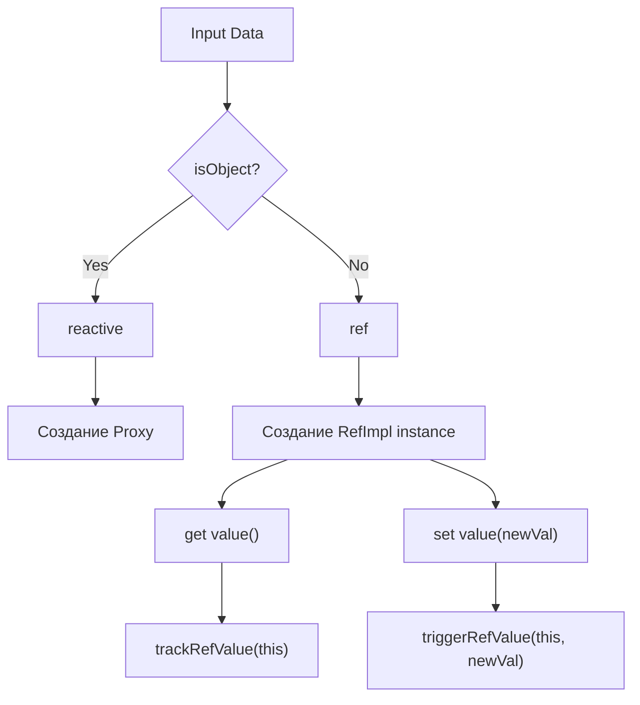

# Ref vs Reactive Internals

## 1. Концепция и Архитектура (Mental Model)

Почему во Vue существуют два примитива для создания состояния: `ref` и `reactive`? 
**Техническая причина:** В JavaScript примитивные типы (string, number, boolean) передаются по значению, а не по ссылке. Невозможно обернуть число в `Proxy`, так как `Proxy` работает только с объектами (`typeof target === 'object'`).

- `reactive` — прозрачная обёртка-Proxy над объектом.
- `ref` — класс-контейнер (бокс), который имеет свойство `.value`. Если в `.value` положить примитив, `ref` будет трекать доступ к геттеру/сеттеру этого свойства. Если положить объект, то под капотом он всё равно вызовет `reactive()`.

## 2. Визуализация (Mermaid)



## 3. Ссылки на исходный код
- `packages/reactivity/src/ref.ts`
- `packages/reactivity/src/reactive.ts`

## 4. Разбор реализации (Code Deep Dive)

Ключевой класс для рефов — это `RefImpl`. В отличие от `Proxy`, который является магическим объектом движка, `RefImpl` — это самый обычный класс JavaScript с геттерами и сеттерами.

```typescript
// packages/reactivity/src/ref.ts

class RefImpl<T> {
  private _value: T
  private _rawValue: T

  // Узел зависимости прямо внутри класса! Нет нужды в глобальном targetMap
  public dep?: Dep = undefined 
  public readonly __v_isRef = true // Флаг для isRef()

  constructor(value: T, public readonly __v_isShallow: boolean) {
    this._rawValue = __v_isShallow ? value : toRaw(value)
    // Если value это объект, конвертируем в reactive!
    this._value = __v_isShallow ? value : toReactive(value)
  }

  get value() {
    // В отличие от Proxy, трекинг идет напрямую к свойству dep экземпляра
    trackRefValue(this) 
    return this._value
  }

  set value(newVal) {
    const useDirectValue = this.__v_isShallow || isShallow(newVal) || isReadonly(newVal)
    newVal = useDirectValue ? newVal : toRaw(newVal)
    
    // Меняем значение только если оно реально изменилось
    if (hasChanged(newVal, this._rawValue)) {
      this._rawValue = newVal
      this._value = useDirectValue ? newVal : toReactive(newVal)
      // Оповещаем подписчиков
      triggerRefValue(this, newVal)
    }
  }
}

export const toReactive = <T extends unknown>(value: T): T =>
  isObject(value) ? reactive(value) : value
```

## 5. Оптимизации и Edge Cases (Подводные камни)

- **Inline Dep:** Заметьте, что у `RefImpl` есть свойство `dep`. В `reactive()` системе зависимости хранятся в огромной глобальной мапе `targetMap`, ключами которой выступают объекты. У рефов зависимость живёт прямо внутри инстанса! Это делает `ref` на примитивы невероятно быстрым и экономичным с точки зрения сборки мусора (не нужно лазить в `WeakMap`).
- **Автоматическое разворачивание (Unwrapping):** В шаблонах Vue компонента (шаблоны компилируются в render-функции) вам не нужно писать `.value`. Почему? Во время компиляции шаблона Vue добавляет специальный Proxy (`proxyRefs`), который перехватывает чтение свойств контекста и, если видит у объекта флаг `__v_isRef === true`, автоматически возвращает `его .value`.
- **ShallowRef:** Передача `__v_isShallow = true` отключает глубокую конвертацию `toReactive`. Это критическая оптимизация для хранения массивных внешних структур данных (например, инстанса 3D-сцены Three.js) во Vue состоянии.
