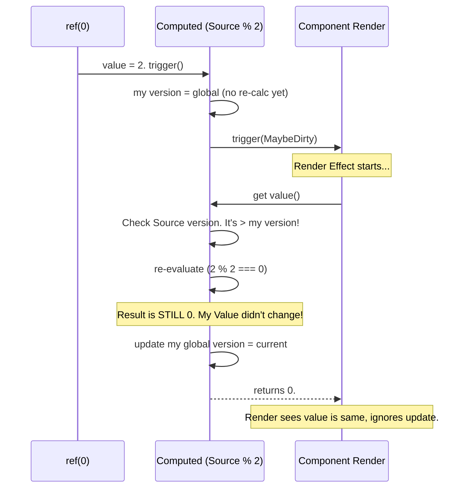

# Computed in Vue 3.4+ (Dirty Levels)

## 1. Концепция и Архитектура (Mental Model)

Как описано в архитектуре `Dirty Levels` и `Version Counting`, классическая имплементация Computed (с булевым флагом `_dirty`) имела проблему "каскадного перерендера" (Diamond Problem / Cascading Updates). 

Если `Computed C` зависит от `A` и `B`. Если триггерится базовая `Ref`, которая меняет `A` и `B`, то `A` скажет `C` "я грязный", и `B` скажет `C` "я грязный". `C` дважды пнёт компонент. Более того, если `A` пересчитался, но его итоговое значение **не изменилось**, компонент всё равно получал сигнал перерисовки.

В версии 3.4+ Computed стали намного умнее. Они не триггерят своих подписчиков (рендер) безусловно. Они триггерят их со статусом `MaybeDirty` (Возможно грязный). Когда рендер приходит читать `.value`, Computed опрашивает свои зависимости: "Эй, ваша глобальная версия реально изменилась?". И только если это так, происходит пересчет.

## 2. Визуализация (Mermaid)



## 3. Ссылки на исходный код
- `packages/reactivity/src/computed.ts`

## 4. Разбор реализации (Code Deep Dive)

Код `ComputedRefImpl` в версии 3.4+ сильно видоизменился. 

```typescript
// packages/reactivity/src/computed.ts (Vue 3.4+)

export class ComputedRefImpl<T> {
  // ...
  get value() {
    // 1. Кто-то читает наш Computed.
    const link = trackRefValue(this)
    
    // 2. Если у нас статус MaybeDirty, мы должны проверить зависимости!
    if (link && link.dep!.version === 0 /* ... упрощение ... */) {
      // Обходим все зависимости (например, другие Computed),
      // заставляя ИХ перепроверить свои кэши и обновить версии.
      refreshComputed(this.effect)
    }

    // 3. После refreshComputed, если хотя бы одна зависимость
    // реально поменяла значение (ее версия > нашей), _dirty станет true.
    if (this._dirty || !this.effect.deps) {
      // Только теперь запускаем тяжелый getter()
      const newValue = this.effect.run()!
      
      // 4. ГЛАВНАЯ МАГИЯ: Изменился ли результат?
      if (hasChanged(this._value, newValue)) {
        this._value = newValue
        this.dep!.version = ++globalVersion // Апаем свою версию!
      }
      this._dirty = false
    }

    return this._value
  }
}
```

## 5. Оптимизации и Edge Cases (Подводные камни)

- **O(1) bailout:** Если Computed возвращает тот же самый результат, несмотря на то, что зависимости внутри него дёргались, его `version` не увеличится. Соответственно, рендер-функция, которая читает этот Computed, увидит старую версию и "выйдет" (bailout) из процесса перерисовки DOM. Это колоссальный скачок производительности в масштабах больших энтерпрайз-приложений.
- **Циклические зависимости:** Vue отслеживает, если Computed ссылается сам на себя в процессе `refreshComputed`. В таком случае выбрасывается ошибка в DEV-моде, а в PROD цикл просто разрывается (возвращается undefined/старое значение), предотвращая зависание вкладки браузера.
