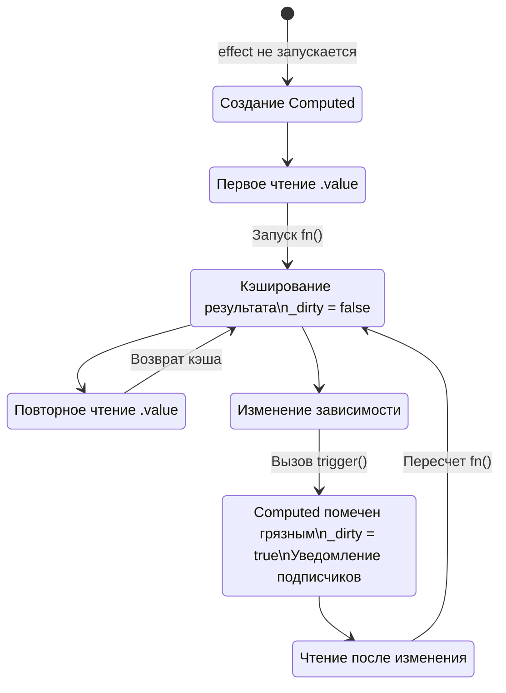

# Ленивые вычисления и кэширование (Lazy Evaluation & Caching)

## 1. Концепция и Архитектура (Mental Model)

Computed-свойства — это гибриды. С одной стороны, они ведут себя как `ReactiveEffect`, потому что у них есть функция-геттер, которая подписывается на другие реактивные зависимости (читает их). С другой стороны, они ведут себя как `Ref`, потому что к ним можно обращаться через `.value`, и они сами выступают источниками зависимостей (Deps) для других эффектов (например, для рендера).

Главная фишка Computed — **Ленивость (Laziness)** и **Кэширование (Caching)**.
1. *Ленивость:* При создании `computed(() => heavyMath())` вычисления не происходит. Оно произойдёт ТОЛЬКО в момент первого обращения к `.value`.
2. *Кэширование:* Пока ни одна из зависимостей не изменилась, повторные обращения к `.value` будут возвращать закэшированный результат, не вызывая `heavyMath()`.

## 2. Визуализация (Mermaid)



## 3. Ссылки на исходный код
- `packages/reactivity/src/computed.ts`

## 4. Разбор реализации (Code Deep Dive)

В реализации до версии 3.4 это выглядело как класс с флагом `_dirty` и внутренним эффектом, планировщик (`scheduler`) которого просто сбрасывал флаг в `true`, но **не выполнял функцию сразу**.

```typescript
// packages/reactivity/src/computed.ts (Упрощенная старая модель)

class ComputedRefImpl<T> {
  public dep?: Dep = undefined
  private _value!: T
  public readonly effect: ReactiveEffect<T>
  public _dirty = true // Изначально грязный (нужен пересчет)

  constructor(getter: ComputedGetter<T>) {
    // Создаем эффект. Передаем getter и SCHEDULER!
    this.effect = new ReactiveEffect(getter, () => {
      if (!this._dirty) {
        this._dirty = true // Если зависимости изменились, просто помечаем грязным
        triggerRefValue(this) // И пинаем подписчиков этого Computed
      }
    })
  }

  get value() {
    trackRefValue(this) // Кто-то читает меня. Трекаем.
    if (this._dirty) {
      this._dirty = false
      this._value = this.effect.run()! // Пересчитываем ТОЛЬКО если мы грязные
    }
    return this._value // Возвращаем кэш
  }
}
```

## 5. Оптимизации и Edge Cases (Подводные камни)

- **Проблема Zombie Effects (Мертвые вычисления):** Ленивость означает, что если компонент демонтирован (unmounted), и зависимость изменилась, Computed *никогда* не будет пересчитан, так как его `.value` больше никто не читает. Это экономит CPU. 
- **Побочные эффекты (Side-effects):** Геттеры Computed **ОБЯЗАНЫ** быть чистыми функциями (Pure Functions). Из-за ленивости и кэширования нет гарантии *когда* (и сколько раз) функция выполнится. Если в ней делать HTTP-запросы или мутировать DOM, логика приложения сломается. Для side-effects существуют Watchers.
