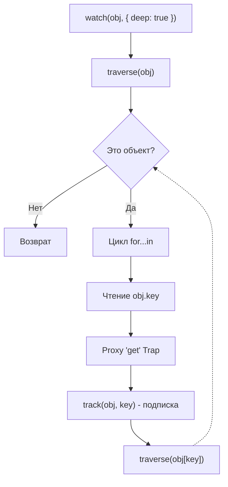

# Deep Traversal (Глубокое отслеживание)

## 1. Концепция и Архитектура (Mental Model)

Когда вы пишете `watch(myObject, callback)`, Vue подписывается только на **сам объект**. Если вы измените `myObject.foo.bar = 1`, вотчер не сработает, потому что геттер `.foo` никогда не читался внутри эффекта вотчера, а значит `track` для него не происходил.

Опция `{ deep: true }` заставляет вотчер сработать на любую вложенную мутацию. Как это достигается? Vue использует "Брутфорс": специальная функция `traverse()` рекурсивно обходит **все** ключи объекта (и его вложенных объектов/массивов). При чтении каждого ключа (`obj[key]`) срабатывает `get`-ловушка Proxy, что вызывает `track()` и записывает текущий вотчер как подписчика для *вообще каждого свойства в дереве*.

Это невероятно мощно, но катастрофически медленно для огромных деревьев данных (Big-O: `O(N)`, где N - количество вложенных свойств).

## 2. Визуализация (Mermaid)



## 3. Ссылки на исходный код
- `packages/runtime-core/src/apiWatch.ts` (Функция `traverse`)

## 4. Разбор реализации (Code Deep Dive)

Код функции `traverse` — это классический рекурсивный обход графа. Важнейшая деталь — передача `Set<any>` (визитора) для предотвращения зацикливания при циклических ссылках в объектах.

```typescript
// Упрощенная реализация из packages/runtime-core/src/apiWatch.ts

export function traverse(value: unknown, seen?: Set<unknown>) {
  // 1. Игнорируем примитивы и замороженные/нереактивные объекты
  if (!isObject(value) || (value as any)[ReactiveFlags.SKIP]) {
    return value
  }
  
  // 2. Защита от циклических ссылок (A -> B -> A)
  seen = seen || new Set()
  if (seen.has(value)) {
    return value
  }
  seen.add(value)

  // 3. Обход в зависимости от типа
  if (isRef(value)) {
    traverse(value.value, seen) // Разворачиваем рефы
  } else if (isArray(value)) {
    for (let i = 0; i < value.length; i++) {
      traverse(value[i], seen) // Читаем индекс - трекаем
    }
  } else if (isSet(value) || isMap(value)) {
    value.forEach((v: any) => {
      traverse(v, seen) // Читаем элементы коллекций
    })
  } else if (isPlainObject(value)) {
    for (const key in value) {
      traverse((value as any)[key], seen) // Читаем ключи - трекаем
    }
  }
  return value
}
```

## 5. Оптимизации и Edge Cases (Подводные камни)

- **Trade-offs производительности:** Вызов `{ deep: true }` на массиве из 10 000 объектов подпишет эффект на все 10 000 элементов и их поля. При старте компонента это вызовет спайк CPU (задержку основного потока). **Рекомендация инженеров Vue:** всегда избегайте `{ deep: true }`, если можно наблюдать за специфичным полем (например, `watch(() => state.hugeArray[0].foo)`).
- **Неявный Deep:** Если вы передаете в `watch` реактивный объект напрямую (`watch(reactiveObj, ...)`), Vue **автоматически** включает `deep: true` под капотом, потому что иначе такое наблюдение не имело бы смысла (ссылка на сам Proxy-объект никогда не меняется). Но если вы передаете getter-функцию (`watch(() => reactiveObj, ...)`), глубокого обхода не происходит.
