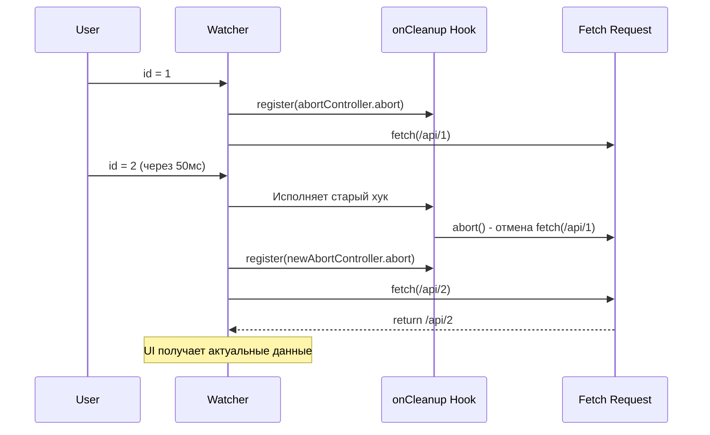

# Watch Cleanup (Очистка сайд-эффектов)

## 1. Концепция и Архитектура (Mental Model)

Вотчеры часто используются для асинхронных операций (например, загрузка данных при изменении ID). Если ID меняется быстро, могут возникнуть "Состояния гонки" (Race Conditions): старый сетевой запрос завершается позже нового, и в UI отображаются неконсистентные данные.

Для решения этого Vue предоставляет механизм `onCleanup` (а в Vue 3.5+ новый API `onWatcherCleanup`). Это функция, которая регистрирует хук. Этот хук будет вызван ядром Vue **непосредственно перед следующим запуском** этого же вотчера, либо при окончательной остановке/демонтировании вотчера.

## 2. Визуализация (Mermaid)



## 3. Ссылки на исходный код
- `packages/runtime-core/src/apiWatch.ts` (Тип `WatchOnCleanup` и функция вызова)

## 4. Разбор реализации (Code Deep Dive)

В реализации `apiWatch` под каждый вотчер аллоцируется переменная для хранения хука очистки (`cleanup`).

```typescript
// Упрощенная логика из packages/runtime-core/src/apiWatch.ts

function doWatch(source, cb) {
  let cleanup: (() => void) | undefined

  // Эта функция передается третьим аргументом в пользовательский коллбэк
  const onCleanup = (fn: () => void) => {
    // Привязываем функцию очистки к текущему эффекту
    cleanup = effect.onStop = () => {
      callWithErrorHandling(fn, instance, ErrorCodes.WATCH_CLEANUP)
      cleanup = undefined
    }
  }

  const job = () => {
    if (cleanup) {
      // ПЕРЕД выполнением нового коллбэка, запускаем старый cleanup
      cleanup()
    }
    const newValue = effect.run()
    // Выполняем вотчер
    cb(newValue, oldValue, onCleanup)
  }
}
```

*Vue 3.5+ Note:* Добавлен `onWatcherCleanup(() => {})`, который использует глобальный стейт (подобно `inject` или `activeEffect`), чтобы зарегистрировать очистку без необходимости прокидывать аргумент `onCleanup` через параметры коллбэка.

## 5. Оптимизации и Edge Cases (Подводные камни)

- **Где выполняется Cleanup?** Он выполняется в том же тике, в котором начинает работать новый триггер вотчера. Ошибка внутри `onCleanup` перехватывается глобальным обработчиком `app.config.errorHandler`, чтобы не уронить весь планировщик (Scheduler).
- **Использование с AbortController:** Идеальный паттерн использования `onCleanup` — это вызов `controller.abort()` для отмены HTTP-запросов (fetch / axios).
- **Утечки памяти:** Если внутри вотчера подписываться на глобальные события (`window.addEventListener`), и не отписываться в `onCleanup`, каждый триггер вотчера будет добавлять нового слушателя, что приведет к катастрофической утечке памяти.
