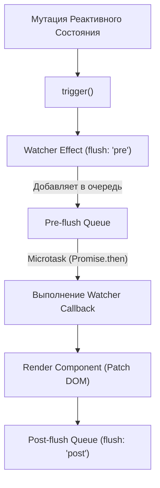

# Watch API Scheduler (Планировщик вотчеров)

## 1. Концепция и Архитектура (Mental Model)

По своей сути, `watch` и `watchEffect` создают такой же `ReactiveEffect`, как и рендер компонента. Разница лишь в том, *что* этот эффект делает и *когда* он выполняется.

Главная архитектурная деталь Watcher-а — это его интеграция с **Scheduler (Планировщиком задач)**. Когда зависимость мутирует, она не вызывает callback вотчера мгновенно (синхронно). Иначе при мутации 10 свойств подряд, вотчер отработал бы 10 раз, уничтожив производительность. Вместо этого, триггер кидает вотчер в очередь шедулера.

В Vue есть 3 опции планирования (`flush`):
- `pre` (По умолчанию) — вызов *до* рендера компонента. Полезно для подготовки данных.
- `post` — вызов *после* рендера компонента (и обновления DOM). Полезно для работы с `<div ref="myEl">`.
- `sync` — синхронный вызов *мгновенно* при мутации. Ломает батчинг. Использовать с крайней осторожностью.

## 2. Визуализация (Mermaid)



## 3. Ссылки на исходный код
- `packages/runtime-core/src/apiWatch.ts`
- `packages/runtime-core/src/scheduler.ts`

## 4. Разбор реализации (Code Deep Dive)

В `apiWatch.ts` создается `ReactiveEffect`. В качестве функции-инициализатора передается `getter` (то, что мы отслеживаем), а самое интересное происходит в передаваемом `scheduler` хуке:

```typescript
// Упрощенная реализация из packages/runtime-core/src/apiWatch.ts

function doWatch(source, cb, { flush }) {
  // ...
  let scheduler: EffectScheduler
  
  if (flush === 'sync') {
    // Синхронный вызов напрямую
    scheduler = () => job() 
  } else if (flush === 'post') {
    // В очередь ПОСЛЕ обновления DOM
    scheduler = () => queuePostRenderEffect(job, instance)
  } else {
    // По умолчанию ('pre'): В очередь ДО обновления DOM
    scheduler = () => queueJob(job)
  }

  const effect = new ReactiveEffect(getter, scheduler)

  const job = () => {
    if (!effect.active) return
    // Вызов геттера (трекаем заново)
    const newValue = effect.run()
    if (hasChanged(newValue, oldValue) || deep) {
      // Вызов пользовательского callback!
      cb(newValue, oldValue, onCleanup)
      oldValue = newValue
    }
  }

  // Первоначальный запуск для сбора зависимостей
  effect.run() 
}
```

## 5. Оптимизации и Edge Cases (Подводные камни)

- **Разрыв Reactivity System и Runtime Core:** Само ядро `reactivity` (и `ReactiveEffect`) ничего не знает про очереди, DOM или `Promise.then`. Очереди реализованы в пакете `runtime-core`. Это позволяет использовать `reactivity` отдельно от Vue (например, в Node.js серверах) без накладных расходов планировщика DOM-рендера.
- **Дедупликация (Deduplication):** Функции `queueJob` проверяют массив на наличие дубликатов с помощью `Array.includes` (или `Set`). Если вотчер с одним и тем же ID триггерится 5 раз за один тик (Microtask), он будет добавлен в очередь только единожды.
- **Бесконечные циклы:** Если внутри callback-а вотчера мутируется то же самое свойство, за которым он наблюдает, это вызовет новый триггер, новую постановку в очередь и краш приложения ("Maximum recursive updates exceeded"). Шедулер имеет встроенный счетчик глубины рекурсии (около 100), чтобы ловить и прерывать такие баги с человекопонятной ошибкой.
