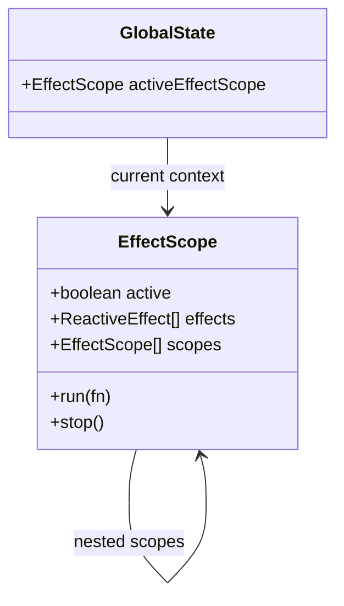

# Effect Scopes (Области видимости эффектов)

## 1. Концепция и Архитектура (Mental Model)

В Vue компонентах есть магия: когда компонент уничтожается (`unmounted`), все его `watch`, `watchEffect` и `computed` свойства автоматически перестают работать и очищаются. Это предотвращает утечки памяти.

Как Vue знает, *какие* эффекты принадлежат компоненту? В момент вызова `setup()` Vue устанавливает "активный инстанс компонента". Все создаваемые эффекты добавляются в массив этого инстанса.

Но что если мы используем систему реактивности Vue **вне** компонентов? (Например, в Pinia store, Node.js или ванильном JS-модуле). Для этого был создан `effectScope`. Это API для создания искусственных границ (контекстов) сборки мусора реактивности. Вы создаете скоуп, запускаете в нем эффекты, а потом одним вызовом `scope.stop()` уничтожаете их все.

## 2. Визуализация (Mermaid)



## 3. Ссылки на исходный код
- `packages/reactivity/src/effectScope.ts`

## 4. Разбор реализации (Code Deep Dive)

Модель `EffectScope` поразительно похожа на модель самих эффектов: она использует стек (через глобальную переменную) для отслеживания вложенности.

```typescript
// packages/reactivity/src/effectScope.ts

export let activeEffectScope: EffectScope | undefined

export class EffectScope {
  private _active = true
  effects: ReactiveEffect[] = []
  cleanups: (() => void)[] = []

  run<T>(fn: () => T): T | undefined {
    if (this._active) {
      const currentEffectScope = activeEffectScope
      activeEffectScope = this // Делаем себя активным
      try {
        return fn() // Все created эффекты попадут в this.effects!
      } finally {
        activeEffectScope = currentEffectScope // Восстанавливаем
      }
    }
  }

  stop(fromParent?: boolean) {
    if (this._active) {
      // 1. Останавливаем все эффекты (вызовет unlink зависимостей)
      for (let i = 0, l = this.effects.length; i < l; i++) {
        this.effects[i].stop()
      }
      // 2. Вызываем пользовательские onScopeDispose
      for (let i = 0, l = this.cleanups.length; i < l; i++) {
        this.cleanups[i]()
      }
      this._active = false
    }
  }
}

// В конструкторе ReactiveEffect есть такая логика:
// if (activeEffectScope) { activeEffectScope.effects.push(this) }
```

## 5. Оптимизации и Edge Cases (Подводные камни)

- **Использование в Pinia:** Хранилища Pinia (Stores) под капотом создают собственный `effectScope(true)` (detached scope, независимый от текущего компонента). Поэтому computed-свойства в сторе не умирают вместе с компонентом, который первым их использовал.
- **Detached Scopes:** Если вызвать `effectScope(true)`, новый скоуп не будет добавлен в массив потомков текущего активного скоупа. Это полезно для создания глобальных синглтонов реактивности, которые должны жить вечно (или управляться вручную), даже если инициализируются внутри компонента.
- **Хук `onScopeDispose`:** Аналог `onUnmounted`, но для скоупов. Позволяет сторонним библиотекам очищать свои подписки (например, WebSocket соединения), не привязываясь к архитектуре компонентов.
