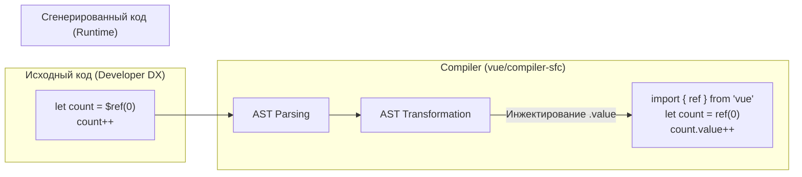

# Reactivity Transform (Legacy)

## 1. Концепция и Архитектура (Mental Model)

**Reactivity Transform** (изначально известная как Ref Sugar, `$ref`, `$computed`) была экспериментальной фичей (RFC), предложенной в Vue 3. Её цель заключалась в том, чтобы убрать необходимость постоянно писать `.value` при обращении к рефам внутри тега `<script setup>`.

Вместо рантайм-оберток, Reactivity Transform была **Compiler-Macro** (макросом компилятора). Вы писали `let count = $ref(0)`, и компилятор SFC автоматически превращал все упоминания `count` в `count.value`.

**Почему её отменили (Vue 3.3+)?**
Evan You официально удалил фичу из ядра по следующим причинам:
1. **Фрагментация ментальной модели:** Код реактивности внутри файлов `.vue` начинал работать по другим правилам, чем код в обычных `.js`/`.ts` файлах.
2. **Проблемы с TypeScript:** Так как переменная помечалась как примитив, но вела себя как реактивная сущность, TypeScript часто не мог правильно вывести типы при деструктуризации или передаче в функции.
3. **Невидимая реактивность:** Явное указание `.value` оказалось полезным маркером для разработчиков, говорящим: "Осторожно, здесь происходит реактивное чтение/запись, а не просто работа с локальной переменной".

## 2. Визуализация (Mermaid)



## 3. Ссылки на исходный код
- Фича была удалена из `@vue/compiler-sfc`. Сейчас её можно использовать только через внешний плагин экосистемы: `Vue Macros` (`@vue-macros/reactivity-transform`).

## 4. Разбор реализации (Code Deep Dive)

Как это работало под капотом компилятора:

1. Компилятор парсил AST с помощью Babel.
2. Он искал вызовы `$ref`, `$computed`.
3. Сохранял имена переменных в специальный Set (например, `refBindings: Set<string>`).
4. При обходе остального дерева (AST Traversal), каждый раз, когда компилятор встречал `Identifier` (идентификатор), имя которого было в `refBindings`, он заменял его на `MemberExpression` (свойство объекта): `Identifier.value`.

```javascript
// Псевдокод компилятора:
if (node.type === 'Identifier' && refBindings.has(node.name)) {
  return createMemberExpression(node, createIdentifier('value'))
}
```

## 5. Оптимизации и Edge Cases (Подводные камни)

- **Альтернатива (defineModel):** Одной из главных причин использования `$ref` была деструктуризация `props`. В современных версиях Vue эта проблема решена через макрос `defineProps` (с реактивной деструктуризацией) и макрос `defineModel()`, которые предоставляют отличный DX без "скрытой" магии `.value` по всему файлу.
- **Использование `unref`:** В случаях, когда тип переменной неизвестен (это реф или примитив?), инженеры часто используют `unref(val)`. Это безопасная рантайм-альтернатива компиляторным макросам: `val = isRef(val) ? val.value : val`.
