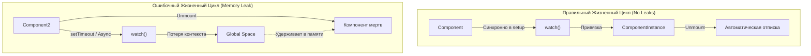

# Утечки памяти в системе реактивности (Memory Leaks Prevention)

## 1. Концепция и Архитектура (Mental Model)

Система реактивности Vue спроектирована так, чтобы быть устойчивой к утечкам памяти (Memory Leaks). Основой этого служит использование `WeakMap` в ядре трекинга зависимостей. `WeakMap` позволяет ключам (целевым объектам) быть собранными сборщиком мусора (Garbage Collector), если на них больше не осталось ссылок в пользовательском коде.

Однако, разработчики часто сами создают утечки, ломая жизненный цикл (Lifecycle) реактивности. Три главные причины:
1. Создание эффектов (`watch`, `computed`) **асинхронно**.
2. Отсутствие использования `effectScope` вне компонентов.
3. Сохранение реактивных объектов в глобальных (домашних) объектах (например, в `window`), что предотвращает их удаление из `WeakMap`.

## 2. Визуализация (Mermaid)



## 3. Ссылки на исходный код
- `packages/reactivity/src/effect.ts` (`WeakMap targetMap`)
- `packages/runtime-core/src/apiWatch.ts` (привязка к `currentInstance`)

## 4. Разбор реализации (Code Deep Dive)

Ключевой механизм безопасности ядра — `WeakMap`. 

```typescript
// packages/reactivity/src/reactive.ts

// targetMap использует объект в качестве ключа. 
// Если на 'target' больше нет ссылок, сборщик мусора V8 уничтожает 
// всю внутреннюю Map (KeyToDepMap), очищая Deps.
export const targetMap = new WeakMap<any, KeyToDepMap>()
```

Вторая линия обороны — привязка эффектов в компонентах:

```typescript
// packages/runtime-core/src/apiWatch.ts
function doWatch(...) {
  const instance = currentInstance // Захватываем текущий компонент
  
  const effect = new ReactiveEffect(...)
  
  if (instance) {
    // Внимание! Это работает только если watch вызван СИНХРОННО
    // пока currentInstance не занулён ядром.
    instance.effects.push(effect)
  }
}
```

## 5. Оптимизации и Edge Cases (Подводные камни)

- **Асинхронные Вотчеры:** Если вы пишете код вида `setTimeout(() => { watch(data, cb) }, 1000)` внутри `setup()`, к моменту вызова функции Vue уже уберет текущий компонент из глобальной переменной `currentInstance`. Вотчер не привяжется к компоненту и будет жить вечно (или пока вы вручную не вызовете функцию его остановки: `const unwatch = watch(...); unwatch()`).
- **Слушатели событий:** `watch` может создавать слушателей (`addEventListener`). Утечка не в самом `watch`, а в том, что DOM-узел держит ссылку на `callback` вотчера. Всегда используйте `onCleanup` внутри вотчера для `removeEventListener`.
- **Global Stores:** Реактивные объекты, возвращаемые из модулей (Singleton pattern, `export const state = reactive({})`), живут в течение всей жизни страницы. Если эти объекты аккумулируют данные без очистки, это приведет к постепенному исчерпанию оперативной памяти.
