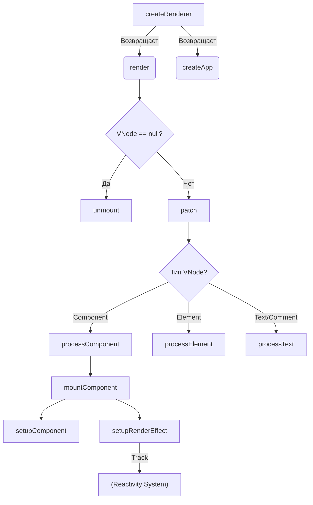

# 00 Runtime Architecture (Runtime Core)

## Концепция и Архитектура (Mental Model)

`runtime-core` (Платформонезависимое ядро) — это сердце Vue.js 3, которое связывает систему реактивности (`@vue/reactivity`) с компонентной моделью и Virtual DOM. В отличие от Vue 2, где логика работы с DOM была жестко вшита в ядро, в Vue 3 `runtime-core` не знает о существовании браузера. Он оперирует абстрактными узлами (VNodes) и делегирует фактическое создание элементов платформо-зависимым рендерерам (например, `runtime-dom` для браузера, `runtime-test` для тестов, или кастомным рендерерам для Canvas/WebGL).

Главная задача `runtime-core` — управлять жизненным циклом компонентов, обрабатывать пропсы/события, отслеживать зависимости через эффекты (render effects) и запускать алгоритмы согласования (diffing).

## Визуализация (Mermaid)



## Ссылки на исходный код (Source Code References)
- **Точка входа рендерера:** `packages/runtime-core/src/renderer.ts`
- **Компонентная модель:** `packages/runtime-core/src/component.ts`
- **VNode API:** `packages/runtime-core/src/vnode.ts`

## Разбор реализации (Code Deep Dive)

В основе архитектуры лежит паттерн Фабрика. Функция `createRenderer` принимает объект с платформо-специфичными операциями (nodeOps) и возвращает функции `render` и `createApp`.

```typescript
// packages/runtime-core/src/renderer.ts

// Абстрактный интерфейс для взаимодействия с платформой
export interface RendererOptions<HostNode = RendererNode, HostElement = RendererElement> {
  insert(el: HostNode, parent: HostElement, anchor?: HostNode | null): void
  remove(el: HostNode): void
  createElement(type: string): HostElement
  createText(text: string): HostNode
  // ... другие методы
}

export function createRenderer<HostNode, HostElement>(
  options: RendererOptions<HostNode, HostElement>
) {
  return baseCreateRenderer<HostNode, HostElement>(options)
}

function baseCreateRenderer(options: RendererOptions, hydrate?: typeof hydrateCore) {
  // Деструктуризация методов платформы
  const {
    insert: hostInsert,
    remove: hostRemove,
    createElement: hostCreateElement,
  } = options

  // Сердце рендерера — функция patch. Вызывает рекурсивный обход дерева.
  const patch = (n1, n2, container, anchor = null, parentComponent = null) => {
    if (n1 === n2) return
    // Unmount старой ноды, если типы не совпадают
    if (n1 && !isSameVNodeType(n1, n2)) {
      unmount(n1, parentComponent, parentSuspense, true)
      n1 = null
    }

    const { type, shapeFlag } = n2
    // Маршрутизация по типам VNode с использованием битовых масок (shapeFlag)
    if (shapeFlag & ShapeFlags.ELEMENT) {
      processElement(n1, n2, container, anchor, parentComponent)
    } else if (shapeFlag & ShapeFlags.COMPONENT) {
      processComponent(n1, n2, container, anchor, parentComponent)
    } // ...
  }

  const render = (vnode, container) => {
    if (vnode == null) {
      if (container._vnode) unmount(container._vnode, null, null, true)
    } else {
      patch(container._vnode || null, vnode, container)
    }
    container._vnode = vnode
  }

  return {
    render,
    hydrate,
    createApp: createAppAPI(render)
  }
}
```

**Ключевые моменты:**
1. **Замыкания (Closures):** `baseCreateRenderer` — это огромная функция (~2000 строк). Использование замыкания позволяет избежать передачи `options` во все внутренние функции (`patch`, `mount`, `unmount`), что сильно улучшает производительность, так как JS-движок (V8) отлично оптимизирует доступ к переменным в замыкании.
2. **Абстракция:** `hostCreateElement` ничего не знает про `document.createElement`. Это делает возможным рендеринг в консоль или PDF.

## Оптимизации и Edge Cases (Подводные камни)

- **Tree-shaking (Dead Code Elimination):** В ядре активно используются константы вроде `__DEV__` или `__FEATURE_SUSPENSE__`. При сборке (Rollup + Terser/esbuild) эти константы заменяются на `false` в production, и целые ветви логики удаляются, делая бандл минимальным.
- **Megamorphic Functions:** Функция `patch` полиморфна, но благодаря тому, что `type` и `shapeFlag` проверяются быстро (через побитовое "И"), JS-движок строит эффективные inline-кэши (IC).
- **Разделение фаз:** Инициализация (setup) и рендеринг (render) четко разделены. `setup()` вызывается только один раз, а `render()` может вызываться множество раз (через реактивный `effect`).
