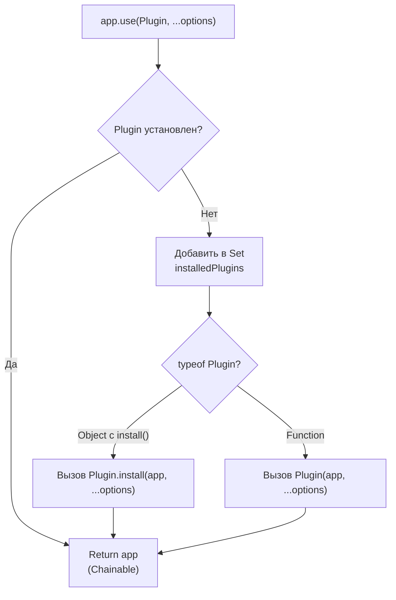

# Plugin System Internals

## Концепция и Архитектура (Mental Model)

Система плагинов во Vue — это легковесный механизм для добавления глобального функционала в приложение. Архитектурно она не делает ничего сложного: плагин — это либо объект с методом `install`, либо просто функция. Вся магия плагинов (таких как Vue Router или Pinia) заключается в том, что они используют предоставленный инстанс `app` для регистрации глобальных компонентов, директив, настройки Provide/Inject и модификации `app.config`.

Главная инженерная задача механизма плагинов — предотвратить повторную установку одного и того же плагина (что может привести к дублированию стейта, бесконечным циклам или ошибкам).

## Визуализация (Mermaid)



## Ссылки на исходный код (Source Code References)
- **Точка входа метода use:** `packages/runtime-core/src/apiCreateApp.ts`

## Разбор реализации (Code Deep Dive)

В реализации `createAppAPI` возвращается объект `app`, содержащий метод `use()`. Состояние установленных плагинов хранится в замыкании внутри объекта `Set`.

```typescript
// packages/runtime-core/src/apiCreateApp.ts

export function createAppAPI<HostElement>(
  render: RootRenderFunction<HostElement>,
  hydrate?: RootHydrateFunction
): CreateAppFunction<HostElement> {
  return function createApp(rootComponent, rootProps = null) {
    const context = createAppContext()
    
    // Set для отслеживания установленных плагинов (дедупликация)
    const installedPlugins = new WeakSet() // В реальности используется Set, так как плагины могут быть не только объектами, но в более ранних версиях Vue 3 это был Set.
    // Начиная с определенных версий используется Set(). WeakSet не подходит, так как функция может быть GC.
    const installedPluginsSet = new Set() 

    const app: App = (context.app = {
      _uid: uid++,
      _component: rootComponent as ConcreteComponent,
      _props: rootProps,
      _container: null,
      _context: context,
      _instance: null,

      version,

      get config() {
        return context.config
      },

      use(plugin: Plugin, ...options: any[]) {
        if (installedPluginsSet.has(plugin)) {
          __DEV__ && warn(`Plugin has already been applied to target app.`)
        } else if (plugin && isFunction(plugin.install)) {
          installedPluginsSet.add(plugin)
          plugin.install(app, ...options)
        } else if (isFunction(plugin)) {
          installedPluginsSet.add(plugin)
          plugin(app, ...options)
        } else if (__DEV__) {
          warn(`A plugin must either be a function or an object with an "install" function.`)
        }
        return app // Поддержка чейнинга (app.use().use())
      },
      // ...
    })

    return app
  }
}
```

## Оптимизации и Edge Cases (Подводные камни)

- **Дедупликация (Deduplication):** Использование `Set` (по ссылке на функцию или объект плагина) является критическим. Оно гарантирует, что даже если плагин-зависимость импортируется несколькими независимыми модулями и передается в `app.use()`, `install` будет вызван строго один раз.
- **Поддержка Чейнинга (Fluent Interface):** Метод `use` всегда возвращает инстанс `app`. Это классический паттерн проектирования, который улучшает Developer Experience (DX): `createApp(App).use(router).use(store).mount('#app')`.
- **Контроль утечек памяти:** Плагины хранятся в `Set` конкретного `app`. Когда приложение размонтируется (`app.unmount()`), инстанс `app` уничтожается, и Garbage Collector корректно очищает `Set`, так как глобальных ссылок на него не остается (в отличие от Vue 2).
