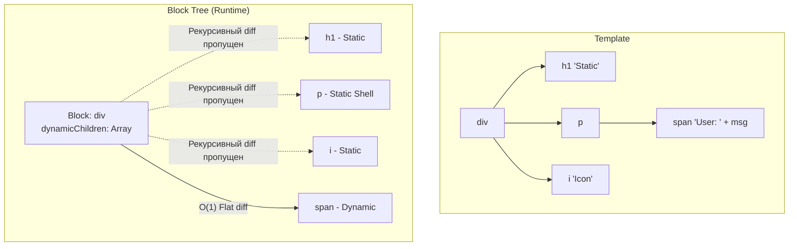

# Block Tree & Dynamic Children

## Концепция и Архитектура (Mental Model)

Главный прорыв производительности Vue 3 (по сравнению с Vue 2 и React) заключается в концепции **Block Tree (Дерево Блоков)**. В классическом Virtual DOM алгоритм `patch` рекурсивно обходит всё дерево узлов, даже если 90% шаблона статичны. Это приводит к O(Размер Дерева) времени обновления.

В Vue 3 Compiler DOM анализирует шаблон во время сборки (AOT-компиляция) и извлекает все "динамические" узлы (с переменными, обработчиками событий, реактивными классами) в плоский массив `dynamicChildren`. Родительский элемент (например, корень компонента или узлы с `v-if`/`v-for`) помечается как **Block (Блок)**. Во время обновления рендерер просто итерируется по плоскому массиву `dynamicChildren` и патчит только их. Обновление теперь работает за **O(Количество Динамических Узлов)**.

## Визуализация (Mermaid)



## Ссылки на исходный код (Source Code References)
- **Управление блоками:** `packages/runtime-core/src/vnode.ts` (функции `openBlock`, `setupBlock`, `createBlock`)
- **Патчинг блоков:** `packages/runtime-core/src/renderer.ts` (функция `patchBlockChildren`)

## Разбор реализации (Code Deep Dive)

Компилятор генерирует код с использованием `openBlock()` и `createElementBlock()`. В рантайме работает стек текущих блоков (Global Block Stack).

```typescript
// packages/runtime-core/src/vnode.ts

// Глобальные переменные для отслеживания текущего открытого блока
export let currentBlock: VNode[] | null = null

export function openBlock(disableTracking = false) {
  // Открываем новый блок. Кладем его в стек.
  blockStack.push((currentBlock = disableTracking ? null : []))
}

export function createBlock(
  type: VNodeTypes,
  props?: Record<string, any> | null,
  children?: any,
  patchFlag?: number,
  dynamicProps?: string[]
): VNode {
  // Создаем обычный VNode
  const vnode = createBaseVNode(type, props, children, patchFlag, dynamicProps, true)
  
  // Присваиваем собранные динамические узлы этому блоку
  // currentBlock был заполнен дочерними динамическими VNode (через createVNode)
  vnode.dynamicChildren = currentBlock || (EMPTY_ARR as any)
  
  // Закрываем блок и возвращаем его
  closeBlock()
  
  // Вставляем этот блок как динамический ребенок в родительский блок (если он есть)
  if (currentBlock) {
    currentBlock.push(vnode)
  }
  
  return vnode
}
```

Как VNode попадает в `currentBlock`? Внутри базовой функции `createVNode` есть проверка: если у узла есть `patchFlag` (он динамический) и открыт `currentBlock`, то узел добавляет сам себя в `currentBlock`.

```typescript
// Внутри createBaseVNode (упрощенно):
if (isBlockTreeEnabled && vnode.patchFlag > 0 && currentBlock) {
  currentBlock.push(vnode) // Я динамический, запомни меня!
}
```

А в рендерере (`renderer.ts`) функция `patchBlockChildren` просто обходит плоский массив:

```typescript
const patchBlockChildren = (oldChildren, newChildren, fallbackContainer, ...) => {
  for (let i = 0; i < newChildren.length; i++) {
    const oldVNode = oldChildren[i]
    const newVNode = newChildren[i]
    // Прямой патчинг динамического узла, минуя его статичных родителей!
    patch(oldVNode, newVNode, fallbackContainer, ...)
  }
}
```

## Оптимизации и Edge Cases (Подводные камни)

- **v-if и v-for ломают структуру:** Если динамический ребенок находится внутри `v-if`, компилятор не может предсказать, будет ли он существовать. Поэтому `v-if` и `v-for` заставляют компилятор создавать **Вложенные Блоки (Nested Blocks)**. Вложенный блок выступает как динамический ребенок для родительского блока, а внутри себя имеет свой `dynamicChildren`.
- **Bail Out (Отказ от Block Tree):** Если мы используем Render Functions напрямую (вручную пишем `h()`) или вставляем динамические слоты, `runtime-core` не может гарантировать безопасность плоского патчинга (так как нет AOT анализа). В таких случаях флаг `patchFlag` может получить значение `BAIL` (-2), и `patch` перейдет в медленный "Legacy Mode" (рекурсивный обход всего дерева, как в Vue 2).
