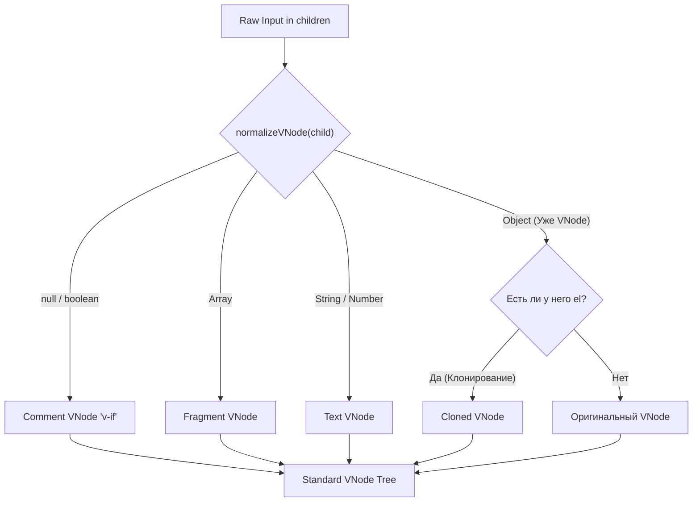

# Normalize VNode

## Концепция и Архитектура (Mental Model)

Разработчики пишут компоненты и шаблоны по-разному: кто-то передает строки, кто-то массивы, кто-то примитивы (числа, boolean), кто-то вставляет другой компонент без оберток. Если бы рендерер в `patch` должен был обрабатывать все эти краевые случаи, код превратился бы в лапшу из `if/else`.

Архитектурное решение — **Нормализация (Normalization)**. Перед тем как VNode попадает в пайплайн рендеринга (или когда дочерние элементы парсятся при создании родителя), вызывается функция `normalizeVNode`. Её задача — привести любые входные данные к стандартной и безопасной форме VNode.

## Визуализация (Mermaid)



## Ссылки на исходный код (Source Code References)
- **Нормализация:** `packages/runtime-core/src/vnode.ts` (функции `normalizeVNode` и `cloneIfMounted`)

## Разбор реализации (Code Deep Dive)

В исходном коде нормализация обрабатывает несколько сценариев. Особо важен случай с клонированием присланных VNode.

```typescript
// packages/runtime-core/src/vnode.ts

export function normalizeVNode(child: VNodeChild): VNode {
  if (child == null || typeof child === 'boolean') {
    // Пустые значения (v-if="false") становятся Comment нодами
    // Это нужно как плейсхолдер для DOM, чтобы знать куда вставить элемент, когда условие станет true
    return createVNode(Comment)
  } else if (isArray(child)) {
    // Массивы становятся Фрагментами (Fragment)
    return createVNode(Fragment, null, child.slice())
  } else if (typeof child === 'object') {
    // Это уже объект (скорее всего VNode)
    // cloneIfMounted защищает от повторного использования одного и того же объекта VNode в разных частях дерева
    return cloneIfMounted(child)
  } else {
    // Примитивы (строки, числа) становятся Текстовыми нодами
    return createVNode(Text, null, String(child))
  }
}

export function cloneIfMounted(child: VNode): VNode {
  // Если у VNode уже есть свойство .el, это означает, что он УЖЕ смонтирован в DOM (или был смонтирован).
  // Использование одного и того же VNode в двух местах вызовет баги,
  // так как `el` может указывать только на один физический DOM-элемент.
  // Поэтому мы делаем поверхностную копию (Shallow Clone).
  return (child.el === null && child.patchFlag !== PatchFlags.HOISTED) ||
    child.memo
    ? child
    : cloneVNode(child)
}
```

## Оптимизации и Edge Cases (Подводные камни)

- **HOISTED (Поднятые узлы):** Компилятор Vue 3 использует концепцию *Static Hoisting*. Статические VNode (не меняющиеся от рендера к рендеру) создаются один раз вне функции `render()`. Следовательно, они переиспользуются в каждом рендере. У них флаг `PatchFlags.HOISTED` (-1). Функция `cloneIfMounted` *пропускает* клонирование для `HOISTED` нод (если они уже не смонтированы в другом месте). В DOM рендерере (runtime-dom) поднятые ноды могут даже переиспользовать уже созданные `el` (клонирование через `Node.cloneNode(true)`), что экстремально быстро!
- **Память и GC:** Нормализация происходит каждый рендер-цикл для динамических массивов. Для предотвращения нагрузки на Garbage Collector, `normalizeVNode` старается возвращать исходный объект везде, где это безопасно.
- **Comment Nodes:** `v-if="false"` компилируется не в `null`, а в `Comment` (обычно это `<!---->` в DOM). Это критично для алгоритма diffing: если `div` заменится на "ничто", Vue нужно знать позицию (anchor), чтобы потом вставить `div` обратно. Comment node служит таким "якорем" (anchor).
