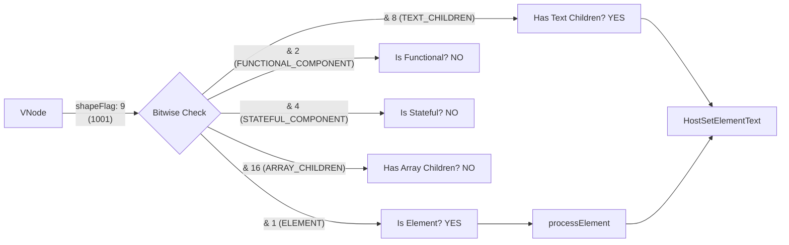

# Shape Flags & Bitwise Ops

## Концепция и Архитектура (Mental Model)

В любом Virtual DOM рендерере (включая Vue и React) критическим местом является фаза `patch`. Рендерер должен определить тип узла (элемент, компонент, текст, фрагмент) и тип его детей (строка, массив, слоты), чтобы направить логику по нужному пути.

Вместо медленных проверок через `typeof`, `Array.isArray()` или множественных `if-else` на строках, Vue 3 использует **Битовые маски (Bitwise Flags)**. Это техника из системного программирования (C/C++). Каждый тип узла и детей представляется уникальным битом (степенью двойки: 1, 2, 4, 8...). Это позволяет проверять состояния за одну сверхбыструю побитовую операцию "И" (`&`).

## Визуализация (Mermaid)



## Ссылки на исходный код (Source Code References)
- **Определение флагов:** `packages/shared/src/shapeFlags.ts`
- **Использование в рендерере:** `packages/runtime-core/src/renderer.ts` (функции `patch`, `mountElement`)

## Разбор реализации (Code Deep Dive)

В файле `shapeFlags.ts` (в пакете `shared`) определен `const enum` со всеми возможными состояниями.

```typescript
// packages/shared/src/shapeFlags.ts

export const enum ShapeFlags {
  ELEMENT = 1,                     // 000000001
  FUNCTIONAL_COMPONENT = 1 << 1,   // 000000010 (2)
  STATEFUL_COMPONENT = 1 << 2,     // 000000100 (4)
  TEXT_CHILDREN = 1 << 3,          // 000001000 (8)
  ARRAY_CHILDREN = 1 << 4,         // 000010000 (16)
  SLOTS_CHILDREN = 1 << 5,         // 000100000 (32)
  TELEPORT = 1 << 6,               // 001000000 (64)
  SUSPENSE = 1 << 7,               // 010000000 (128)
  COMPONENT_SHOULD_KEEP_ALIVE = 1 << 8,
  COMPONENT_KEPT_ALIVE = 1 << 9,
  COMPONENT = ShapeFlags.STATEFUL_COMPONENT | ShapeFlags.FUNCTIONAL_COMPONENT
}
```

При создании VNode, флаг вычисляется заранее (состояние узла + состояние детей):
```typescript
// Упрощенный пример из createVNode
let shapeFlag = isString(type)
  ? ShapeFlags.ELEMENT
  : isObject(type)
    ? ShapeFlags.STATEFUL_COMPONENT
    : isFunction(type)
      ? ShapeFlags.FUNCTIONAL_COMPONENT
      : 0;

// Если у элемента текстовые дети, добавляем флаг (побитовое ИЛИ)
if (isString(children)) {
  shapeFlag |= ShapeFlags.TEXT_CHILDREN // Например, 1 | 8 = 9
}
```

Внутри `patch` проверки выполняются молниеносно:
```typescript
// packages/runtime-core/src/renderer.ts

const patch = (n1, n2, container, ...) => {
  const { type, shapeFlag } = n2
  
  // Побитовое И. Проверяем, является ли узел компонентом (Stateful или Functional)
  if (shapeFlag & ShapeFlags.COMPONENT) {
    processComponent(n1, n2, container, ...)
  } else if (shapeFlag & ShapeFlags.ELEMENT) {
    processElement(n1, n2, container, ...)
  } else if (shapeFlag & ShapeFlags.TELEPORT) {
    (type as typeof TeleportImpl).process(...)
  }
}
```

## Оптимизации и Edge Cases (Подводные камни)

- **Inline Enums:** Обратите внимание, что `ShapeFlags` — это `const enum`. TypeScript при компиляции полностью удаляет этот enum и инлайнит числа прямо в код. `if (shapeFlag & ShapeFlags.ELEMENT)` превращается в бандле в `if (shapeFlag & 1)`. Никакого оверхеда на чтение свойств объекта!
- **Скорость JIT-компиляции:** Битовые операции (`&`, `|`, `^`) работают на уровне регистров процессора. JIT-компиляторы (V8) обожают такие инструкции и выполняют их за 1 такт процессора.
- **Двойные проверки:** `ShapeFlags.COMPONENT` сам по себе является результатом `1 << 1 | 1 << 2` (т.е. 6). Это позволяет одним вызовом `shapeFlag & 6` проверить, является ли узел *любым* компонентом, вместо того, чтобы делать `if (isFunctional || isStateful)`.
