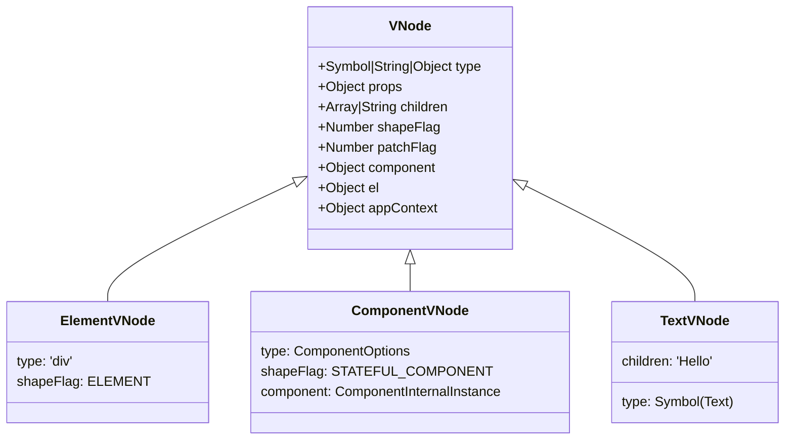

# VNode Shape and Types

## Концепция и Архитектура (Mental Model)

VNode (Virtual Node) — это легковесный JavaScript-объект, описывающий то, как должен выглядеть реальный узел на платформе (в DOM браузере, в Canvas и т.д.). Использование VNode позволяет абстрагироваться от тяжелых нативных API.

Vue 3 спроектировал форму (shape) VNode таким образом, чтобы она была максимально плоской (flat) и предсказуемой для JIT-компилятора JavaScript. Чем меньше изменений в структуре объекта происходит во время его жизни (отсутствие добавления/удаления ключей, так называемых скрытых классов или "Hidden Classes"), тем быстрее движок (V8) будет обрабатывать массивы VNode во время Diffing-а.

## Визуализация (Mermaid)



## Ссылки на исходный код (Source Code References)
- **Определение VNode:** `packages/runtime-core/src/vnode.ts` (интерфейс `VNode` и фабрика `createVNode`)

## Разбор реализации (Code Deep Dive)

Ключевая функция ядра — `createVNode` (которая часто алиасится как `h` для ручного использования). Во время компиляции шаблонов (Compiler DOM) большинство вызовов компилируется не в `createVNode`, а в `createBaseVNode` или `createElementBlock` для оптимизации.

```typescript
// packages/runtime-core/src/vnode.ts

export interface VNode<
  HostNode = any,
  HostElement = any,
  ExtraProps = { [key: string]: any }
> {
  // Идентификатор узла (строка для DOM, объект для компонента, Symbol для текста/фрагмента)
  type: VNodeTypes
  // Свойства и атрибуты
  props: (VNodeProps & ExtraProps) | null
  // Ключ для алгоритма diffing
  key: string | number | symbol | null
  // Ссылка на реальный DOM узел (создается при mount)
  el: HostNode | null
  // Дочерние элементы
  children: VNodeNormalizedChildren
  
  // --- Оптимизации компилятора (Block Tree) ---
  patchFlag: number
  dynamicProps: string[] | null
  dynamicChildren: VNode[] | null
  
  // --- Битовые маски для быстрой маршрутизации в patch() ---
  shapeFlag: number
  
  // Ссылка на инстанс компонента (если VNode описывает компонент)
  component: ComponentInternalInstance | null
  // Ссылка на контекст (нужно для Provide/Inject и плагинов)
  appContext: AppContext | null
}
```

## Оптимизации и Edge Cases (Подводные камни)

- **Морфология объектов (Monomorphic Classes):** Объект `VNode` в Vue 3 всегда создается с полным набором ключей. Даже если узел не имеет `props` или `children`, ключи всё равно инициализируются как `null`. Это гарантирует, что V8 сгенерирует единый Hidden Class (Shape) для всех VNodes. Если бы ключи динамически добавлялись (`vnode.props = ...`), это вызвало бы деоптимизацию памяти и скорости доступа (Polymorphic/Megamorphic state).
- **Символы (Symbols):** Внутренние типы нод, такие как `Text`, `Comment`, `Fragment`, `Static` определяются с помощью `Symbol()`. Это защищает от конфликтов с тегами (например, чтобы нельзя было случайно срендерить `<Text>`).
- **Блоки (Blocks) и Динамические дети:** Свойства `patchFlag`, `dynamicProps` и `dynamicChildren` — это часть новой архитектуры Compiler-Informed Virtual DOM. Они позволяют `runtime-core` пропускать рекурсивный обход статических частей шаблона, сводя Diffing к O(Количество динамических узлов), а не O(Размер дерева).
