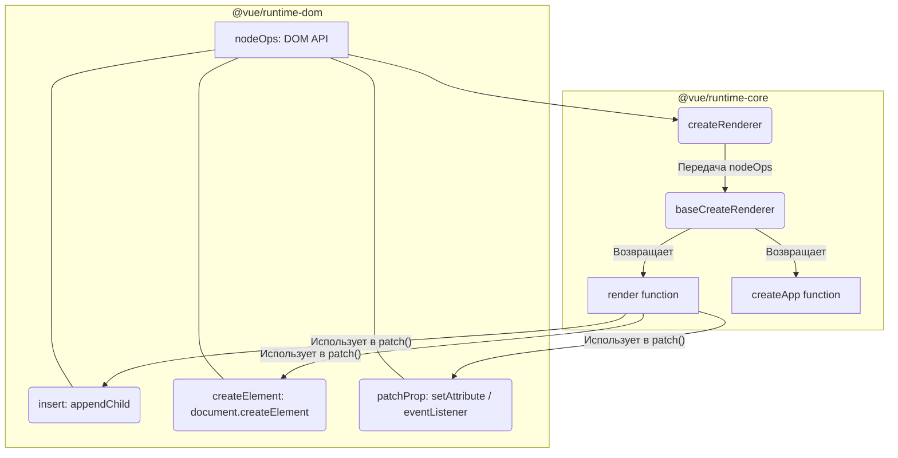

# Create Renderer Factory

## Концепция и Архитектура (Mental Model)

Паттерн "Фабрика" лежит в основе всей архитектуры рендерера Vue 3. Чтобы отделить платформо-специфичные операции от платформонезависимой логики (обход дерева, diffing, lifecycle hooks), ядро `runtime-core` не экспортирует готовый рендерер. Оно экспортирует *фабрику* рендереров — `createRenderer`.

Эта фабрика принимает объект конфигурации `nodeOps` (вставлять, удалять, изменять текст, патчить атрибуты) и замыкает эти методы внутри гигантского "ядра" — функции `baseCreateRenderer`. Этот подход позволяет использовать Vue в DOM (`runtime-dom`), в Node.js для SSR (`@vue/server-renderer`), в мобильных фреймворках (NativeScript) и в тестировании (`@vue/runtime-test`).

## Визуализация (Mermaid)



## Ссылки на исходный код (Source Code References)
- **Точка создания:** `packages/runtime-core/src/renderer.ts`
- **Адаптер для DOM:** `packages/runtime-dom/src/index.ts`

## Разбор реализации (Code Deep Dive)

Код разделен на публичное API (`createRenderer`) и внутреннюю реализацию (`baseCreateRenderer`).

```typescript
// packages/runtime-core/src/renderer.ts

// Типы ноды и элемента платформы дженерики (HostNode, HostElement)
export function createRenderer<
  HostNode = RendererNode,
  HostElement = RendererElement
>(options: RendererOptions<HostNode, HostElement>) {
  return baseCreateRenderer<HostNode, HostElement>(options)
}

function baseCreateRenderer(
  options: RendererOptions,
  createHydrationFns?: typeof createHydrationFunctions
): any {
  // 1. Деструктуризация платформенных методов (nodeOps)
  const {
    insert: hostInsert,
    remove: hostRemove,
    patchProp: hostPatchProp,
    createElement: hostCreateElement,
    createText: hostCreateText,
    createComment: hostCreateComment,
    setText: hostSetText,
    setElementText: hostSetElementText,
    parentNode: hostParentNode,
    nextSibling: hostNextSibling,
    setScopeId: hostSetScopeId = NOOP,
    insertStaticContent: hostInsertStaticContent
  } = options

  // 2. Определение сотен внутренних функций (patch, mount, unmount, diff...)
  // Эти функции ИСПОЛЬЗУЮТ hostInsert, hostCreateElement и т.д.
  const patch = (...) => { ... }
  const mountElement = (...) => { 
     const el = hostCreateElement(vnode.type)
     hostInsert(el, container)
  }
  const unmount = (...) => { ... }

  // 3. Возврат публичного интерфейса
  const render: RootRenderFunction = (vnode, container, isSVG) => {
    // Входная точка рендеринга
    if (vnode == null) {
      if (container._vnode) {
        unmount(container._vnode, null, null, true)
      }
    } else {
      patch(container._vnode || null, vnode, container, null, null, null, isSVG)
    }
    container._vnode = vnode
  }

  return {
    render,
    hydrate, // доступно, если был передан createHydrationFns
    createApp: createAppAPI(render, hydrate) // Привязка функции render к методу mount() инстанса приложения
  }
}
```

В `runtime-dom` это используется так:
```typescript
// packages/runtime-dom/src/index.ts
import { createRenderer } from '@vue/runtime-core'
import { nodeOps } from './nodeOps'
import { patchProp } from './patchProp'

const rendererOptions = /*#__PURE__*/ extend({ patchProp }, nodeOps)

let renderer: Renderer<Element | ShadowRoot> | LazyTelemetryRenderer

// Ленивая инициализация: рендерер создается только при первом вызове createApp
function ensureRenderer() {
  return (
    renderer ||
    (renderer = createRenderer<Node, Element | ShadowRoot>(rendererOptions))
  )
}

export const createApp = ((...args) => {
  const app = ensureRenderer().createApp(...args)
  // ... DOM-специфичная логика mount() ...
  return app
}) as CreateAppFunction<Element>
```

## Оптимизации и Edge Cases (Подводные камни)

- **Мега-Замыкание (Mega Closure):** `baseCreateRenderer` занимает более 2000 строк кода. Все функции `patch`, `mount`, алгоритмы массивов находятся *внутри* этой фабрики. Почему нельзя было вынести их в модули? Из-за производительности. Передача `options` или методов как аргументов в каждую функцию `patch(node, options)` убила бы производительность и вызвала бы переполнение стека аргументов. Хранение `hostInsert` в лексическом окружении (замыкании) позволяет V8 обращаться к ним максимально быстро без накладных расходов.
- **Tree-Shaking для Hydration:** Для создания обычного рендерера используется `createRenderer`. Но в Vue есть отдельный рендерер для SSR-гидратации. `createHydrationRenderer` вызывает ту же `baseCreateRenderer`, но передает вторым аргументом функции для гидратации. Это позволяет сборщику вырезать код гидратации для чисто клиентских приложений (SPA).
- **Ленивая Инициализация (Lazy Init):** В `runtime-dom` рендерер не создается при импорте модуля. Вызывается `ensureRenderer()` (паттерн Singleton). Если проект использует Vue только для реактивности (`@vue/reactivity`), или это SSR сборка, тяжелая фабрика не запустится, экономя CPU и память.
