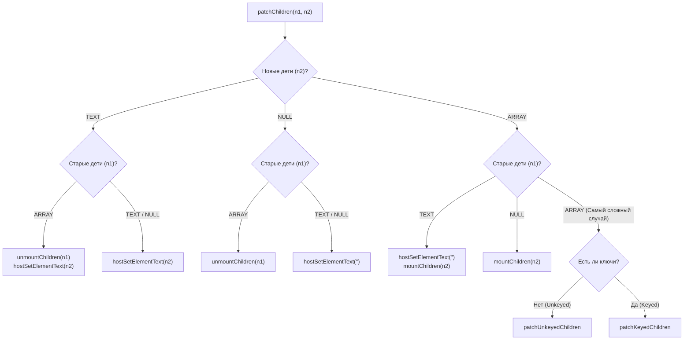

# Diffing Algorithms

## Концепция и Архитектура (Mental Model)

Когда VNode обновляется (фаза `patch`), рендереру нужно обновить его дочерние элементы. Это самая ресурсоемкая операция во фреймворке. Алгоритм сравнения старого списка детей с новым называется **Diffing**.

В Vue 3 функция `patchChildren` реализует маршрутизатор стратегий. Тип детей может быть только трех видов: Текст (`TEXT`), Массив (`ARRAY`), или Пусто (`NULL`). В зависимости от того, какими дети были (old) и какими стали (new), выбирается алгоритм (например, если был текст, а стал массив — нужно очистить текст и смонтировать массив). 

Самый сложный случай — это `ARRAY` -> `ARRAY`. Здесь Vue применяет два разных алгоритма: **Unkeyed Diff** (без атрибута `key`, O(N) наивный перебор) и **Keyed Diff** (с атрибутом `key`, сложный эвристический алгоритм).

## Визуализация (Mermaid)



## Ссылки на исходный код (Source Code References)
- **Точка входа Diffing:** `packages/runtime-core/src/renderer.ts` (функция `patchChildren`)
- **Unkeyed Diff:** `packages/runtime-core/src/renderer.ts` (функция `patchUnkeyedChildren`)

## Разбор реализации (Code Deep Dive)

Рассмотрим сначала `patchChildren` и `patchUnkeyedChildren` (о `patchKeyedChildren` рассказано в соседнем файле).

```typescript
// packages/runtime-core/src/renderer.ts

const patchChildren: PatchChildrenFn = (
  n1, n2, container, anchor, parentComponent, parentSuspense, isSVG, slotScopeIds, optimized
) => {
  const c1 = n1 && n1.children
  const prevShapeFlag = n1 ? n1.shapeFlag : 0
  const c2 = n2.children
  const { patchFlag, shapeFlag } = n2

  // Если новые дети - это текст
  if (shapeFlag & ShapeFlags.TEXT_CHILDREN) {
    if (prevShapeFlag & ShapeFlags.ARRAY_CHILDREN) {
      unmountChildren(c1 as VNode[], parentComponent, parentSuspense)
    }
    if (c2 !== c1) {
      hostSetElementText(container, c2 as string)
    }
  } else {
    // Новые дети либо Array, либо Null
    if (prevShapeFlag & ShapeFlags.ARRAY_CHILDREN) {
      // Старые тоже Array
      if (shapeFlag & ShapeFlags.ARRAY_CHILDREN) {
        // ARRAY to ARRAY diff
        patchUnkeyedChildren(c1 as VNode[], c2 as VNode[], container, anchor, ...)
        // (Примечание: patchKeyedChildren вызывается внутри patchBlockChildren или если optimized = false)
      } else {
        // Старые Array, новые Null
        unmountChildren(c1 as VNode[], parentComponent, parentSuspense, true)
      }
    } else {
      // Старые Text или Null
      if (prevShapeFlag & ShapeFlags.TEXT_CHILDREN) {
        hostSetElementText(container, '') // Очищаем старый текст
      }
      if (shapeFlag & ShapeFlags.ARRAY_CHILDREN) {
        // Монтируем новые элементы
        mountChildren(c2 as VNode[], container, anchor, ...)
      }
    }
  }
}

const patchUnkeyedChildren = (c1: VNode[], c2: VNode[], container, anchor, ...) => {
  c1 = c1 || EMPTY_ARR
  c2 = c2 || EMPTY_ARR
  const oldLength = c1.length
  const newLength = c2.length
  const commonLength = Math.min(oldLength, newLength)
  
  let i
  // Шаг 1: Патчим узлы на совпадающих индексах по порядку (от 0 до commonLength)
  for (i = 0; i < commonLength; i++) {
    const nextChild = (c2[i] = optimized
      ? cloneIfMounted(c2[i] as VNode)
      : normalizeVNode(c2[i]))
    patch(c1[i], nextChild, container, null, ...)
  }
  
  // Шаг 2: Если старый список длиннее — удаляем остатки
  if (oldLength > newLength) {
    unmountChildren(c1, parentComponent, parentSuspense, true, false, commonLength)
  }
  // Шаг 3: Если новый список длиннее — монтируем новые элементы
  else {
    mountChildren(c2, container, anchor, parentComponent, parentSuspense, isSVG, slotScopeIds, optimized, commonLength)
  }
}
```

## Оптимизации и Edge Cases (Подводные камни)

- **Почему Unkeyed Diff опасен?** В `patchUnkeyedChildren` Vue предполагает, что `c1[i]` и `c2[i]` — это один и тот же DOM-элемент (т.к. нет ключей). Он вызывает `patch` на них. Если у вас был список `[A, B, C]` и он стал `[B, C, A]`, Vue не будет перемещать узлы. Он обновит `A` в `B` (изменит текст/атрибуты), `B` в `C`, а `C` в `A`. Это не только медленно из-за мутаций DOM, но и ломает state (например, если это `<input>` и фокус или набранный текст останется на первом узле, хотя данные сместились). Именно поэтому ESLint-плагины для Vue форсируют использование `v-bind:key` в `v-for`.
- **Быстрые пути (Fast Paths):** В `patchChildren` огромное количество `if-else` кажется избыточным, но это делается ради производительности. Вызов `hostSetElementText(container, '')` в разы быстрее, чем рекурсивный вызов `unmount` для текстовой ноды. Vue всегда старается найти кратчайший путь к DOM API.
