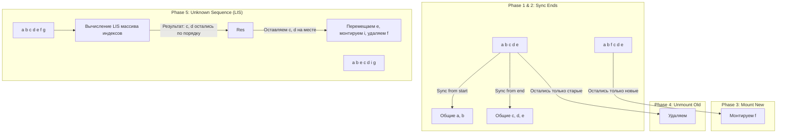

# Keyed Children LIS Algorithm

## Концепция и Архитектура (Mental Model)

Когда список элементов рендерится с помощью `v-for` и каждому узлу присвоен уникальный атрибут `key`, Vue 3 использует **Keyed Diff** алгоритм. Его цель — минимизировать операции вставки, удаления и модификации DOM-узлов, находя те узлы, которые просто поменяли свою позицию, и перемещая их (вместо пересоздания).

В основе реализации Vue 3 лежит концепция, позаимствованная из алгоритма **InfernoJS** (одного из самых быстрых Virtual DOM). Она состоит из 5 фаз. Главная "магия" происходит на 5-й фазе: чтобы определить, какие узлы нужно переставить с минимальными затратами, Vue вычисляет **Наибольшую возрастающую подпоследовательность (Longest Increasing Subsequence, LIS)** индексов.

## Визуализация (Mermaid)



## Ссылки на исходный код (Source Code References)
- **Функция Keyed Diff:** `packages/runtime-core/src/renderer.ts` (`patchKeyedChildren`)
- **Алгоритм LIS:** Функция `getSequence` в конце файла `renderer.ts`.

## Разбор реализации (Code Deep Dive)

Функция `patchKeyedChildren` разделена на 5 шагов:

```typescript
// packages/runtime-core/src/renderer.ts (упрощенно)

const patchKeyedChildren = (c1: VNode[], c2: VNodeArrayChildren, ...) => {
  let i = 0
  const l2 = c2.length
  let e1 = c1.length - 1 // указатель на конец старого массива
  let e2 = l2 - 1        // указатель на конец нового массива

  // 1. sync from start (Синхронизация с начала)
  // (a b) c
  // (a b) d e
  while (i <= e1 && i <= e2) {
    if (isSameVNodeType(c1[i], c2[i])) { patch(c1[i], c2[i]); i++ } else break
  }

  // 2. sync from end (Синхронизация с конца)
  // a (b c)
  // d e (b c)
  while (i <= e1 && i <= e2) {
    if (isSameVNodeType(c1[e1], c2[e2])) { patch(c1[e1], c2[e2]); e1--; e2-- } else break
  }

  // 3. common sequence + mount (Остались только новые узлы)
  // (a b)
  // (a b) c
  if (i > e1) {
    if (i <= e2) {
      // Монтируем элементы от i до e2
      while (i <= e2) { mountElement(c2[i]) }
    }
  }
  // 4. common sequence + unmount (Остались только старые узлы)
  // (a b) c
  // (a b)
  else if (i > e2) {
    while (i <= e1) { unmount(c1[i]) }
  }

  // 5. unknown sequence (Неизвестная последовательность)
  else {
    const s1 = i // Начало оставшейся несинхронизированной части в старом
    const s2 = i // в новом
    
    // Построение карты ключей (Key -> Index) для новых узлов O(N)
    const keyToNewIndexMap: Map<string | number | symbol, number> = new Map()
    for (i = s2; i <= e2; i++) { keyToNewIndexMap.set(c2[i].key, i) }

    // Массив, хранящий индекс старого узла для каждого нового узла
    const newIndexToOldIndexMap = new Array(toBePatched).fill(0)
    let moved = false
    
    // Обход старых элементов: патчим те, что есть в keyToNewIndexMap, удаляем остальные
    for (i = s1; i <= e1; i++) {
       const newIndex = keyToNewIndexMap.get(c1[i].key)
       if (newIndex === undefined) { unmount(c1[i]) } 
       else {
         newIndexToOldIndexMap[newIndex - s2] = i + 1 // +1 чтобы избежать нуля (null check)
         patch(c1[i], c2[newIndex])
         // ... логика определения moved
       }
    }

    // Если moved === true, вычисляем Наибольшую возрастающую подпоследовательность (LIS)
    const increasingNewIndexSequence = moved
      ? getSequence(newIndexToOldIndexMap)
      : EMPTY_ARR
      
    // Идем с конца, перемещая DOM элементы.
    // Если индекс узла есть в increasingNewIndexSequence, значит он "на месте относительно других" — не трогаем DOM!
    // Иначе вызываем hostInsert (перемещение)
  }
}
```

**Алгоритм LIS (`getSequence`):**
```typescript
function getSequence(arr: number[]): number[] {
  // Реализация алгоритма через бинарный поиск + массив обратных ссылок (O(N log N)).
  // Возвращает МАССИВ ИНДЕКСОВ элементов из arr, которые образуют возрастающую последовательность.
  // Пример: [10, 22, 9, 33, 21, 50, 41, 60, 80] -> возвращает индексы элементов [10, 22, 33, 50, 60, 80]
  // ... код бинарного поиска (опущен для краткости) ...
}
```

## Оптимизации и Edge Cases (Подводные камни)

- **Почему LIS?** Допустим, у нас есть DOM элементы `[A, B, C, D]`, а стали `[A, D, B, C]`. Без LIS мы бы переместили `B`, затем `C`, затем `D` (3 операции `Node.insertBefore`). Алгоритм LIS заметит, что `[B, C]` — это возрастающая последовательность, и её нужно оставить в покое. Он возьмет `D` и переместит его наверх (1 операция `insertBefore`). DOM операции — самые дорогие, и вычисление LIS на JavaScript обходится в десятки раз "дешевле" по CPU, чем лишний вызов нативного `insertBefore` в браузере.
- **Двунаправленная синхронизация (Фазы 1 и 2):** Шаги 1 и 2 (sync from start/end) экстремально важны для производительности (Fast Path). В реальных приложениях списки чаще всего пополняются в конце (push/append), в начале (unshift/prepend) или удаляются элементы по краям. Фазы 1-4 обрабатывают эти сценарии за **O(1)** без необходимости строить Map и вычислять LIS.
