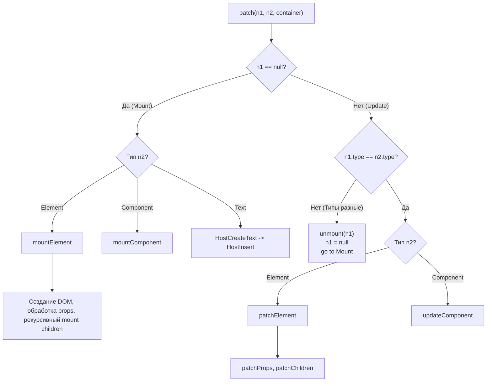

# Mount vs Patch

## Концепция и Архитектура (Mental Model)

В жизненном цикле любого узла (VNode) в Virtual DOM есть две критические фазы:
1. **Mount (Монтирование):** Первичное создание физического узла (DOM-элемента, компонента) "с нуля". VNode появляется в дереве впервые (`oldVNode` равен `null`).
2. **Patch (Обновление/Диффинг):** Обновление существующего физического узла. Vue сравнивает старый VNode (`n1`) и новый VNode (`n2`) и применяет минимально необходимые изменения (patch) к реальной платформе.

Архитектура рендерера построена как гигантский маршрутизатор (Router). Функция `patch()` всегда является входной точкой. Если она видит, что старого узла (`n1`) нет, она делегирует работу функциям семейства `mount*` (`mountElement`, `mountComponent`). Если `n1` есть, она вызывает функции `patch*` (`patchElement`, `updateComponent`).

## Визуализация (Mermaid)



## Ссылки на исходный код (Source Code References)
- **Точка маршрутизации:** `packages/runtime-core/src/renderer.ts` (функция `patch`)
- **Монтирование:** `mountElement`, `mountComponent`
- **Обновление:** `patchElement`, `updateComponent`

## Разбор реализации (Code Deep Dive)

Посмотрим на архитектуру функции `patch`, которая обрабатывает этот поток:

```typescript
// packages/runtime-core/src/renderer.ts

const patch = (
  n1: VNode | null, // Старый VNode (null если Mount)
  n2: VNode,        // Новый VNode
  container: RendererElement,
  anchor: RendererNode | null = null,
  parentComponent: ComponentInternalInstance | null = null,
  parentSuspense: SuspenseBoundary | null = null,
  isSVG = false,
  slotScopeIds: string[] | null = null,
  optimized = __DEV__ && isHmrUpdating ? false : !!n2.dynamicChildren
) => {
  // 1. Быстрый выход: узлы идентичны по ссылке (Static Hoisting)
  if (n1 === n2) {
    return
  }

  // 2. Если типы не совпадают (div -> span), старый узел полностью уничтожается
  if (n1 && !isSameVNodeType(n1, n2)) {
    anchor = getNextHostNode(n1) // Запоминаем позицию для вставки нового узла
    unmount(n1, parentComponent, parentSuspense, true)
    n1 = null // Приравниваем n1 к null, форсируя Mount на следующем шаге
  }

  const { type, ref, shapeFlag } = n2

  // 3. Маршрутизация на основе shapeFlag
  switch (type) {
    case Text:
      processText(n1, n2, container, anchor)
      break
    case Comment:
      processCommentNode(n1, n2, container, anchor)
      break
    // ... Fragment, Static
    default:
      if (shapeFlag & ShapeFlags.ELEMENT) {
        processElement(n1, n2, container, anchor, ...)
      } else if (shapeFlag & ShapeFlags.COMPONENT) {
        processComponent(n1, n2, container, anchor, ...)
      } // ...
  }
}

const processElement = (n1, n2, container, anchor, ...) => {
  if (n1 == null) {
    // Mount фаза
    mountElement(n2, container, anchor, ...)
  } else {
    // Patch фаза
    patchElement(n1, n2, parentComponent, ...)
  }
}
```

Внутри `patchElement`:
```typescript
const patchElement = (n1, n2, ...) => {
  const el = (n2.el = n1.el!) // Переносим ссылку на DOM узел из n1 в n2
  const oldProps = n1.props || EMPTY_OBJ
  const newProps = n2.props || EMPTY_OBJ

  // Обновление детей (здесь запускается алгоритм Diffing)
  patchChildren(n1, n2, el, null, parentComponent, parentSuspense, isSVG)

  // Обновление атрибутов/свойств, если они изменились
  if (n2.dynamicProps) {
    // Block Tree Optimization: патчим только изменившиеся пропсы (например, :class)
    for (let i = 0; i < n2.dynamicProps.length; i++) {
      const key = n2.dynamicProps[i]
      hostPatchProp(el, key, oldProps[key], newProps[key])
    }
  } else {
    // Full props diff (медленный путь)
    patchProps(el, n2, oldProps, newProps, parentComponent, parentSuspense, isSVG)
  }
}
```

## Оптимизации и Edge Cases (Подводные камни)

- **isSameVNodeType:** Функция проверяет `n1.type === n2.type` и `n1.key === n2.key`. Если ключи или типы разные, Vue даже не пытается обновить узел. Он удаляет старый (Unmount) и создает новый (Mount). Это объясняет, почему изменение `key` на компоненте (паттерн `key-changing`) принудительно заставляет его пересоздаться, вызывая `onMounted` заново.
- **Оптимизация передачи `el`:** Во время фазы Patch рендерер не ищет элемент в DOM (`document.getElementById`). Он берет ссылку из `n1.el` и напрямую присваивает её `n2.el`. Это обеспечивает мгновенный доступ к нативному узлу O(1).
- **Разделение логики:** Функции вида `process*` (например `processElement`) служат чисто как if-else гейты для разделения потоков на Mount и Patch, что делает V8 JIT-оптимизации более предсказуемыми (каждая функция делает только одно действие, избегая мегаморфности).
