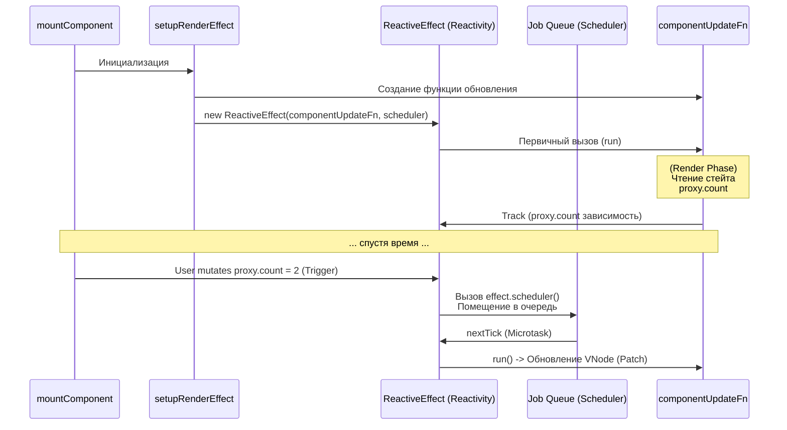

# Render Effect Setup

## Концепция и Архитектура (Mental Model)

Суть реактивности Vue заключается в том, что рендеринг компонента — это **Побочный Эффект (Side Effect)** изменения состояния (стейта). 

Архитектурно мост между `runtime-core` (Жизненный цикл, VNode) и `@vue/reactivity` (Proxy, Dependency Tracking) строится в момент монтирования компонента в функции `setupRenderEffect`. Vue оборачивает функцию отрисовки (генерации VNode дерева) в класс `ReactiveEffect`. Когда эта функция выполняется, реактивная система отслеживает (track) геттеры. Когда стейт меняется (setter), реактивная система уведомляет (trigger) эффект рендера, и он ставится в очередь (Scheduler) на повторное выполнение (update).

## Визуализация (Mermaid)



## Ссылки на исходный код (Source Code References)
- **Создание эффекта:** `packages/runtime-core/src/renderer.ts` (функция `setupRenderEffect`)

## Разбор реализации (Code Deep Dive)

Внутри рендерера процесс `mountComponent` вызывает `setupRenderEffect`. 

```typescript
// packages/runtime-core/src/renderer.ts

const setupRenderEffect = (
  instance: ComponentInternalInstance,
  initialVNode: VNode,
  container: RendererElement,
  anchor: RendererNode | null,
  parentSuspense: SuspenseBoundary | null,
  isSVG: boolean,
  optimized: boolean
) => {
  // Эта функция будет выполняться при первом рендере и при каждом обновлении
  const componentUpdateFn = () => {
    if (!instance.isMounted) {
      // ---- ФАЗА MOUNT (Первичный рендер) ----
      
      // Вызов хуков beforeMount
      if (instance.bm) { invokeArrayFns(instance.bm) }

      // 1. Запуск render() функции.
      // Здесь происходит Track реактивных зависимостей (Proxy getters)
      const subTree = (instance.subTree = renderComponentRoot(instance))

      // 2. Делегирование создания DOM рекурсивно
      patch(null, subTree, container, anchor, instance, parentSuspense, isSVG)
      initialVNode.el = subTree.el

      // 3. Вызов хуков mounted в очередь
      if (instance.m) { queuePostRenderEffect(instance.m, parentSuspense) }
      instance.isMounted = true
    } else {
      // ---- ФАЗА UPDATE (Реактивное обновление) ----
      
      // Вызов хуков beforeUpdate
      if (instance.bu) { invokeArrayFns(instance.bu) }

      // 1. Перегенерация дерева VNode с новыми данными
      const nextTree = renderComponentRoot(instance)
      const prevTree = instance.subTree
      instance.subTree = nextTree

      // 2. Diffing! Сравнение старого и нового дерева
      patch(
        prevTree,
        nextTree,
        // Использование хост-узла старого поддерева
        hostParentNode(prevTree.el!)!,
        getNextHostNode(prevTree),
        instance,
        parentSuspense,
        isSVG
      )

      // Вызов хуков updated в очередь
      if (instance.u) { queuePostRenderEffect(instance.u, parentSuspense) }
    }
  }

  // Создание моста с @vue/reactivity
  // ReactiveEffect принимает функцию и кастомный sheduler
  const effect = (instance.effect = new ReactiveEffect(
    componentUpdateFn,
    // Scheduler определяет, ЧТО делать при триггере (изменении стейта)
    () => queueJob(update),
    instance.scope // Привязка к EffectScope для автоматической отписки при unmount
  ))

  const update: SchedulerJob = (instance.update = () => effect.run())
  update.id = instance.uid

  // Запуск первого рендера
  update()
}
```

## Оптимизации и Edge Cases (Подводные камни)

- **Job Queue (Асинхронный батчинг):** Обратите внимание на `() => queueJob(update)`. Это `scheduler` для `ReactiveEffect`. Если вы сделаете `count.value++` 1000 раз подряд в одном синхронном цикле (например, цикле `for`), Vue не будет рендерить компонент 1000 раз. Вместо того, чтобы немедленно вызывать `effect.run()`, система реактивности вызовет `queueJob`. Этот планировщик (`scheduler.ts`) добавляет функцию `update` в Set (дедупликация) и создает микрозадачу (`Promise.resolve().then(flushJobs)`). Рендер произойдет ровно один раз в конце текущего Event Loop (nextTick).
- **Infinite Update Loop Prevention:** Что произойдет, если внутри функции `render` изменить реактивный стейт компонента (например, мутировать `count.value` прямо в шаблоне)? Это вызовет trigger эффекта, который поставит задачу на перерендер, который снова изменит `count`, вызывая бесконечный цикл. Vue имеет защиту от этого внутри `flushJobs`: он проверяет, не запущен ли в данный момент тот же самый эффект (т.к. у каждого эффекта есть ID) и выбрасывает ошибку/warning.
- **Fallback (Условный рендеринг):** `renderComponentRoot` (генерация VNode) всегда гарантирует возврат нормализованного дерева (или хотя бы `Comment` ноды, если компонент рендерит `null`). Это необходимо, чтобы на фазе Update рендерер знал, где находится позиция компонента в DOM (Anchor point) для последующей вставки узлов, если стейт поменяется.
