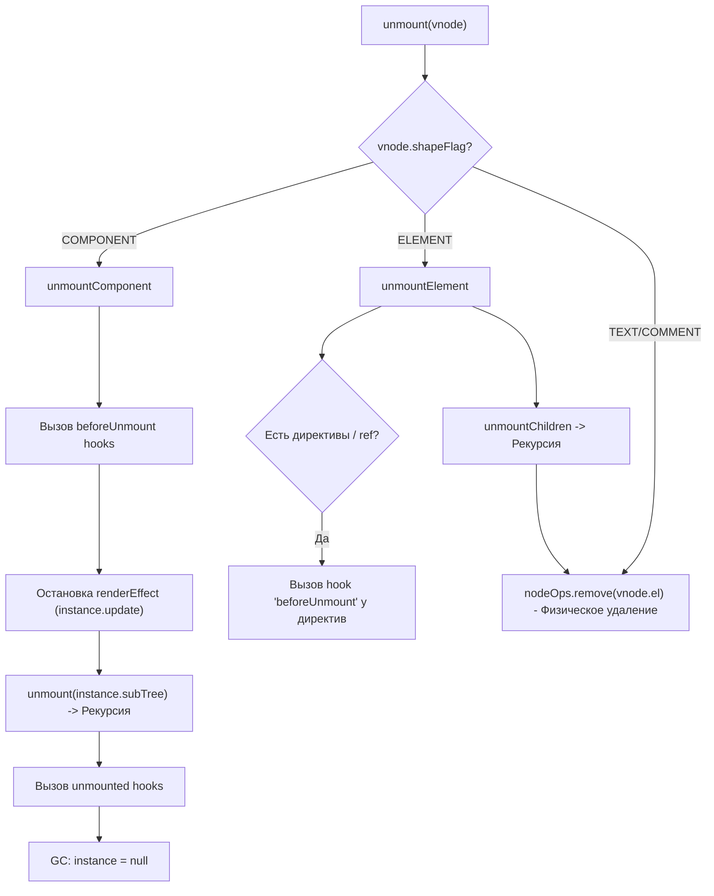

# Unmount & Teardown

## Концепция и Архитектура (Mental Model)

Удаление узла из Virtual DOM — это не просто вызов `parent.removeChild(node)`. В Vue 3 процесс `unmount` (размонтирование) представляет собой рекурсивную очистку (Teardown) всего поддерева. 

Архитектурная задача фазы размонтирования:
1. Вызвать хуки жизненного цикла (`beforeUnmount`, `unmounted`).
2. Отменить эффекты реактивности (остановить трекинг зависимостей, чтобы избежать утечек памяти).
3. Разрушить инстанс компонента (ComponentInstance).
4. Очистить директивы (вызвать хуки директив).
5. Размонтировать Teleport и Suspense (если они есть).
6. И в самом конце — физически удалить элемент из платформы (`nodeOps.remove`).

## Визуализация (Mermaid)



## Ссылки на исходный код (Source Code References)
- **Логика размонтирования:** `packages/runtime-core/src/renderer.ts` (функции `unmount`, `unmountComponent`, `remove`)

## Разбор реализации (Code Deep Dive)

Сердце процесса находится в функции `unmount`:

```typescript
// packages/runtime-core/src/renderer.ts

const unmount = (
  vnode: VNode,
  parentComponent: ComponentInternalInstance | null,
  parentSuspense: SuspenseBoundary | null,
  doRemove = false, // Флаг: нужно ли физически удалять el из DOM
  optimized = false
) => {
  const { type, props, ref, children, dynamicChildren, shapeFlag, patchFlag, dirs } = vnode

  // 1. Очистка ссылок на DOM элементы (Template Refs)
  if (ref != null) {
    setRef(ref, null, parentSuspense, vnode, true)
  }

  // 2. Очистка KeepAlive
  if (shapeFlag & ShapeFlags.COMPONENT_SHOULD_KEEP_ALIVE) {
    // Вместо удаления, компонент отправляется в кэш
    ;(parentComponent!.ctx as KeepAliveContext).deactivate(vnode)
    return
  }

  // 3. Маршрутизация по типам для кастомной логики
  const shouldInvokeDirs = shapeFlag & ShapeFlags.ELEMENT && dirs
  const shouldInvokeVnodeHook = !isAsyncWrapper(vnode)

  let vnodeHook: VNodeHook | undefined | null
  // Вызов VNode hook: beforeUnmount
  if (shouldInvokeVnodeHook && (vnodeHook = props && props.onVnodeBeforeUnmount)) {
    invokeVNodeHook(vnodeHook, parentComponent, vnode)
  }

  // 4. Глубокое размонтирование
  if (shapeFlag & ShapeFlags.COMPONENT) {
    unmountComponent(vnode.component!, parentSuspense, doRemove)
  } else {
    // Обработка директив
    if (shouldInvokeDirs) {
      invokeDirectiveHook(vnode, null, parentComponent, 'beforeUnmount')
    }

    if (shapeFlag & ShapeFlags.TELEPORT) {
      ;(type as typeof TeleportImpl).remove(vnode, parentComponent, parentSuspense, optimized)
    } else if (
      dynamicChildren &&
      (type !== Fragment || (patchFlag > 0 && patchFlag & PatchFlags.STABLE_FRAGMENT))
    ) {
      // Оптимизация: размонтируем только динамических детей (Block Tree)
      unmountChildren(dynamicChildren, parentComponent, parentSuspense, false, true)
    } else if (
      (type === Fragment && patchFlag & (PatchFlags.KEYED_FRAGMENT | PatchFlags.UNKEYED_FRAGMENT)) ||
      (!optimized && shapeFlag & ShapeFlags.ARRAY_CHILDREN)
    ) {
      // Полное размонтирование детей
      unmountChildren(children as VNode[], parentComponent, parentSuspense)
    }

    // 5. Физическое удаление (если требуется)
    if (doRemove) {
      remove(vnode)
    }
  }

  // Вызов VNode hook: unmounted
  if (shouldInvokeVnodeHook && (vnodeHook = props && props.onVnodeUnmounted)) {
    queuePostRenderEffect(() => invokeVNodeHook(vnodeHook!, parentComponent, vnode), parentSuspense)
  }
}
```

Логика внутри `unmountComponent`:
```typescript
const unmountComponent = (
  instance: ComponentInternalInstance,
  parentSuspense: SuspenseBoundary | null,
  doRemove?: boolean
) => {
  const { bum, scope, update, subTree, um } = instance

  // beforeUnmount хуки компонента
  if (bum) invokeArrayFns(bum)

  // ОСТАНОВКА РЕАКТИВНОСТИ:
  // Останавливаем render effect (ReactiveEffect), чтобы изменения state больше не вызывали update()
  if (update) {
    update.active = false
    unmount(subTree, instance, parentSuspense, doRemove)
  }

  // Остановка EffectScope (очищает все computed, watch и кастомные effect внутри setup())
  scope.stop()

  // unmounted хуки (отправляются в очередь PostFlush, чтобы сработать после реального удаления)
  if (um) {
    queuePostRenderEffect(um, parentSuspense)
  }

  // Освобождаем память
  instance.isUnmounted = true
}
```

## Оптимизации и Edge Cases (Подводные камни)

- **DoRemove Optimization:** Флаг `doRemove` означает вызов нативного `parentNode.removeChild()`. Vue оптимизирует это: когда удаляется целый компонент, `doRemove=true` передается только корневому элементу (`subTree`) этого компонента. Дочерним элементам внутри компонента будет передано `doRemove=false`. Зачем удалять каждый `<span>` внутри `<div>` поштучно, если удаление корневого `<div>` уничтожит всё поддерево в DOM сразу? Это экономит огромное количество дорогих вызовов DOM API! Тем не менее, рекурсия по VNode продолжается (без `doRemove`), чтобы очистить `watch`, директивы и память.
- **EffectScope:** Метод `scope.stop()` (из пакета `@vue/reactivity`) — это гениальный паттерн. Все реактивные эффекты, созданные в `setup()`, автоматически добавляются в `EffectScope` инстанса. При размонтировании одной командой `scope.stop()` отписываются все зависимости. Разработчику не нужно вручную делать `.off()` или `clearWatch()`.
- **Фрагменты (Fragments):** Если корневым узлом компонента является `Fragment` (несколько элементов на верхнем уровне), Vue должен физически удалить (doRemove) *каждый* узел внутри фрагмента, так как у них нет единого родительского DOM-узла-обертки.
