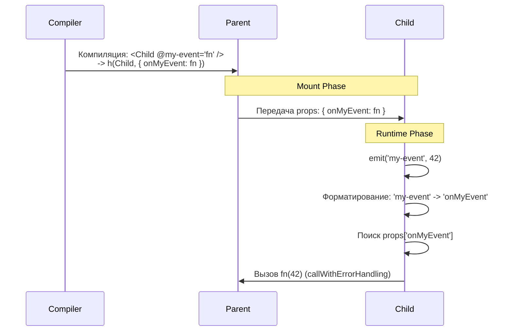

# Emits & Event Handling

## Концепция и Архитектура (Mental Model)

В Vue компоненты общаются снизу вверх с помощью событий (`$emit`). В отличие от нативных DOM-событий (которые всплывают через фазы Capture/Bubble), компонентные события во Vue 3 **не всплывают**. Это строго контрактная связь между ребенком и непосредственным родителем.

Архитектурно `$emit` — это просто вызов функции. Когда родитель компилирует шаблон `<Child @custom-event="handler" />`, компилятор преобразует `@custom-event` в пропс с именем `onCustomEvent`. Функция `emit('custom-event')` внутри ребенка просто ищет этот пропс в `instance.vnode.props` и вызывает его.

## Визуализация (Mermaid)



## Ссылки на исходный код (Source Code References)
- **Функция Emit:** `packages/runtime-core/src/componentEmits.ts` (функция `emit`)

## Разбор реализации (Code Deep Dive)

Внутри `setupContext` и PublicInstance (для `$emit`) метод ссылается на внутреннюю функцию `emit`.

```typescript
// packages/runtime-core/src/componentEmits.ts

export function emit(
  instance: ComponentInternalInstance,
  event: string,
  ...rawArgs: any[]
) {
  if (instance.isUnmounted) return
  const props = instance.vnode.props || EMPTY_OBJ

  // 1. Нормализация имени события
  // Например: 'my-event' -> 'onMyEvent'
  // 'update:modelValue' -> 'onUpdate:modelValue'
  let handlerName = toHandlerKey(camelize(event))
  let handler = props[handlerName]

  // Если не нашли camelCase, пробуем kebab-case fallback (onMy-event)
  if (!handler && event.includes('-')) {
    handlerName = toHandlerKey(event)
    handler = props[handlerName]
  }

  // 2. Валидация аргументов в DEV режиме
  if (__DEV__) {
    const options = instance.emitsOptions
    if (options) {
      const validator = options[event]
      if (isFunction(validator)) {
        const isValid = validator(...rawArgs)
        if (!isValid) {
          warn(`Invalid event arguments: event validation failed for event "${event}".`)
        }
      }
    }
  }

  // 3. Вызов обработчика
  if (handler) {
    // callWithAsyncErrorHandling оборачивает вызов для перехвата исключений
    // и направляет их в onErrorCaptured / глобальный ErrorHandler
    callWithAsyncErrorHandling(
      handler,
      instance,
      ErrorCodes.COMPONENT_EVENT_HANDLER,
      rawArgs
    )
  }
  
  // 4. Одноразовые обработчики (Modifiers like .once)
  const onceHandler = props[handlerName + `Once`]
  if (onceHandler) {
    if (!instance.emitted) {
      instance.emitted = {}
    } else if (instance.emitted[handlerName]) {
      return // Уже было вызвано
    }
    instance.emitted[handlerName] = true
    callWithAsyncErrorHandling(
      onceHandler,
      instance,
      ErrorCodes.COMPONENT_EVENT_HANDLER,
      rawArgs
    )
  }
}
```

## Оптимизации и Edge Cases (Подводные камни)

- **Zero Overhead Events:** Так как `$emit` — это просто поиск ключа в объекте и вызов функции (`props['onEvent']()`), компонентные события в Vue 3 работают с нулевым оверхедом. Нет сложной системы подписок (Event Emitter/Bus) внутри инстанса (как это было в Vue 2, где использовались `$on` и `$off`).
- **Синтаксис `.once`:** Модификатор `@click.once` компилируется в пропс `onClickOnce`. Внутри `emit` есть специальная ветка логики для поиска суффикса `Once`. Чтобы отследить, что событие уже было вызвано, инстанс использует объект `instance.emitted` как кэш.
- **`v-model` Under the Hood:** Двустороннее связывание `v-model="text"` на компоненте компилируется в передачу пропса `modelValue` и слушателя `@update:modelValue="text = $event"`. При вызове `emit('update:modelValue', 'new string')`, вызывается именно этот авто-сгенерированный обработчик, замыкающий круг обновления.
