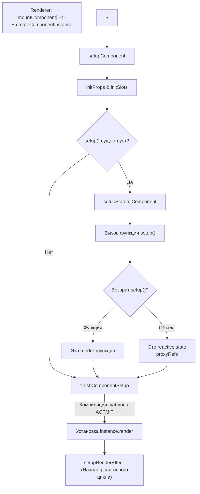

# Instance Creation Lifecycle

## Концепция и Архитектура (Mental Model)

Компонент во Vue 3 — это не просто объект с методами. В рантайме он представлен двумя сущностями: **VNode** (легковесное описание того, что должно быть отрендерено) и **ComponentInternalInstance** (состояние, жизненный цикл, пропсы, слоты и контекст компонента).

Жизненный цикл инстанса начинается в тот момент, когда рендерер решает смонтировать `ComponentVNode`. Инстанс создается (выделение памяти), затем настраивается (разрешение пропсов/слотов, вызов `setup()`), и наконец, запускается (компиляция шаблона, если нужно, и запуск `ReactiveEffect` рендера).

## Визуализация (Mermaid)



## Ссылки на исходный код (Source Code References)
- **Создание инстанса:** `packages/runtime-core/src/component.ts` (функции `createComponentInstance`, `setupComponent`)

## Разбор реализации (Code Deep Dive)

Процесс начинается с инициализации структуры данных компонента.

```typescript
// packages/runtime-core/src/component.ts

export function createComponentInstance(
  vnode: VNode,
  parent: ComponentInternalInstance | null,
  suspense: SuspenseBoundary | null
) {
  const type = vnode.type as ComponentOptions
  
  // Ключевой объект: Внутренний контекст компонента.
  // Vue не использует классы (class VueComponent) ради tree-shaking и минификации!
  const instance: ComponentInternalInstance = {
    uid: uid++,
    vnode,
    type,
    parent,
    appContext: parent ? parent.appContext : vnode.appContext!,
    root: null!, // устанавливается позже
    next: null,
    subTree: null!, // результат render()
    effect: null!,
    update: null!, // функция перерендера
    scope: new EffectScope(true /* detached */),
    render: null,
    proxy: null,
    exposed: null,
    exposeProxy: null,
    withProxy: null,
    provides: parent ? parent.provides : Object.create(vnode.appContext!.provides),
    
    // State
    data: EMPTY_OBJ,
    props: EMPTY_OBJ,
    attrs: EMPTY_OBJ,
    slots: EMPTY_OBJ,
    refs: EMPTY_OBJ,
    setupState: EMPTY_OBJ,
    setupContext: null,

    // Lifecycle Hooks (Массивы, так как можно вызвать onMounted несколько раз)
    bm: null, // beforeMount
    m: null,  // mounted
    a: null,  // activated
    um: null, // unmounted
    // ...
  }
  
  // Установка root ссылки (удобно для глобальных проверок)
  instance.root = parent ? parent.root : instance
  instance.ctx = { _: instance }

  return instance
}
```

Далее вызывается `setupComponent`, где происходит наполнение этой "пустышки" данными.

```typescript
export function setupComponent(
  instance: ComponentInternalInstance,
  isSSR = false
) {
  const { props, children } = instance.vnode
  const isStateful = isStatefulComponent(instance)
  
  // 1. Инициализация Props, Attrs, Emits
  initProps(instance, props, isStateful, isSSR)
  
  // 2. Инициализация Слотов (разбор children на vnode слотов)
  initSlots(instance, children)

  // 3. Вызов setup()
  const setupResult = isStateful
    ? setupStatefulComponent(instance, isSSR)
    : undefined
    
  return setupResult
}
```

## Оптимизации и Edge Cases (Подводные камни)

- **Почему не Классы (Class vs Factory/Object)?** Во Vue 2 инстансы компонентов создавались через `new VueComponent()`. В Vue 3 от этого отказались в пользу фабрики `createComponentInstance`. Причина — минификация. Свойства классов в JavaScript (особенно в ES5) сложно минифицировать, так как их имена могут быть использованы динамически (`this['prop']`). Когда инстанс является просто объектом, компилятор типа Terser легко "манглит" свойства, сокращая вес бандла.
- **Tree-Shaking State:** Если вы не используете Options API (например `data()` или `methods()`), Vue 3 на этапе `setupStatefulComponent` не будет тянуть в бандл логику разрешения Options API, если стоит флаг `__VUE_OPTIONS_API__: false` (в конфигурации Vite/Webpack).
- **Global `currentInstance`:** Во время вызова `setup()` Vue устанавливает глобальную переменную `currentInstance = instance`. Именно поэтому Composition API хуки (`onMounted`, `provide`, `inject`) "знают", к какому компоненту они относятся, хотя вы не передаете им `this`! Как только `setup()` завершается, глобальная переменная сбрасывается.
