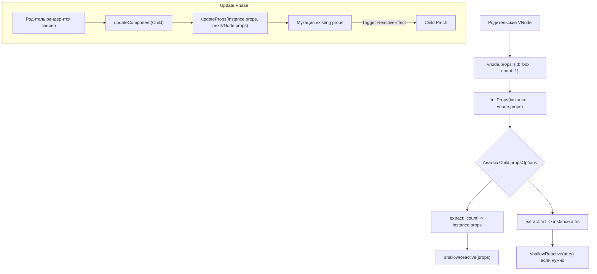

# Props Initialization & Updates

## Концепция и Архитектура (Mental Model)

Пропсы (Props) — это интерфейс передачи данных от родителя к дочернему компоненту (One-way Data Flow). В ядре Vue пропсы реализованы как специальный реактивный объект. 

Когда `runtime-core` монтирует компонент, он разделяет атрибуты, переданные на VNode (`vnode.props`), на две группы:
1. **Пропсы (Props):** Свойства, которые компонент явно объявил в `defineProps` (или `props: {}`).
2. **Обычные атрибуты (Fallthrough Attributes / Attrs):** Все остальные переданные свойства (например, `class`, `id`, `@click`), которые не были объявлены как пропсы. Они сохраняются в объект `instance.attrs`.

При обновлении родителя, если переданные пропсы изменились, Vue напрямую мутирует объект `instance.props`. Поскольку этот объект реактивный, это вызывает триггер обновления внутри дочернего компонента.

## Визуализация (Mermaid)



## Ссылки на исходный код (Source Code References)
- **Инициализация и обновление:** `packages/runtime-core/src/componentProps.ts` (функции `initProps`, `updateProps`, `setFullProps`)

## Разбор реализации (Code Deep Dive)

В момент создания компонента вызывается `initProps`:

```typescript
// packages/runtime-core/src/componentProps.ts

export function initProps(
  instance: ComponentInternalInstance,
  rawProps: Data | null,
  isStateful: number,
  isSSR = false
) {
  const props: Data = {}
  const attrs: Data = {}
  
  // Компонент компилирует свои опции `props` (определяя типы, дефолты) в нормализованный вид
  // Этот процесс кэшируется глобально для каждого типа компонента!
  const [options, needCastKeys] = instance.propsOptions
  
  let hasExtractedProps = false
  if (rawProps) {
    for (const key in rawProps) {
      const value = rawProps[key]
      
      // Разделяем на props и attrs
      if (options && hasOwn(options, key)) {
        props[key] = value
        hasExtractedProps = true
      } else if (!isReservedProp(key)) {
        attrs[key] = value
      }
    }
  }

  // Применение дефолтных значений и кастинг типов (Boolean)
  if (options) {
    for (const key in options) {
      // Если ключа нет в переданных, но есть дефолт, ставим дефолт
      // Если тип Boolean, кастуем (' ' -> true, null -> false)
      let opt = options[key]
      if (opt != null) { ... }
    }
  }

  // Ключевой момент: Пропсы делаются shallowReactive.
  // Мы делаем поверхностную реактивность, так как глубокая реактивность (deep)
  // уже обеспечена родителем. Нет смысла оборачивать объект дважды.
  if (isStateful) {
    instance.props = __DEV__ ? shallowReadonly(props) : props
    // Обратите внимание: в production props не оборачиваются в readonly!
    // Это экономит память. Мутации пропсов отслеживаются на уровне Proxy сеттеров.
  } else {
    // Функциональные компоненты
    instance.props = attrs
  }
  
  instance.attrs = attrs
}

export function updateProps(
  instance: ComponentInternalInstance,
  nextVNode: VNode,
  optimized: boolean
) {
  const { props: rawProps } = nextVNode
  const { props, attrs } = instance

  // Мы мутируем СУЩЕСТВУЮЩИЙ объект props (instance.props)
  // Поскольку он обернут в shallowReactive, изменение любого ключа
  // затриггерит renderEffect компонента.
  
  for (const key in rawProps) {
    // ... присвоение props[key] = rawProps[key]
  }
}
```

## Оптимизации и Edge Cases (Подводные камни)

- **Shallow Reactive:** `instance.props` оборачивается только в `shallowReactive`. Это сделано для максимальной производительности. Если родитель передал реактивный объект `state.user`, он уже является Proxy. Vue просто записывает эту ссылку в `instance.props.user`. Мутация `props.user.name` не триггерит пропс, она триггерит исходный `state` родителя.
- **PropsOptions Cache:** Функция нормализации опций пропсов (парсинг `defineProps`) выполняется ровно ОДИН раз для типа компонента. Результат сохраняется в `instance.appContext.propsCache` (через `WeakMap`). При создании 1000 одинаковых компонентов, тяжелый парсинг конфигурации пропсов опускается 999 раз.
- **Production Readonly:** В режиме Production Vue **не** делает объект `instance.props` иммутабельным через `shallowReadonly`. Разработчик всё равно не должен мутировать пропсы напрямую, и если он это сделает, багов не избежать. Но убирая обертку в production, ядро экономит целую фабрику Proxy и время выполнения для каждого компонента.
