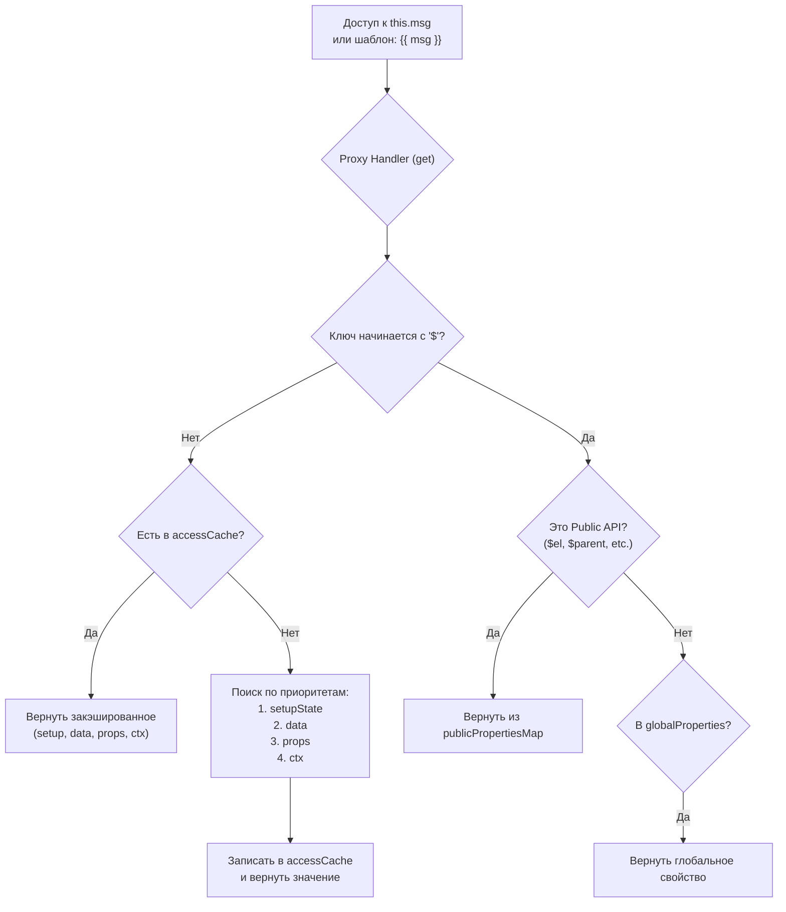

# Public Instance Proxy

## Концепция и Архитектура (Mental Model)

Когда вы пишете `this.msg` в Options API, или когда шаблон обращается к переменной `msg`, откуда Vue берет это значение? Оно может быть в `data()`, в `props`, возвращено из `setup()`, в глобальных `app.config.globalProperties` или даже в `appContext.provides`.

Архитектурное решение в Vue 3 — **Public Instance Proxy**. Это единый, мощный `Proxy`-объект, который оборачивает внутренний контекст компонента (ComponentInternalInstance). Его цель — обеспечить "плоский" доступ к свойствам из разных источников и маршрутизировать обращения (Getter/Setter) в правильные места с учетом строгих приоритетов (что важнее: пропс или переменная из `setup`?).

## Визуализация (Mermaid)




## Ссылки на исходный код (Source Code References)
- **Обработчики Proxy:** `packages/runtime-core/src/componentPublicInstance.ts` (объект `PublicInstanceProxyHandlers`)

## Разбор реализации (Code Deep Dive)

Ядро Proxy-хендлера использует концепцию "Bit Fields" (`accessCache`) для мега-быстрого резолва ключей, чтобы не делать `hasOwnProperty` на каждом рендере.

```typescript
// packages/runtime-core/src/componentPublicInstance.ts

export const PublicInstanceProxyHandlers: ProxyHandler<any> = {
  get({ _: instance }: ComponentRenderContext, key: string) {
    const { ctx, setupState, data, props, accessCache, type, appContext } = instance

    // 1. Быстрый путь (Fast Path): если ключ не начинается с '$' (встроенные свойства)
    if (key[0] !== '$') {
      // Кэш доступа: запоминаем, ГДЕ мы нашли этот ключ в прошлый раз
      const n = accessCache![key]
      if (n !== undefined) {
        switch (n) {
          case AccessTypes.SETUP: return setupState[key]
          case AccessTypes.DATA: return data[key]
          case AccessTypes.CONTEXT: return ctx[key]
          case AccessTypes.PROPS: return props![key]
        }
      } else if (setupState !== EMPTY_OBJ && hasOwn(setupState, key)) {
        // Если найдено в setupState
        accessCache![key] = AccessTypes.SETUP
        return setupState[key]
      } else if (data !== EMPTY_OBJ && hasOwn(data, key)) {
        // Если найдено в data()
        accessCache![key] = AccessTypes.DATA
        return data[key]
      } else if (
        // Пропсы
        (normalizedProps = instance.propsOptions[0]) &&
        hasOwn(normalizedProps, key)
      ) {
        accessCache![key] = AccessTypes.PROPS
        return props![key]
      } else if (ctx !== EMPTY_OBJ && hasOwn(ctx, key)) {
        accessCache![key] = AccessTypes.CONTEXT
        return ctx[key]
      } else if (!__VUE_OPTIONS_API__ || !hasSetupBinding(state, key)) {
         // fallback ...
      }
    }

    // 2. Обработка встроенных свойств (начинаются с $)
    const publicGetter = publicPropertiesMap[key]
    if (publicGetter) {
      if (key === '$attrs') { track(instance, TrackOpTypes.GET, key) }
      return publicGetter(instance) // Например: $el -> instance.vnode.el
    } else if (
      // 3. Глобальные свойства
      hasOwn(appContext.config.globalProperties, key)
    ) {
      return appContext.config.globalProperties[key]
    }
    // ...
  },

  set({ _: instance }: ComponentRenderContext, key: string, value: any): boolean {
    const { data, setupState, ctx } = instance
    
    // Запрет мутации props
    if (instance.propsOptions[0] && hasOwn(instance.propsOptions[0], key)) {
      __DEV__ && warn(`Attempting to mutate prop "${key}". Props are readonly.`)
      return false
    }
    
    // Маршрутизация сеттера по приоритету (setupState -> data)
    if (setupState !== EMPTY_OBJ && hasOwn(setupState, key)) {
      setupState[key] = value
      return true
    } else if (data !== EMPTY_OBJ && hasOwn(data, key)) {
      data[key] = value
      return true
    }
    // ...
    return true
  }
}
```

## Оптимизации и Edge Cases (Подводные камни)

- **AccessCache (Кэш Доступа):** Proxy `get` вызывается тысячи раз во время рендеринга шаблона. Использование `hasOwn` (Object.prototype.hasOwnProperty.call) очень дорогое. Поэтому Vue использует объект `accessCache` внутри компонента. При первом обращении к `msg`, Vue ищет его, находит, например, в `setupState`, и записывает `accessCache['msg'] = AccessTypes.SETUP` (числовой Enum). При следующем рендере `get` сразу забирает значение по индексу, достигая сложности O(1).
- **Защита Props:** В Proxy `set` вшита строгая проверка: если ключ является пропсом, Vue выбрасывает warning и блокирует мутацию. Однонаправленный поток данных (One-way data flow) энфорсится именно здесь.
- **with() Statement (Compiler DOM):** Если вы используете In-Browser компиляцию (шаблон из HTML), сгенерированная рендер-функция оборачивается в блок `with (this) { return h('div', msg) }`. Это старая JS-фича, которая перехватывает все обращения к переменным в шаблоне и направляет их в PublicInstance Proxy.
 ?}
    
    C -->|Да| D["Резервированные свойства Vue <br/> $el, $parent, $props, $emit"]
    C -->|Нет| E{"Где находится ключ? (Поиск по приоритету)"}
    
    E --> F["1. setupState (из setup())"]
    E --> G["2. data (Options API)"]
    E --> H[3. props]
    E --> I["4. ctx (локальные свойства)"]
    E --> J["5. globalProperties (app.config)"]
    
    F --> R[Возврат значения]
    G --> R
    H --> R
    I --> R
    J --> R
```

## Ссылки на исходный код (Source Code References)
- **Обработчики Proxy:** `packages/runtime-core/src/componentPublicInstance.ts` (объект `PublicInstanceProxyHandlers`)

## Разбор реализации (Code Deep Dive)

Ядро Proxy-хендлера использует концепцию "Bit Fields" (`accessCache`) для мега-быстрого резолва ключей, чтобы не делать `hasOwnProperty` на каждом рендере.

```typescript
// packages/runtime-core/src/componentPublicInstance.ts

export const PublicInstanceProxyHandlers: ProxyHandler<any> = {
  get({ _: instance }: ComponentRenderContext, key: string) {
    const { ctx, setupState, data, props, accessCache, type, appContext } = instance

    // 1. Быстрый путь (Fast Path): если ключ не начинается с '$' (встроенные свойства)
    if (key[0] !== '$') {
      // Кэш доступа: запоминаем, ГДЕ мы нашли этот ключ в прошлый раз
      const n = accessCache![key]
      if (n !== undefined) {
        switch (n) {
          case AccessTypes.SETUP: return setupState[key]
          case AccessTypes.DATA: return data[key]
          case AccessTypes.CONTEXT: return ctx[key]
          case AccessTypes.PROPS: return props![key]
        }
      } else if (setupState !== EMPTY_OBJ && hasOwn(setupState, key)) {
        // Если найдено в setupState
        accessCache![key] = AccessTypes.SETUP
        return setupState[key]
      } else if (data !== EMPTY_OBJ && hasOwn(data, key)) {
        // Если найдено в data()
        accessCache![key] = AccessTypes.DATA
        return data[key]
      } else if (
        // Пропсы
        (normalizedProps = instance.propsOptions[0]) &&
        hasOwn(normalizedProps, key)
      ) {
        accessCache![key] = AccessTypes.PROPS
        return props![key]
      } else if (ctx !== EMPTY_OBJ && hasOwn(ctx, key)) {
        accessCache![key] = AccessTypes.CONTEXT
        return ctx[key]
      } else if (!__VUE_OPTIONS_API__ || !hasSetupBinding(state, key)) {
         // fallback ...
      }
    }

    // 2. Обработка встроенных свойств (начинаются с $)
    const publicGetter = publicPropertiesMap[key]
    if (publicGetter) {
      if (key === '$attrs') { track(instance, TrackOpTypes.GET, key) }
      return publicGetter(instance) // Например: $el -> instance.vnode.el
    } else if (
      // 3. Глобальные свойства
      hasOwn(appContext.config.globalProperties, key)
    ) {
      return appContext.config.globalProperties[key]
    }
    // ...
  },

  set({ _: instance }: ComponentRenderContext, key: string, value: any): boolean {
    const { data, setupState, ctx } = instance
    
    // Запрет мутации props
    if (instance.propsOptions[0] && hasOwn(instance.propsOptions[0], key)) {
      __DEV__ && warn(`Attempting to mutate prop "${key}". Props are readonly.`)
      return false
    }
    
    // Маршрутизация сеттера по приоритету (setupState -> data)
    if (setupState !== EMPTY_OBJ && hasOwn(setupState, key)) {
      setupState[key] = value
      return true
    } else if (data !== EMPTY_OBJ && hasOwn(data, key)) {
      data[key] = value
      return true
    }
    // ...
    return true
  }
}
```

## Оптимизации и Edge Cases (Подводные камни)

- **AccessCache (Кэш Доступа):** Proxy `get` вызывается тысячи раз во время рендеринга шаблона. Использование `hasOwn` (Object.prototype.hasOwnProperty.call) очень дорогое. Поэтому Vue использует объект `accessCache` внутри компонента. При первом обращении к `msg`, Vue ищет его, находит, например, в `setupState`, и записывает `accessCache['msg'] = AccessTypes.SETUP` (числовой Enum). При следующем рендере `get` сразу забирает значение по индексу, достигая сложности O(1).
- **Защита Props:** В Proxy `set` вшита строгая проверка: если ключ является пропсом, Vue выбрасывает warning и блокирует мутацию. Однонаправленный поток данных (One-way data flow) энфорсится именно здесь.
- **with() Statement (Compiler DOM):** Если вы используете In-Browser компиляцию (шаблон из HTML), сгенерированная рендер-функция оборачивается в блок `with (this) { return h('div', msg) }`. Это старая JS-фича, которая перехватывает все обращения к переменным в шаблоне и направляет их в PublicInstance Proxy.
