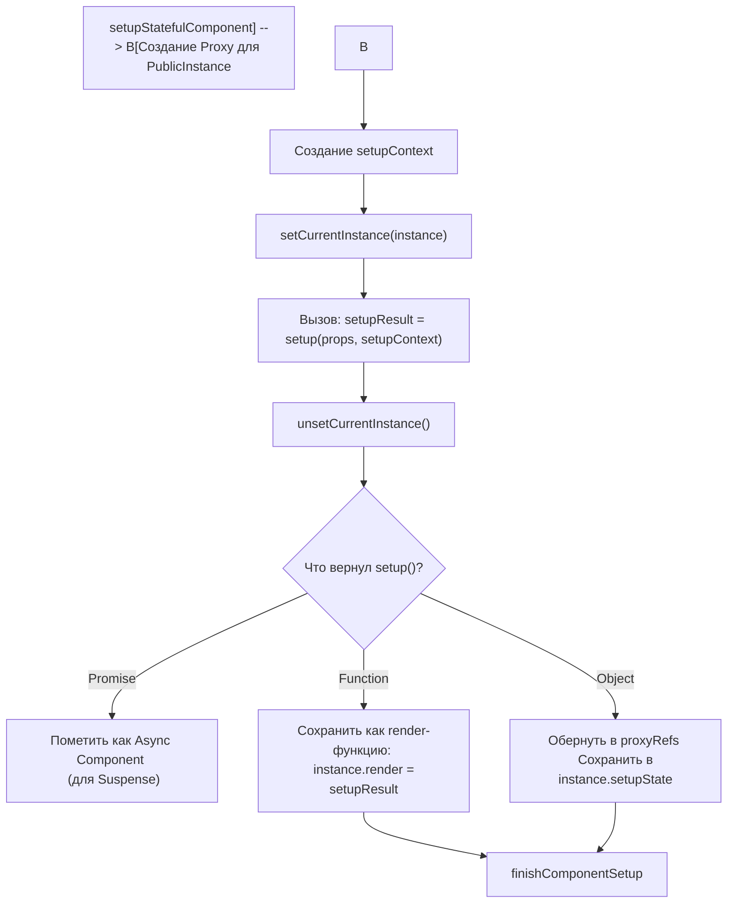

# Setup Stateful Component

## Концепция и Архитектура (Mental Model)

Центральной точкой Composition API является вызов функции `setup()` (или выполнение `<script setup>`). Именно здесь происходит объявление реактивного состояния, computed-свойств, хуков жизненного цикла и локальных методов.

Функция `setupStatefulComponent` отвечает за оркестрацию этого процесса. Её задачи:
1. Создать `setupContext` (включающий `attrs`, `slots`, `emit`, `expose`).
2. Установить компонент как **Текущий Активный (currentInstance)**, чтобы Composition API работало.
3. Вызвать функцию `setup(props, context)`.
4. Обработать результат (Promise для Suspense, Render-функцию или Реактивный Объект).
5. Развернуть (Unwrap) возвращенные `ref` для использования в шаблоне.

## Визуализация (Mermaid)



## Ссылки на исходный код (Source Code References)
- **Точка выполнения setup:** `packages/runtime-core/src/component.ts` (функции `setupStatefulComponent`, `handleSetupResult`)

## Разбор реализации (Code Deep Dive)

В реализации есть защита от ошибок и обработка Promise (асинхронный setup).

```typescript
// packages/runtime-core/src/component.ts

export function setupStatefulComponent(
  instance: ComponentInternalInstance,
  isSSR: boolean
) {
  const Component = instance.type as ComponentOptions
  
  // 1. Создание Public Proxy (см. Public Instance Proxy)
  instance.proxy = new Proxy(instance.ctx, PublicInstanceProxyHandlers)

  const { setup } = Component
  if (setup) {
    // 2. Создание Context.
    // Это геттеры, поэтому вызов props или slots всегда актуален
    const setupContext = (instance.setupContext =
      setup.length > 1 ? createSetupContext(instance) : null)

    // 3. Устанавливаем глобальную переменную для Composition API
    setCurrentInstance(instance)
    pauseTracking() // Важно: останавливаем сбор зависимостей реактивности!
    
    // 4. Безопасный вызов setup
    const setupResult = callWithErrorHandling(
      setup,
      instance,
      ErrorCodes.SETUP_FUNCTION,
      [__DEV__ ? shallowReadonly(instance.props) : instance.props, setupContext]
    )
    
    resetTracking()
    unsetCurrentInstance()

    // 5. Обработка результата
    if (isPromise(setupResult)) {
      // Async setup() - работает в связке с <Suspense>
      setupResult.then(unsetCurrentInstance, unsetCurrentInstance)
      instance.asyncDep = setupResult // Ждем резолва
    } else {
      handleSetupResult(instance, setupResult, isSSR)
    }
  } else {
    // Fallback: Component не имеет setup(), только Options API
    finishComponentSetup(instance, isSSR)
  }
}

export function handleSetupResult(
  instance: ComponentInternalInstance,
  setupResult: unknown,
  isSSR: boolean
) {
  if (isFunction(setupResult)) {
    // setup возвращает render функцию (JSX или h)
    instance.render = setupResult as InternalRenderFunction
  } else if (isObject(setupResult)) {
    // setup возвращает объект со стейтом (классический setup() {})
    // proxyRefs АВТОМАТИЧЕСКИ разворачивает .value для ref!
    instance.setupState = proxyRefs(setupResult)
  }
  
  finishComponentSetup(instance, isSSR)
}
```

## Оптимизации и Edge Cases (Подводные камни)

- **`pauseTracking()` во время `setup`:** Почему перед вызовом `setup()` вызывается `pauseTracking()`, а после `resetTracking()`? Если внутри `setup` мы просто *прочитаем* свойство реактивного объекта (например, сделаем `console.log(state.count)`), мы НЕ хотим, чтобы этот компонент перерендерился при изменении `state.count`. Трекинг зависимостей должен работать *только* во время вызова `render()` (фаза Patch), а не во время инициализации.
- **`<script setup>` компиляция:** Когда вы используете `<script setup>`, компилятор Vue (SFC Compiler) преобразует весь ваш код внутри тега в одну функцию `setup()`. Он также анализирует, какие переменные объявлены на верхнем уровне, и автоматически возвращает их в виде объекта. Более того, при AOT-компиляции шаблона, `setup()` не возвращает объект, а возвращает *уже скомпилированную render-функцию*, используя переменные из лексического замыкания (closure). Это кардинально быстрее, чем возвращать объект (нет затрат на создание объекта и вызов `proxyRefs`).
- **Разворачивание (Unwrapping) Ref:** `proxyRefs` — это Proxy-обертка. Когда шаблон пытается обратиться к переменной из `setupState`, этот Proxy проверяет: `isRef(value)`. Если да, он возвращает `value.value`. Поэтому в шаблонах Vue мы не пишем `{{ count.value }}`, а пишем просто `{{ count }}`.
