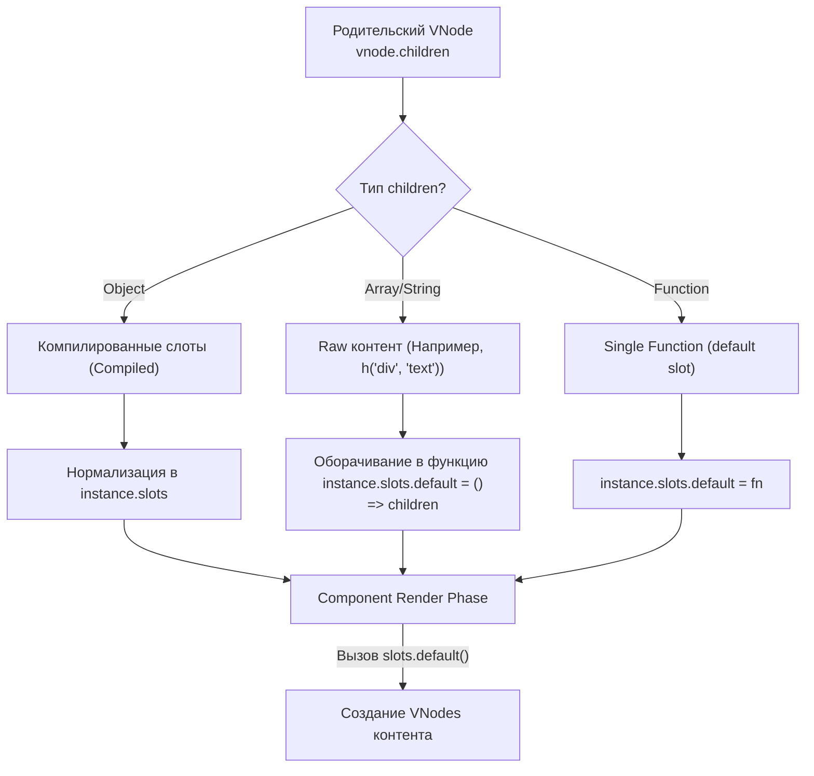

# Slots Normalization

## Концепция и Архитектура (Mental Model)

Слоты (Slots) в Vue — это механизм проекции контента (Content Projection). Архитектурно слот в Vue 3 — это всегда **Функция**, возвращающая массив VNodes (Render Function). Даже статический слот без параметров (`<template>Привет</template>`) под капотом компилируется в функцию `() => [h(Text, 'Привет')]`.

Почему слоты — это функции? 
1. **Scoped Slots:** Позволяет передавать аргументы из дочернего компонента родительскому (т.к. мы можем вызвать функцию `slotFn(scope)`).
2. **Ленивый рендеринг (Lazy Evaluation):** Если слот обернут в `v-if="false"` внутри ребенка, функция слота просто не вызовется. Родительский компонент не будет тратить время на создание VNodes для этого слота. Это огромный скачок в производительности по сравнению с Vue 2.

Процесс `normalizeSlots` отвечает за то, чтобы все переданные детям свойства (строки, массивы, функции) были приведены к единообразному интерфейсу: объекту, где ключи — имена слотов, а значения — функции генерации.

## Визуализация (Mermaid)



## Ссылки на исходный код (Source Code References)
- **Нормализация слотов:** `packages/runtime-core/src/componentSlots.ts` (функции `initSlots`, `normalizeObjectSlots`)

## Разбор реализации (Code Deep Dive)

Процесс нормализации происходит в начале фазы монтирования компонента.

```typescript
// packages/runtime-core/src/componentSlots.ts

export function initSlots(
  instance: ComponentInternalInstance,
  children: VNodeNormalizedChildren
) {
  if (instance.vnode.shapeFlag & ShapeFlags.SLOTS_CHILDREN) {
    // Если флаг говорит, что дети - это слоты (скомпилировано из шаблона)
    const type = (children as RawSlots)._
    if (type) {
      // Это скомпилированный объект слотов от Compiler DOM
      // Мы можем просто присвоить его instance.slots
      instance.slots = cloneIfMounted(children as Slots)
      // Оптимизация: помечаем, что слоты стабильны и не требуют глубокого diffing
      def(instance.slots, '_', type)
    } else {
      normalizeObjectSlots(children as RawSlots, (instance.slots = {}), instance)
    }
  } else {
    // Fallback: ручное использование render-функции (h)
    // Разработчик написал `h(Component, 'text')` или `h(Component, [h('div')])`
    instance.slots = {}
    if (children) {
      // Весь этот raw-контент складывается в дефолтный слот!
      normalizeVNodeSlots(instance, children)
    }
  }
  
  // Защита для Public API, чтобы слоты всегда возвращали Proxy
  def(instance.slots, InternalObjectKey, 1)
}

function normalizeVNodeSlots(
  instance: ComponentInternalInstance,
  children: VNodeNormalizedChildren
) {
  // Оборачиваем статические VNode в ленивую функцию
  const normalized = normalizeVNode(children)
  // instance.slots.default теперь возвращает массив VNodes
  instance.slots.default = () => [normalized]
}
```

## Оптимизации и Edge Cases (Подводные камни)

- **Slot Flags (`_` property):** Скомпилированный объект слотов всегда содержит скрытое свойство `_`. Это перечисление (`SlotFlags`), которое говорит рендереру о типе слотов: `STABLE` (1), `DYNAMIC` (2) или `FORWARDED` (3). Если слоты `STABLE` (что бывает в 90% случаев), ядро Vue знает, что при перерендере родителя слоты ребенка не изменились, и ребенку *не нужно* перерендериваться (Bail Out).
- **Разрыв реактивности (Reactivity Disconnect):** Слоты всегда вычисляются (invoke) в контексте Родителя, так как именно родитель скомпилировал эту функцию-слот. Однако *вызов* этой функции происходит внутри метода `render()` Ребенка. Это означает, что если внутри слота есть реактивная переменная родителя (`state.msg`), то при изменении этой переменной Vue заставит перерендериться *только родителя* (ведь он владелец зависимости), а родитель затем вызовет обновление ребенка и передаст ему новые слоты.
- **VNode Proxying (Forwarding):** Когда вы пробрасываете слот дальше (`<template #default><slot /></template>`), Vue использует флаг `FORWARDED`. Это сигнал рендереру не создавать лишние слои абстракций, а просто передать ссылку на оригинальную функцию-слот из инстанса деда напрямую внуку.
