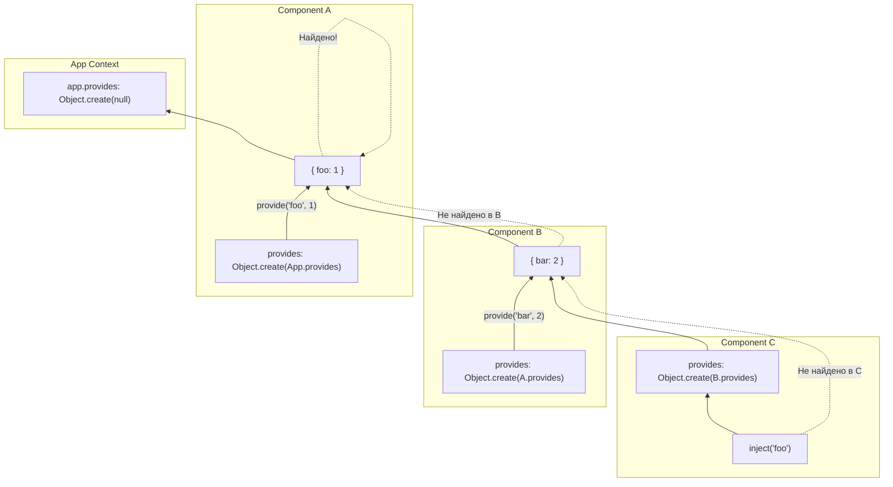

# Provide / Inject Chain

## Концепция и Архитектура (Mental Model)

Provide/Inject — это механизм Dependency Injection (DI) в Vue, позволяющий пробрасывать данные сквозь дерево компонентов, минуя необходимость передавать пропсы на каждом уровне (решение проблемы "Prop Drilling"). 

Архитектурно этот механизм опирается на **цепочку прототипов JavaScript (Prototype Chain)**. Каждый инстанс компонента имеет свой объект `provides`. По умолчанию, он указывает на объект `provides` своего родителя как на прототип. Это создает графовую структуру, где поиск зависимости (`inject`) работает ровно так же, как поиск свойства в прототипе JS: движок поднимается вверх по цепочке, пока не найдет значение или не достигнет корня (`app.provides`).

## Визуализация (Mermaid)



## Ссылки на исходный код (Source Code References)
- **Provide/Inject API:** `packages/runtime-core/src/apiInject.ts`
- **Инициализация в компоненте:** `packages/runtime-core/src/component.ts` (функция `createComponentInstance`)

## Разбор реализации (Code Deep Dive)

Магия Provide/Inject заключается в том, как инициализируется объект `provides` при создании компонента.

```typescript
// packages/runtime-core/src/apiInject.ts

export function provide<T>(key: InjectionKey<T> | string | number, value: T) {
  if (!currentInstance) {
    if (__DEV__) warn(`provide() can only be used inside setup().`)
    return
  }
  
  let provides = currentInstance.provides
  // По умолчанию инстанс компонента наследует provides родителя.
  // Но если компонент хочет сделать свой provide, он должен создать свой собственный
  // объект provides, где прототипом будет объект provides родителя.
  const parentProvides =
    currentInstance.parent && currentInstance.parent.provides
  
  // Проверка: мы мутируем ли мы уже собственный объект или всё ещё ссылаемся на родительский?
  if (parentProvides === provides) {
    // Создаем новый объект с прототипом родителя! (Ключевая логика)
    provides = currentInstance.provides = Object.create(parentProvides)
  }
  
  // Сохраняем значение
  provides[key as string] = value
}

export function inject(
  key: InjectionKey<any> | string,
  defaultValue?: unknown,
  treatDefaultAsFactory = false
) {
  // Получаем текущий активный инстанс
  const instance = currentInstance || currentRenderingInstance
  if (instance) {
    // Если компонент в корне, берем appContext.provides, иначе родительский
    const provides =
      instance.parent == null
        ? instance.vnode.appContext && instance.vnode.appContext.provides
        : instance.parent.provides

    if (provides && (key as string | symbol) in provides) {
      // Ключевой момент: in оператор ищет по всей цепочке прототипов!
      return provides[key as string]
    } else if (arguments.length > 1) {
      // Возврат fallback / defaultValue
      return treatDefaultAsFactory && isFunction(defaultValue)
        ? defaultValue.call(instance.proxy)
        : defaultValue
    } else if (__DEV__) {
      warn(`injection "${String(key)}" not found.`)
    }
  }
}
```

## Оптимизации и Edge Cases (Подводные камни)

- **O(1) Memory & Prototype Delegation:** Использование `Object.create(parentProvides)` — гениальное решение. Если компонент ничего не "провайдит", он просто хранит ссылку на `provides` родителя (нулевые затраты по памяти). Поиск при `inject` делегируется самому быстрому механизму JS движков — Prototype Chain Resolving.
- **Предотвращение мутаций родителя:** Проверка `parentProvides === provides` необходима. При инициализации `instance.provides = parent.provides`. Если бы мы сразу записали `instance.provides[key] = value`, мы бы мутировали объект родителя, и эти данные утекли бы "вверх" и к "сиблингам". Создание `Object.create` происходит *лениво* — только в момент первого вызова `provide()` внутри этого компонента.
- **Реактивность:** Сам DI контейнер не реактивен. Но если `value` является `ref` или `reactive`, то получатель сможет отслеживать изменения. Именно так работают Vue Router (провайдит реактивный текущий route) и Pinia.
