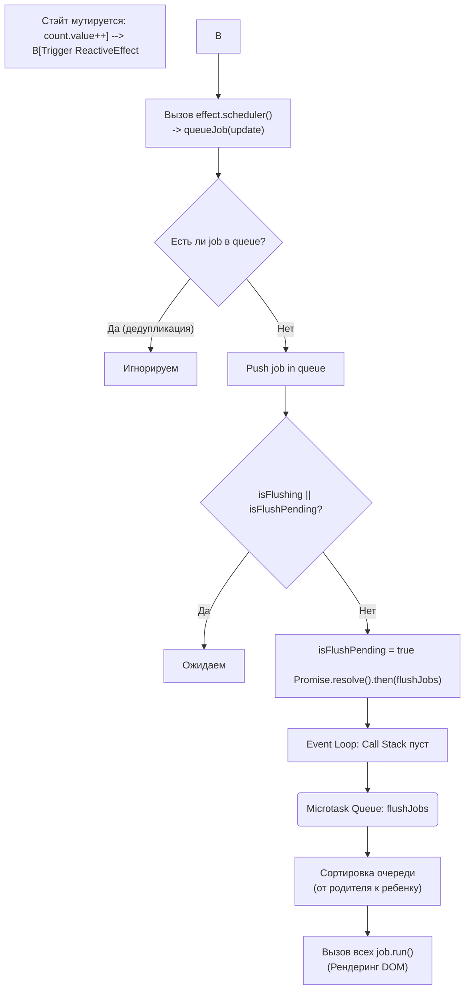

# Job Queue & Microtasks

## Концепция и Архитектура (Mental Model)

Когда реактивное состояние Vue изменяется (`count.value++`), компонент не перерисовывается моментально в ту же миллисекунду. В противном случае, мутация массива в цикле `for` заставила бы Vue отрендерить страницу тысячу раз.

Архитектура Vue опирается на **Планировщик (Scheduler)** и систему **Асинхронного Батчинга (Async Batching)**. Суть: когда реактивный эффект срабатывает, планировщик не выполняет его сразу, а кладет в очередь (Job Queue). Если в очереди уже есть задача с таким же ID (от того же компонента), она дедуплицируется (игнорируется). В конце текущего Event Loop, используя **Microtasks** (Promise), планировщик "флашит" (очищает) очередь, выполняя рендеринг один раз с итоговым состоянием стейта.

## Визуализация (Mermaid)



## Ссылки на исходный код (Source Code References)
- **Ядро планировщика:** `packages/runtime-core/src/scheduler.ts`
- **Асинхронная отложенность:** `nextTick()` (`packages/runtime-core/src/scheduler.ts`)

## Разбор реализации (Code Deep Dive)

Код планировщика строится вокруг нескольких массивов-очередей (Pre, Render, Post) и промиса.

```typescript
// packages/runtime-core/src/scheduler.ts

const queue: SchedulerJob[] = [] // Очередь рендеринга
let isFlushing = false
let isFlushPending = false
const resolvedPromise = Promise.resolve() as Promise<any>
let currentFlushPromise: Promise<void> | null = null

export function queueJob(job: SchedulerJob) {
  // 1. Дедупликация. Array.includes медленный, поэтому используются индексы.
  if (
    (!queue.length ||
      !queue.includes(
        job,
        isFlushing && job.allowRecurse ? flushIndex + 1 : flushIndex
      )) &&
    job !== currentPreFlushParentJob
  ) {
    if (job.id == null) {
      queue.push(job)
    } else {
      // Вставка по ID для поддержания порядка
      queue.splice(findInsertionIndex(job.id), 0, job)
    }
    
    // 2. Инициируем флашинг
    queueFlush()
  }
}

function queueFlush() {
  if (!isFlushing && !isFlushPending) {
    isFlushPending = true
    // 3. Создаем Микрозадачу в Event Loop!
    currentFlushPromise = resolvedPromise.then(flushJobs)
  }
}

function flushJobs(seen?: CountMap) {
  isFlushPending = false
  isFlushing = true

  // 4. Сортировка перед запуском (Критически важно!)
  // Компоненты сортируются по их id (который является счетчиком `uid`).
  // Родители создаются раньше детей, поэтому их uid меньше.
  // Это гарантирует, что Родитель обновится ДО Ребенка.
  queue.sort(comparator)

  try {
    for (flushIndex = 0; flushIndex < queue.length; flushIndex++) {
      const job = queue[flushIndex]
      if (job && job.active !== false) {
        callWithErrorHandling(job, null, ErrorCodes.SCHEDULER) // job() обычно это effect.run()
      }
    }
  } finally {
    flushIndex = 0
    queue.length = 0
    // Выполнение Post Flush (onUpdated, onMounted и т.д.)
    flushPostFlushCbs(seen)
    isFlushing = false
    currentFlushPromise = null
  }
}

export function nextTick<T = void>(
  this: T,
  fn?: (this: T) => void
): Promise<void> {
  const p = currentFlushPromise || resolvedPromise
  return fn ? p.then(this ? fn.bind(this) : fn) : p
}
```

## Оптимизации и Edge Cases (Подводные камни)

- **Почему Microtasks (Promise.resolve), а не Macrotasks (setTimeout)?** Микрозадачи выполняются браузером *до* того, как он перерисует экран (Paint). Если использовать `setTimeout`, браузер сначала отрисует "промежуточное" состояние, а потом запустит таймер и Vue обновит DOM, вызывая моргание (Flicker) и лаги.
- **Сортировка очереди (`queue.sort`)**: Почему родитель должен обновляться первым? Если родительский компонент при обновлении размонтирует (unmount) дочерний `v-if="false"`, нам не нужно тратить CPU на обновление дочернего компонента! Сортировка гарантирует, что если ребенок был в очереди, но его родитель удалил его при своем рендере, то вызов `job.run()` для ребенка отменится.
- **Магия `nextTick`**: Функция `nextTick` просто прикрепляется к текущему `currentFlushPromise` (`p.then(fn)`). Так как `flushJobs` тоже прикреплен к промису, цепочка `.then()` гарантирует, что ваш колбэк выполнится строго после завершения `flushJobs` (когда DOM уже обновлен).
