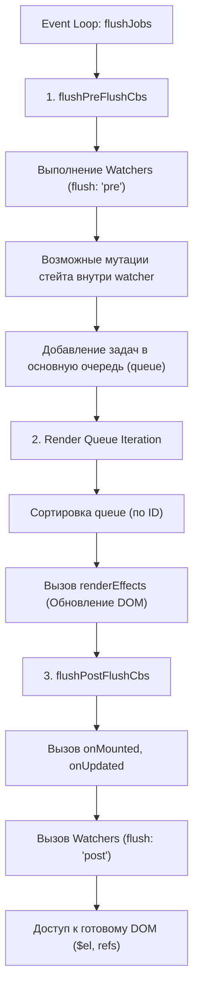

# Pre-flush vs Post-flush

## Концепция и Архитектура (Mental Model)

Очередь задач (Job Queue) в Vue 3 не монолитна. Планировщик разделяет задачи на три "ведра" (buckets), основываясь на времени их выполнения (Таймингах):
1. **Pre-flush Queue:** Выполняется *до* рендеринга компонентов. Здесь лежат Watchers с `flush: 'pre'` (по умолчанию). Они позволяют реагировать на изменения стейта до того, как они попадут в DOM.
2. **Sync / Render Queue:** Синхронная очередь рендеринга (основная). Здесь вызываются `patch()` и обновляется DOM.
3. **Post-flush Queue:** Выполняется *после* того, как весь DOM был обновлен. Здесь живут хуки `onMounted`, `onUpdated`, Watchers с `flush: 'post'` и директивные хуки (`mounted`, `updated`).

Архитектурная цель этого разделения — дать разработчикам возможность безопасно обращаться к актуальному (отрисованному) DOM только в Post-flush фазе, а мутации стейта, не требующие DOM, держать в Pre-flush, чтобы не вызывать повторный цикл рендеринга.

## Визуализация (Mermaid)



## Ссылки на исходный код (Source Code References)
- **Планировщик:** `packages/runtime-core/src/scheduler.ts` (`flushPreFlushCbs`, `flushPostFlushCbs`, `queuePostRenderEffect`)

## Разбор реализации (Code Deep Dive)

Управление Post и Pre очередями реализуется через отдельные массивы. Внутри функции `flushJobs` вызовы строго упорядочены.

```typescript
// packages/runtime-core/src/scheduler.ts

// Отдельные массивы для разных фаз
const pendingPreFlushCbs: SchedulerJob[] = []
let activePreFlushCbs: SchedulerJob[] | null = null

const pendingPostFlushCbs: SchedulerJob[] = []
let activePostFlushCbs: SchedulerJob[] | null = null

export function queuePreFlushCb(cb: SchedulerJob) {
  queueCb(cb, activePreFlushCbs, pendingPreFlushCbs, preFlushIndex)
}

export function queuePostFlushCb(cb: SchedulerJobs) {
  queueCb(cb, activePostFlushCbs, pendingPostFlushCbs, postFlushIndex)
}

function flushJobs(seen?: CountMap) {
  isFlushPending = false
  isFlushing = true

  // --- ФАЗА 1: PRE-FLUSH ---
  // Запускается ДО основной очереди. Это нужно, чтобы Watchers могли
  // затриггерить дополнительные эффекты до рендеринга.
  flushPreFlushCbs(seen)

  // --- ФАЗА 2: RENDER ---
  queue.sort(comparator)
  for (flushIndex = 0; flushIndex < queue.length; flushIndex++) {
    const job = queue[flushIndex]
    if (job) job() // Рендеринг и патч DOM
  }

  // --- ФАЗА 3: POST-FLUSH ---
  // Запускается ПОСЛЕ того, как вся Render Queue опустела
  flushPostFlushCbs(seen)
  
  isFlushing = false
}

export function flushPostFlushCbs(seen?: CountMap) {
  if (pendingPostFlushCbs.length) {
    // Дедупликация (удаление повторяющихся callback'ов, например, вызовы одного и того же хука)
    const deduped = [...new Set(pendingPostFlushCbs)]
    pendingPostFlushCbs.length = 0

    // Если Post-flush уже выполняется, добавляем в конец активного массива
    if (activePostFlushCbs) {
      activePostFlushCbs.push(...deduped)
      return
    }

    activePostFlushCbs = deduped
    
    // Сортировка Post-хуков по ID компонента.
    // Важно: в отличие от Render фазы (где порядок Родитель -> Ребенок),
    // хуки onMounted/onUpdated ДОЛЖНЫ выполняться от Ребенка к Родителю (Дети монтируются первыми)!
    activePostFlushCbs.sort((a, b) => getId(a) - getId(b))

    for (postFlushIndex = 0; postFlushIndex < activePostFlushCbs.length; postFlushIndex++) {
      activePostFlushCbs[postFlushIndex]()
    }
    
    activePostFlushCbs = null
    postFlushIndex = 0
  }
}
```

## Оптимизации и Edge Cases (Подводные камни)

- **Post-flush Сортировка (Bottom-Up):** Обратите внимание на сортировку в `flushPostFlushCbs`. Во время рендера (Render phase), сортировка гарантирует, что компонент обновится *до* своих детей (чтобы не было лишних перерендеров детей, если их пропсы изменятся родителем). Однако `onMounted` и `onUpdated` хуки должны вызываться *снизу-вверх*. Вы не можете сказать, что Родитель "смонтирован", если его Дети еще не смонтированы!
- **Мутации DOM внутри Post-flush:** Если внутри `onUpdated` или `watchPostEffect` вы снова измените реактивный стейт `count.value++`, планировщик (через `queueJob`) снова запустит весь цикл (Event Loop microtask). Это может привести к бесконечному циклу обновлений.
- **Очереди внутри очередей:** Вызов функции `flushPreFlushCbs()` может добавить новые задачи в основную `queue` рендеринга. Именно поэтому она вызывается *перед* сортировкой и выполнением основной очереди.
