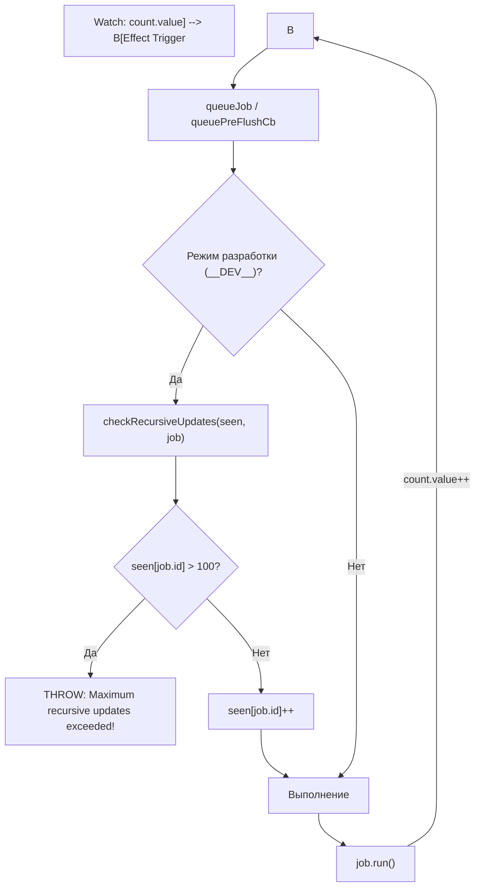

# Recursive Updates Guard

## Концепция и Архитектура (Mental Model)

Синхронная или асинхронная бесконечная рекурсия — страшный сон любого фреймворка. Во Vue это может произойти, если:
1. Компонент в процессе рендеринга синхронно мутирует стейт, который он же сам и читает.
2. Watcher мутирует переменную, за которой он наблюдает, что вызывает Watcher снова.

Для защиты от этого планировщик (Scheduler) в `runtime-core` реализует механизм **Recursive Updates Guard (Защита от рекурсивных обновлений)**. Он отслеживает, сколько раз конкретный Job (Render Effect или Watcher) был добавлен в очередь в рамках одного "флаша" (Tick). Если этот лимит превышает определенный порог (в Vue 3 это 100 итераций), приложение жестко прерывается с выбросом ошибки.

## Визуализация (Mermaid)



## Ссылки на исходный код (Source Code References)
- **Функция проверки:** `packages/runtime-core/src/scheduler.ts` (`checkRecursiveUpdates`)

## Разбор реализации (Code Deep Dive)

Механизм реализован с использованием словаря `Map` (`CountMap`), где ключом выступает сам Job или его ID, а значением — счетчик вызовов. Эта проверка активна только в Development-сборке для производительности (в production разработчик сам виноват, если у него бесконечный цикл).

```typescript
// packages/runtime-core/src/scheduler.ts

type CountMap = Map<SchedulerJob, number>

const RECURSION_LIMIT = 100 // Лимит итераций

function checkRecursiveUpdates(seen: CountMap, fn: SchedulerJob) {
  if (!seen.has(fn)) {
    seen.set(fn, 1)
  } else {
    const count = seen.get(fn)!
    if (count > RECURSION_LIMIT) {
      const instance = fn.ownerInstance
      const componentName = instance && getComponentName(instance.type)
      
      // Критическая ошибка фреймворка
      warn(
        `Maximum recursive updates exceeded${
          componentName ? ` in component <${componentName}>` : ``
        }. ` +
          `This means you have a reactive effect that is mutating its own ` +
          `dependencies and thus recursively triggering itself. Possible sources ` +
          `include component template, render function, updated hook or ` +
          `watcher source function.`
      )
      return true // True значит "Рекурсия обнаружена, остановись"
    } else {
      // Увеличиваем счетчик
      seen.set(fn, count + 1)
    }
  }
}

// Пример использования внутри flushJobs:
function flushJobs(seen?: CountMap) {
  if (__DEV__) {
    // В DEV режиме инициализируем Map
    seen = seen || new Map()
  }
  
  // ...
  for (flushIndex = 0; flushIndex < queue.length; flushIndex++) {
    const job = queue[flushIndex]
    
    // Передача seen в checkRecursiveUpdates.
    // Обратите внимание, что job может снова добавить себя в конец очереди!
    if (__DEV__ && checkRecursiveUpdates(seen!, job)) {
      continue // Пропускаем выполнение этого job
    }
    
    job()
  }
}
```

## Оптимизации и Edge Cases (Подводные камни)

- **Почему Limit = 100?** Значение `100` выбрано эвристически. В сложных интерфейсах (например, каскадные автовычисляемые формы) может возникнуть ситуация, когда обновление поля А триггерит обновление поля B, затем C, D и так далее по цепочке. Цепочки в 10-20 обновлений за тик вполне реальны. Но более 100 обновлений одного и того же элемента — это 100% архитектурная ошибка (бесконечный цикл).
- **Разрешенная Рекурсия (`allowRecurse`):** Иногда компоненту *нужно* обновить себя в процессе своего же жизненного цикла. Например, при обновлении компонента `Tree` или работе с `Transition`. В `ReactiveEffect` есть специальный флаг `effect.allowRecurse`. Если он установлен в `true`, рендерер разрешает эффекту повторно добавить себя в очередь, даже если он сейчас выполняется. Но Guard на 100 итераций всё равно продолжает следить за ним!
- **Отключение в Production:** Вызов `checkRecursiveUpdates` обернут в `if (__DEV__)`. В production сборке (после Terser) эта проверка полностью удаляется из бандла (Dead Code Elimination). Если в production возникнет бесконечный рекурсивный цикл реактивности, браузерная вкладка просто зависнет (Out of Memory или Maximum Call Stack), так как планировщик будет бесконечно наполнять очередь микрозадач.
