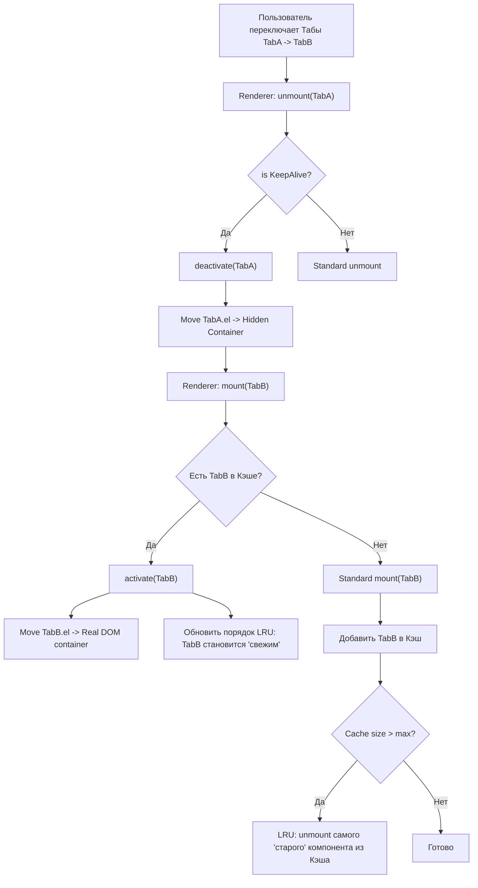

# KeepAlive LRU Cache

## Концепция и Архитектура (Mental Model)

Компонент `<KeepAlive>` — это встроенный (built-in) компонент ядра Vue, предназначенный для кэширования VNode и их инстансов при динамическом переключении (`<component :is="view">` или `vue-router`). 

Архитектурно `<KeepAlive>` не рендерит собственных DOM-узлов (это абстрактный компонент). Его единственная задача — перехватывать процесс размонтирования (`unmount`) дочернего компонента. Вместо физического удаления узла и уничтожения инстанса, он перемещает DOM-элемент в скрытый `DocumentFragment` (Off-DOM storage), а ссылку на инстанс кладет во внутренний кэш. 

Управление памятью кэша работает на основе классического алгоритма **LRU (Least Recently Used — Вытеснение давно неиспользуемых)**.

## Визуализация (Mermaid)



## Ссылки на исходный код (Source Code References)
- **Реализация KeepAlive:** `packages/runtime-core/src/components/KeepAlive.ts`

## Разбор реализации (Code Deep Dive)

`KeepAlive` реализован как обычный stateful компонент, но внутри `setup()` он напрямую манипулирует рендерером.

```typescript
// packages/runtime-core/src/components/KeepAlive.ts

export const KeepAliveImpl = {
  name: `KeepAlive`,
  // Компонент является 'абстрактным' (__isKeepAlive)
  __isKeepAlive: true,

  setup(props, { slots }) {
    const instance = currentInstance!
    const sharedContext = instance.ctx as KeepAliveContext

    // LRU Cache Структуры
    const cache: CacheKeyMap = new Map() // Кэш: Key -> VNode
    const keys: Set<CacheKey> = new Set() // Очередь LRU (Set сохраняет порядок вставки в JS!)

    let current: VNode | null = null

    // Перехват функций рендерера!
    sharedContext.activate = (vnode, container, anchor, isSVG, optimized) => {
      const instance = vnode.component!
      // Перемещение DOM узла из скрытого контейнера в реальный
      move(vnode, container, anchor, MoveType.ENTER, parentSuspense)
      // Вызов activated хуков
      queuePostRenderEffect(() => invokeArrayFns(instance.a!), parentSuspense)
    }

    sharedContext.deactivate = (vnode: VNode) => {
      const instance = vnode.component!
      // Перемещение в скрытый storage (storageContainer)
      move(vnode, storageContainer, null, MoveType.LEAVE, parentSuspense)
      // Вызов deactivated хуков
      queuePostRenderEffect(() => invokeArrayFns(instance.da!), parentSuspense)
    }

    return () => {
      if (!slots.default) return null
      
      const children = slots.default()
      const vnode = children[0] // KeepAlive кэширует только первый дочерний элемент
      
      const key = vnode.key == null ? vnode.type : vnode.key
      const cachedVNode = cache.get(key)

      if (cachedVNode) {
        // Компонент найден в кэше!
        vnode.el = cachedVNode.el
        vnode.component = cachedVNode.component
        
        // Магия LRU: удаляем ключ и вставляем в конец Set (помечаем как самый новый)
        keys.delete(key)
        keys.add(key)
        
        // Флаг для Renderer: НЕ монтировать, а активировать!
        vnode.shapeFlag |= ShapeFlags.COMPONENT_KEPT_ALIVE
      } else {
        // Новый компонент: добавляем в кэш
        keys.add(key)
        
        // Проверка лимита (LRU вытеснение)
        if (props.max && keys.size > parseInt(props.max as string, 10)) {
          // Самый первый элемент в Set — самый старый (Least Recently Used)
          const oldestKey = keys.values().next().value
          const oldestVNode = cache.get(oldestKey)
          // Физическое удаление старого инстанса
          unmount(oldestVNode)
          cache.delete(oldestKey)
          keys.delete(oldestKey)
        }
      }

      cache.set(key, vnode)
      // Флаг для Renderer: при unmount НЕ удалять, а деактивировать!
      vnode.shapeFlag |= ShapeFlags.COMPONENT_SHOULD_KEEP_ALIVE
      current = vnode
      return vnode
    }
  }
}
```

## Оптимизации и Edge Cases (Подводные камни)

- **LRU через `Set` (Hack):** В JavaScript структура данных `Set` (в отличие от обычных Object) сохраняет порядок вставки элементов. Когда мы делаем `keys.delete(key)` и затем сразу `keys.add(key)`, мы эффективно перемещаем ключ в самый конец очереди за O(1). Когда нам нужно удалить самый старый элемент, мы берем `keys.values().next().value` — это всегда первый вставленный элемент (голова очереди). Это гениальная и элегантная реализация LRU-алгоритма.
- **Взаимодействие с Renderer:** Ядро `runtime-core` (функции `patch` и `unmount`) имеет жестко закодированную поддержку `KeepAlive`. При `unmount`, если рендерер видит на узле `shapeFlag & ShapeFlags.COMPONENT_SHOULD_KEEP_ALIVE`, он пропускает стандартную логику уничтожения и вызывает `instance.ctx.deactivate(vnode)`. Это форма инверсии контроля (Inversion of Control).
- **Storage Container:** Деактивированный DOM-узел изымается из документа и помещается в `storageContainer`. В `runtime-dom` этим контейнером служит просто `document.createElement('div')` (который нигде не прикреплен к body). Это гарантирует, что кэшированные узлы не видны пользователю, не участвуют в layout-движке браузера, но сохраняют свое внутреннее состояние (например, фокус инпутов или позицию скролла).
