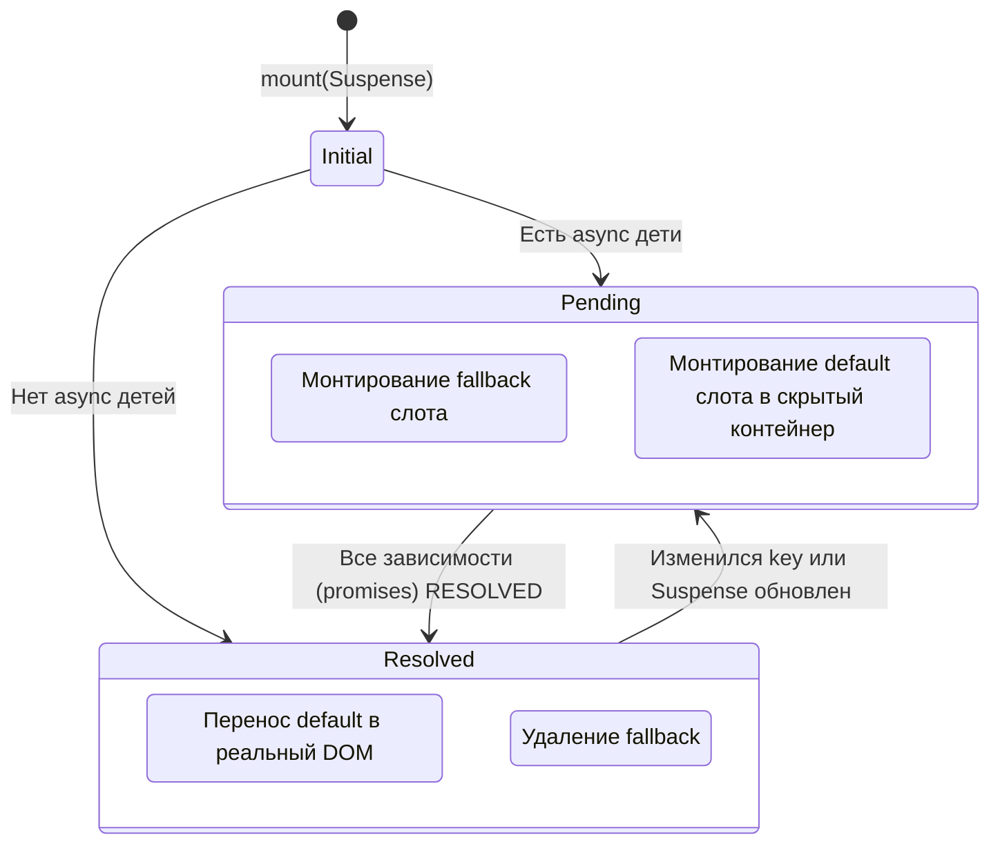

# Suspense State Machine

## Концепция и Архитектура (Mental Model)

Компонент `<Suspense>` позволяет оркестрировать асинхронные зависимости в дереве компонентов. До Vue 3 разработчикам приходилось в каждом компоненте делать стейт `isLoading`, крутить спиннеры и обрабатывать ошибки отдельно. Suspense позволяет дочерним компонентам иметь `async setup()` (или использовать `defineAsyncComponent`). В это время `<Suspense>` перехватывает их Promise и отображает `fallback` (например, Skeleton loader) до тех пор, пока *все* вложенные асинхронные дети не зарезолвятся.

Архитектурно Suspense представляет собой **Конечный Автомат (State Machine)**, управляющий переходами между тремя состояниями:
1. **PENDING:** Ожидание загрузки (показывает `fallback` слот).
2. **RESOLVED:** Загрузка завершена (показывает `default` слот).
3. **FALLBACK:** (Техническое состояние) Ветка `default` скрыта, ветка `fallback` активна.

## Визуализация (Mermaid)



## Ссылки на исходный код (Source Code References)
- **Реализация Suspense:** `packages/runtime-core/src/components/Suspense.ts`

## Разбор реализации (Code Deep Dive)

Как и `Teleport`, `Suspense` имеет свою специфичную имплементацию.

```typescript
// packages/runtime-core/src/components/Suspense.ts

export const SuspenseImpl = {
  name: 'Suspense',
  __isSuspense: true,
  
  process(n1, n2, container, anchor, parentComponent, parentSuspense, ...) {
    if (n1 == null) {
      mountSuspense(n2, container, anchor, parentComponent, parentSuspense, ...)
    } else {
      patchSuspense(n1, n2, container, anchor, parentComponent, isSVG, ...)
    }
  }
}

function mountSuspense(vnode, container, anchor, parentComponent, parentSuspense, ...) {
  // 1. Создание границы Suspense (SuspenseBoundary)
  const suspense: SuspenseBoundary = (vnode.suspense = createSuspenseBoundary(
    vnode, parentSuspense, parentComponent, container, anchor, ...
  ))

  // 2. Инициализация (Resolve слотов)
  const { content, fallback } = normalizeSuspenseChildren(vnode)
  suspense.subTree = content // default слот
  suspense.fallbackTree = fallback

  // 3. Монтирование Default ветки!
  // Да, мы рендерим default слот СРАЗУ, но в СКРЫТЫЙ контейнер (Off-DOM).
  // Это нужно, чтобы "пнуть" async setup() у детей и заставить их вернуть Promises.
  const hiddenContainer = document.createElement('div')
  suspense.isResolving = true
  
  mountChildren(suspense.subTree, hiddenContainer, null, parentComponent, suspense)
  
  // 4. Оценка состояния
  suspense.isResolving = false
  if (suspense.deps > 0) {
    // Если в процессе монтирования default ветки кто-то зарегистрировал зависимость
    // (например, компонент вернул Promise из async setup)
    // Монтируем fallback в реальный DOM
    mountChildren(suspense.fallbackTree, container, anchor, parentComponent, parentSuspense)
    suspense.state = SuspenseState.PENDING
  } else {
    // Асинхронностей нет. Просто переносим default ветку в реальный DOM.
    move(suspense.subTree, container, anchor, MoveType.ENTER)
    suspense.state = SuspenseState.RESOLVED
  }
}

export function registerSuspenseInstance(
  instance: ComponentInternalInstance,
  suspense: SuspenseBoundary
) {
  // Эта функция вызывается из `setupStatefulComponent`, когда `setup` возвращает Promise
  suspense.deps++ // Увеличиваем счетчик ожидающих компонентов
  
  instance.asyncDep!.then(() => {
    suspense.deps--
    if (suspense.deps === 0) {
      // Все промисы завершились! Переключаем состояние.
      suspense.resolve()
    }
  })
}
```

## Оптимизации и Edge Cases (Подводные камни)

- **Монтирование в фоне (Off-DOM rendering):** Вы можете спросить: "Зачем рендерить default-слот до того, как загрузятся данные?". Дело в том, что в Vue (в отличие от React Concurrent Mode) рендеринг — это способ "обхода" дерева для поиска зависимостей. Если не запустить `render()` (в скрытом контейнере), Vue никогда не вызовет `async setup()` дочерних компонентов, и промисы просто не создадутся! Это называется *Waterfalling*. Suspense запускает рендер, собирает все `Promises` по всему поддереву, а в реальный DOM вставляет `fallback`. Когда все промисы готовы, скрытый DOM вставляется на страницу (очень быстрая операция `Node.insertBefore`).
- **Событие Timeout:** Если `fallback` появляется слишком быстро (на 50мс), это вызывает мерцание экрана. У Suspense есть `timeout` пропс (например, `timeout="200"`). `<Suspense>` задержит показ `fallback` на 200мс. Если данные загрузятся за 100мс, пользователь вообще не увидит лоадер (сразу контент). Если загрузка долгая, через 200мс появится лоадер.
- **Error Handling (Интеграция с ErrorBoundary):** Если один из `async setup()` выбросит исключение (`reject`), Suspense перехватит его через `onErrorCaptured`. Компонент перейдет в состояние ошибки. Suspense часто используется в паре с хуком обработки ошибок для показа UI ошибки вместо лоадера.
