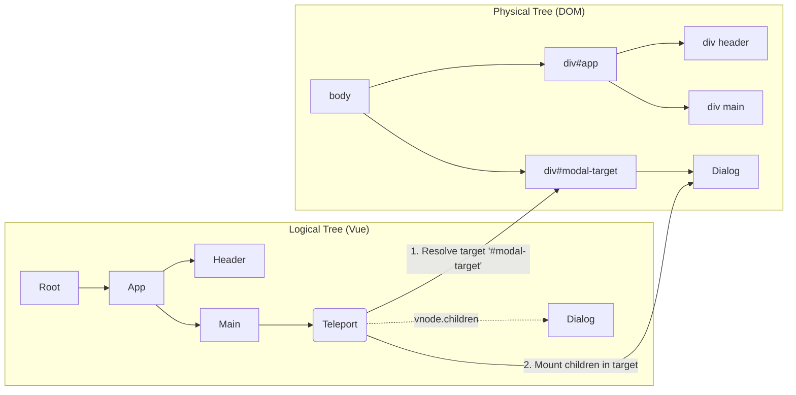

# Teleport Target Resolution

## Концепция и Архитектура (Mental Model)

Компонент `<Teleport>` решает классическую проблему UI: логически компонент (например, Модальное Окно или Tooltip) принадлежит определенному месту в дереве Vue, где он наследует контекст (Provide/Inject) и реактивное состояние. Но физически (в DOM) он должен быть отрендерен совершенно в другом месте (например, прямо в `<body>`), чтобы избежать проблем с `z-index`, `overflow: hidden` или `position: absolute` у родителей.

Архитектурно `<Teleport>` (как и `<KeepAlive>`) перехватывает фазу монтирования (mount). Вместо того чтобы вставлять дочерние элементы в текущий `container`, Teleport динамически резолвит (ищет) целевой `target` в DOM по селектору и делегирует монтирование детей в этот новый контейнер. При этом логическая связь (parent instance) остается нетронутой.

## Визуализация (Mermaid)



## Ссылки на исходный код (Source Code References)
- **Реализация Teleport:** `packages/runtime-core/src/components/Teleport.ts`

## Разбор реализации (Code Deep Dive)

В `runtime-core` `Teleport` — это не компонент (не функция `setup`), а специальный объект (Implementation Object) с методами `process`, `remove` и `move`. Рендерер при виде `ShapeFlags.TELEPORT` вызывает `process`.

```typescript
// packages/runtime-core/src/components/Teleport.ts

export const TeleportImpl = {
  __isTeleport: true,
  
  process(n1, n2, container, anchor, parentComponent, parentSuspense, isSVG, ...) {
    const { mc: mountChildren, pc: patchChildren, o: { insert, querySelector, createText, createComment } } = internals

    // 1. Создаем "Якорь" (Anchor) в оригинальном месте.
    // Teleport всегда оставляет комментарий в том месте дерева, где он был объявлен
    // Это нужно, чтобы знать позицию при размонтировании.
    const placeholder = (n2.el = __DEV__ ? createComment('teleport start') : createText(''))
    const mainAnchor = (n2.anchor = __DEV__ ? createComment('teleport end') : createText(''))
    insert(placeholder, container, anchor)
    insert(mainAnchor, container, anchor)

    // 2. Резолвинг Target-а
    const targetSelector = n2.props && n2.props.to
    let target = null
    
    if (isString(targetSelector)) {
      // Использование DOM API через nodeOps
      target = querySelector(targetSelector)
    } else {
      // target может быть передан как прямой DOM Element
      target = targetSelector
    }

    n2.target = target

    // 3. Mount или Patch
    if (n1 == null) {
      // Mount: вставляем дочерние VNodes ВНУТРЬ нового target контейнера!
      if (target) {
        mountChildren(n2.children, target, null, parentComponent, parentSuspense, isSVG)
      }
    } else {
      // Patch фаза
      if (n2.props.disabled) {
        // Если disabled=true, рендерим на старом месте (fallback to inline)
      } else {
        patchChildren(n1, n2, target, null, parentComponent, parentSuspense, isSVG)
        
        // Перемещение (Moving). Если пропс `to` изменился (#modal -> #body)
        if (n2.props.to !== n1.props.to) {
          const nextTarget = (n2.target = querySelector(n2.props.to))
          if (nextTarget) {
            // Переносим существующие DOM элементы в новый контейнер
            moveTeleport(n2, nextTarget, null, internals)
          }
        }
      }
    }
  },

  remove(vnode, parentComponent, parentSuspense, optimized) {
    const { um: unmount, o: { remove: hostRemove } } = internals
    // При удалении Teleport, мы должны:
    // 1. Удалить детей из удаленного target контейнера
    if (vnode.target) {
      unmountChildren(vnode.children, parentComponent, parentSuspense)
    }
    // 2. Удалить якоря из оригинального контейнера
    hostRemove(vnode.el)
    hostRemove(vnode.anchor)
  }
}
```

## Оптимизации и Edge Cases (Подводные камни)

- **Проблема Порядка Монтирования:** `querySelector` вызывается в момент монтирования компонента. Но если вы делаете `<Teleport to="#footer">`, а сам `<div id="footer">` находится *ниже* по дереву шаблонов и еще не смонтирован (не существует в DOM)? Vue выбросит warning, а Teleport сломается (target is null). Поэтому целевой контейнер должен быть либо вне Vue-приложения (в `index.html`), либо гарантированно смонтирован раньше (через `v-if` или порядок в шаблоне).
- **Disabled State:** Пропс `disabled` позволяет Teleport-у работать как обычный `<div>`, рендеря контент инлайн (по месту объявления). При динамическом переключении `disabled: false -> true`, Vue извлекает DOM-узлы из `target` и переносит их (move) обратно к оригинальному `anchor` (якорю) в главном приложении.
- **SSR Hydration:** Teleport создает огромные сложности для SSR. На сервере нет `document.querySelector`. Серверный рендерер собирает контент всех Teleports в специальный объект (буфер). В клиентском HTML контент телепортов вставляется в конец `<body>`, а на месте объявления оставляются маркеры `<!--teleport start-->`. Во время гидратации клиент "забирает" эти элементы из `<body>` и привязывает к ним VNode.
