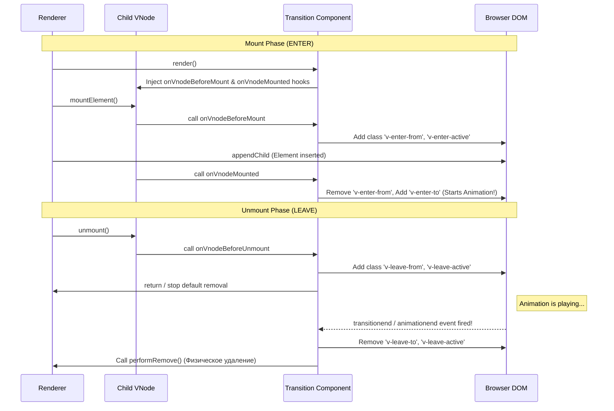

# Transition State Hooks

## Концепция и Архитектура (Mental Model)

Компонент `<Transition>` предназначен для анимации элементов при их добавлении, удалении или изменении в DOM. В отличие от остальных компонентов ядра, Transition уникален тем, что **манипулирует временем (Time)**.

Когда рендерер решает удалить узел (`unmount`), он удаляет его из DOM мгновенно. Но если узел обернут в Transition (например, уходит с экрана с анимацией `fade-out`), Transition вмешивается в процесс. Он говорит рендереру: *"Подожди, не удаляй этот элемент. Я навешу на него CSS-классы, дождусь события `transitionend` (или вызову JS-хук), и только потом сам вызову физическое удаление (remove)"*. 

Архитектура построена на паттерне **Хуков Жизненного Цикла VNode (VNode Hooks)** и **Инъекции Состояния (State Injection)**.

## Визуализация (Mermaid)



## Ссылки на исходный код (Source Code References)
- **Базовый класс:** `packages/runtime-core/src/components/BaseTransition.ts` (Core логика хуков)
- **DOM Имплементация:** `packages/runtime-dom/src/components/Transition.ts` (CSS классы и события)

## Разбор реализации (Code Deep Dive)

В `runtime-core` реализован `BaseTransition`. Это State-less компонент. Его задача — просто прокинуть хуки внутрь `vnode`.

```typescript
// packages/runtime-core/src/components/BaseTransition.ts

export const BaseTransitionImpl = {
  name: `BaseTransition`,
  props: {
    mode: String,
    appear: Boolean,
    persisted: Boolean,
    // JS хуки (onEnter, onLeave, etc)
    onBeforeEnter: Function,
    onEnter: Function,
    onLeave: Function,
    // ...
  },

  setup(props, { slots }) {
    const instance = currentInstance!
    const state = useTransitionState() // Локальный стейт транзиции

    return () => {
      const children = slots.default && slots.default()
      const child = children[0] // Transition работает только с 1 рутовым элементом

      // Ключевой момент: Инъекция Transition Hooks (Hooks Injection)
      // Мы мутируем VNode дочернего элемента, добавляя ему методы,
      // которые рендерер вызовет во время mount/unmount
      const hooks: TransitionHooks = resolveTransitionHooks(
        child,
        props,
        state,
        instance
      )
      setTransitionHooks(child, hooks)

      return child
    }
  }
}

export function resolveTransitionHooks(vnode, props, state, instance): TransitionHooks {
  return {
    // Вызывается перед вставкой в DOM
    beforeEnter(el) {
      if (props.onBeforeEnter) props.onBeforeEnter(el)
      // runtime-dom реализация добавит здесь 'v-enter-from' классы
    },

    // Вызывается после вставки в DOM
    enter(el) {
      if (props.onEnter) {
        props.onEnter(el, () => { /* done callback */ })
      }
      // Ожидание transitionend...
    },

    // ВМЕШАТЕЛЬСТВО В UNMOUNT!
    leave(el, remove) { // remove - это функция hostRemove(el) из рендерера!
      const performRemove = () => {
        remove() // Мы вызываем реальное удаление только когда решим сами!
        if (props.onAfterLeave) props.onAfterLeave(el)
      }

      if (props.onLeave) {
        // JS Transition: вызываем callback
        props.onLeave(el, performRemove)
      } else {
        // CSS Transition: навешиваем классы и ждем события
        // (логика делегируется в runtime-dom, но в итоге вызовется performRemove)
      }
    }
  }
}
```

Внутри `renderer.ts` при размонтировании есть проверка:
```typescript
// renderer.ts -> unmount()
const performRemove = () => hostRemove(vnode.el)

if (shapeFlag & ShapeFlags.ELEMENT && vnode.transition) {
  // Если у узла есть вшитые хуки транзиции, передаем контроль ей!
  vnode.transition.leave(vnode.el, performRemove)
} else {
  performRemove() // Обычное синхронное удаление
}
```

## Оптимизации и Edge Cases (Подводные камни)

- **Отделение Core от DOM:** Самая красивая часть архитектуры — это `BaseTransition`. В `runtime-core` нет ни слова про CSS-классы, `requestAnimationFrame` или `transitionend`. `runtime-core` просто реализует механизм "Захвата управления" (Inversion of Control) через хуки. А уже пакет `runtime-dom` экспортирует компонент `<Transition>`, который наследует `BaseTransition` и передает туда логику работы с классами (`v-enter-active`). Это позволяет использовать `<Transition>` даже в Canvas (где вы делаете JS-анимацию координат).
- **Режим Out-in (Modes):** Пропс `mode="out-in"` заставляет фреймворк подождать окончания анимации `Leave` старого компонента перед тем, как запустить анимацию `Enter` нового. Это достигается за счет сохранения `pending` (ожидающего) VNode в стейте Transition. `BaseTransition` перехватывает Mount нового элемента и блокирует его рендеринг, пока колбэк `onLeave` старого не завершится.
- **Forced Reflow (Hack):** Чтобы CSS транзиции сработали (переход от `v-enter-from` к `v-enter-to`), браузеру нужно принудительно пересчитать стили. В пакете `runtime-dom` вы найдете грязный, но необходимый хак: `document.body.offsetHeight`. Чтение этого свойства заставляет браузер синхронно применить стили `v-enter-from` перед тем, как скрипт добавит `v-enter-to` на следующем фрейме (через `requestAnimationFrame`).
