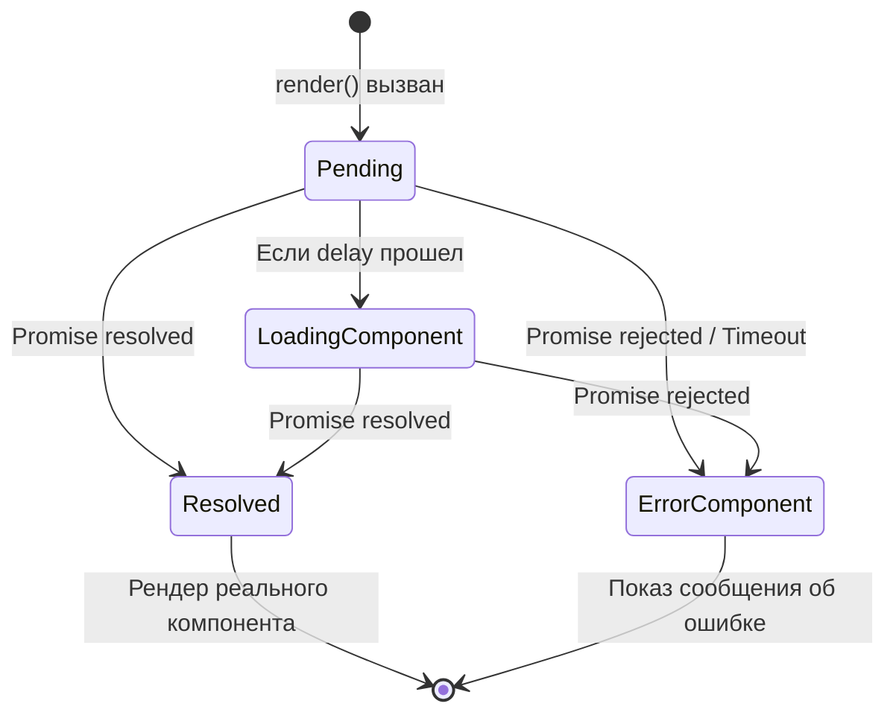

# Async Components Loader

## Концепция и Архитектура (Mental Model)

Асинхронные компоненты (`defineAsyncComponent`) — это механизм ленивой загрузки (Lazy Loading) компонентов. Они жизненно необходимы для разделения кода (Code Splitting) в бандлере (Webpack/Vite), чтобы не отправлять весь код приложения клиенту при первом рендере.

Архитектурно `defineAsyncComponent` создает функцию-обертку (Higher-Order Component). Этот HOC управляет состояниями промиса (загрузка, успех, ошибка), рендерит fallback-контент (индикатор загрузки или компонент ошибки) на время ожидания сети, а после успешного разрешения промиса — монтирует реальный "внутренний" компонент.

## Визуализация (Mermaid)



## Ссылки на исходный код (Source Code References)
- **Определение API:** `packages/runtime-core/src/apiAsyncComponent.ts`

## Разбор реализации (Code Deep Dive)

`defineAsyncComponent` возвращает "пустышку" — стейтфул компонент, который использует `setup()` для управления жизненным циклом загрузки.

```typescript
// packages/runtime-core/src/apiAsyncComponent.ts

export function defineAsyncComponent<
  T extends Component = { new (): ComponentPublicInstance }
>(source: AsyncComponentLoader<T> | AsyncComponentOptions<T>): T {
  // Нормализация опций (может быть передан просто промис-фабрика)
  const options = isFunction(source) ? { loader: source } : source
  const { loader, loadingComponent, errorComponent, delay = 200, timeout } = options

  // Кэш промиса, чтобы не вызывать loader дважды
  let pendingRequest: Promise<Component> | null = null
  let resolvedComp: Component | undefined

  return defineComponent({
    name: 'AsyncComponentWrapper',
    setup() {
      const instance = currentInstance!
      
      // Локальный стейт обертки
      const loaded = ref(false)
      const error = ref<Error>()
      const delayed = ref(!!delay)

      // Запуск загрузки
      if (!pendingRequest) {
        pendingRequest = loader()
          .then(comp => {
            // Поддержка ES Modules: import('./Comp.vue') возвращает { default: Comp }
            resolvedComp = comp.default || comp
            loaded.value = true
          })
          .catch(err => {
            error.value = err
          })
      }

      // Обработка delay для лоадера
      if (delay) {
        setTimeout(() => { delayed.value = false }, delay)
      }

      // Возвращаем render функцию
      return () => {
        if (loaded.value && resolvedComp) {
          // Успех: рендерим настоящий компонент, прокидывая все пропсы и слоты
          return createInnerComp(resolvedComp, instance)
        } else if (error.value && errorComponent) {
          // Ошибка
          return createVNode(errorComponent, { error: error.value })
        } else if (loadingComponent && !delayed.value) {
          // Лоадер (после задержки)
          return createVNode(loadingComponent)
        }
        // Ничего (ожидание delay)
        return null
      }
    }
  }) as any
}

function createInnerComp(comp: Component, parent: ComponentInternalInstance) {
  // Клонируем пропсы, слоты и передаем реальному компоненту
  const vnode = createVNode(comp, parent.vnode.props)
  vnode.children = parent.vnode.children
  return vnode
}
```

## Оптимизации и Edge Cases (Подводные камни)

- **Защита от моргания (Flicker Prevention):** Параметр `delay` (по умолчанию 200ms) решает классическую проблему UI. Если сеть быстрая, показ спиннера на 50ms вызовет неприятное "моргание" интерфейса. Загрузчик рендерит `null`, пока не пройдет `delay`.
- **Interop с ES Modules:** Функция `loader` (обычно `() => import('./Foo.vue')`) резолвится в модуль. Vue проверяет наличие `comp.default`, так как бандлеры кладут экспорт по умолчанию в это свойство.
- **Интеграция с Suspense:** Асинхронные компоненты в Vue 3 нативно интегрированы с `<Suspense>`. Если `defineAsyncComponent` используется внутри Suspense, HOC отдает управление промисом родителю (Suspense), который сам занимается отрисовкой fallback-контента. В коде это достигается за счет возврата Promise из `setup()`.
