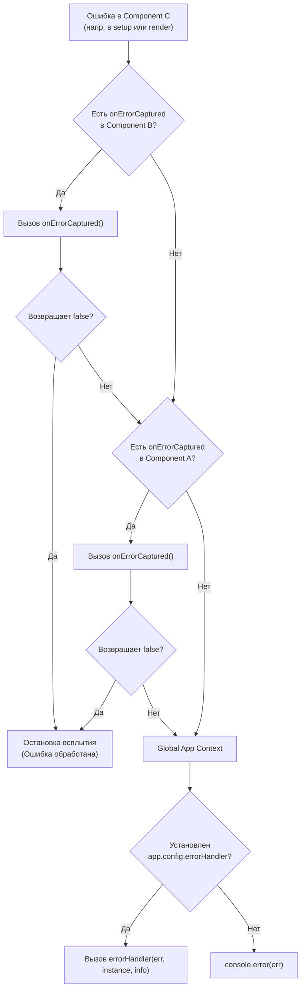

# Error Handling Boundaries

## Концепция и Архитектура (Mental Model)

Надежность UI-фреймворка зависит от того, как он справляется с исключениями. В Vue 3 есть встроенный механизм обработки ошибок (Error Handling Boundary), аналогичный `componentDidCatch` из React. Он перехватывает ошибки, возникающие во время рендеринга, вызова хуков жизненного цикла, обработчиков событий и watchers.

Архитектура строится на концепции **распространения ошибок (Error Propagation)**: ошибка "всплывает" от дочернего компонента к родительским, ища хук `onErrorCaptured`. Если ни один компонент не обработал ошибку, она доходит до глобального `app.config.errorHandler`. Это предотвращает "падение" всего приложения из-за бага в одном изолированном компоненте.

## Визуализация (Mermaid)



## Ссылки на исходный код (Source Code References)
- **Утилиты обработки ошибок:** `packages/runtime-core/src/errorHandling.ts`

## Разбор реализации (Code Deep Dive)

В Vue все потенциально опасные операции (пользовательский код) оборачиваются в функцию `callWithErrorHandling` или `callWithAsyncErrorHandling`.

```typescript
// packages/runtime-core/src/errorHandling.ts

// Синхронный перехват
export function callWithErrorHandling(
  fn: Function,
  instance: ComponentInternalInstance | null,
  type: ErrorTypes, // Enum: SETUP_FUNCTION, RENDER_FUNCTION, WATCH_GETTER...
  args?: unknown[]
) {
  let res
  try {
    res = args ? fn(...args) : fn()
  } catch (err) {
    handleError(err, instance, type)
  }
  return res
}

// Асинхронный перехват (для промисов и async setup)
export function callWithAsyncErrorHandling(
  fn: Function | Function[],
  instance: ComponentInternalInstance | null,
  type: ErrorTypes,
  args?: unknown[]
): any {
  // ... (вызов fn)
  res = callWithErrorHandling(fn, instance, type, args)
  if (res && isPromise(res)) {
    res.catch(err => {
      handleError(err, instance, type)
    })
  }
  return res
}

export function handleError(
  err: unknown,
  instance: ComponentInternalInstance | null,
  type: ErrorTypes,
  throwInDev = true
) {
  const contextVNode = instance ? instance.vnode : null
  if (instance) {
    let cur = instance.parent
    // Всплытие по цепочке родителей
    while (cur) {
      const errorCapturedHooks = cur.ec // массив хуков onErrorCaptured
      if (errorCapturedHooks) {
        for (let i = 0; i < errorCapturedHooks.length; i++) {
          // Если хотя бы один хук вернет false, останавливаем всплытие
          if (errorCapturedHooks[i](err, instance, type) === false) {
            return
          }
        }
      }
      cur = cur.parent
    }
  }
  
  // Достигли глобального уровня
  const appErrorHandler = instance && instance.appContext.config.errorHandler
  if (appErrorHandler) {
    callWithErrorHandling(
      appErrorHandler,
      null,
      ErrorCodes.APP_ERROR_HANDLER,
      [err, instance?.proxy, type]
    )
    return
  }
  
  // Дефолтный fallback
  logError(err, type, contextVNode, throwInDev)
}
```

## Оптимизации и Edge Cases (Подводные камни)

- **Безопасность самого ErrorHandler:** Что если ошибка произойдет внутри глобального `errorHandler`? Vue предвидит это: вызов `appErrorHandler` обернут в `callWithErrorHandling` с типом `APP_ERROR_HANDLER`. Если ошибка случится и там, она перехватится и уже не будет передана в глобальный хендлер (чтобы избежать бесконечного цикла), а просто выведется в консоль.
- **Интеграция с Async setup:** Vue автоматически ловит отброшенные Promise (rejected), возвращаемые из асинхронных хуков (например `onMounted(async () => {...})`).
- **Трансляция (Type Info):** Третий аргумент `type` содержит внутренний код, который преобразуется в понятную строку (например, "render function" или "v-on handler"). Это позволяет трекерам вроде Sentry или Datadog точно указывать фазу, на которой произошел краш.
