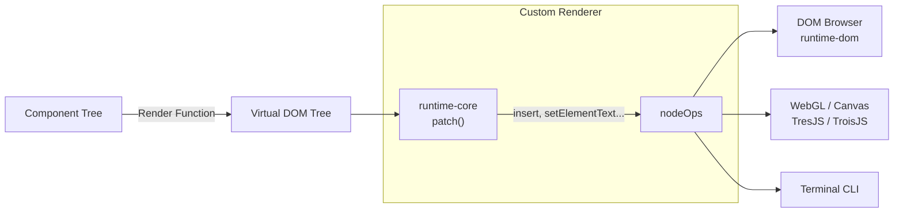

# Custom Renderer API

## Концепция и Архитектура (Mental Model)

Vue 3 проектировался с расчетом на то, чтобы быть больше, чем просто фреймворком для браузера. Архитектура ядра строго отделяет платформонезависимую логику (компоненты, реактивность, жизненные циклы) от платформо-зависимой (вставка ноды, удаление, обновление атрибутов).

`createRenderer` API позволяет разработчикам создавать собственные рендереры, передавая объект `nodeOps` (операции с узлами платформы). Это открывает возможность рендерить Vue-компоненты в Canvas (например, `vue-konva`), мобильные нативные элементы (`NativeScript-Vue`), терминал, или даже аппаратные контроллеры.

## Визуализация (Mermaid)



## Ссылки на исходный код (Source Code References)
- **Интерфейс Custom Renderer:** `packages/runtime-core/src/renderer.ts` (interface `RendererOptions`)
- **Реализация DOM рендерера (для примера):** `packages/runtime-dom/src/nodeOps.ts` и `packages/runtime-dom/src/patchProp.ts`

## Разбор реализации (Code Deep Dive)

Чтобы создать кастомный рендерер, нужно импортировать `createRenderer` из `@vue/runtime-core` и реализовать интерфейс `RendererOptions`.

```typescript
import { createRenderer } from '@vue/runtime-core'

// Пример создания рендерера для гипотетического Canvas API
const { render, createApp } = createRenderer({
  // Как обработать свойства узла (patch prop)
  patchProp(el, key, prevValue, nextValue) {
    if (key === 'x') el.setX(nextValue)
    if (key === 'y') el.setY(nextValue)
  },
  
  // Создание элемента
  createElement(type, isSVG, isCustomElement, vnodeProps) {
    return new CanvasNode(type) // Возвращаем инстанс хост-среды
  },
  
  // Вставка элемента в родителя
  insert(el, parent, anchor) {
    parent.addChild(el, anchor)
  },
  
  // Создание текстовой ноды
  createText(text) {
    return new CanvasTextNode(text)
  },
  
  setElementText(node, text) {
    node.text = text
  },
  
  // ... и другие базовые CRUD операции: remove, parentNode, nextSibling
})

// Теперь мы можем использовать createApp, как в вебе
const app = createApp(App)
// Но монтироваться он будет в Canvas-контейнер
app.mount(document.getElementById('my-canvas-layer'))
```

## Оптимизации и Edge Cases (Подводные камни)

- **Производительность:** Все вызовы `nodeOps` происходят синхронно во время фазы patch. Если ваш кастомный API медленный (например, общение с физическим девайсом через Serial Port), это заблокирует весь поток рендеринга. В таких случаях операции нужно ставить в очередь (buffer) внутри ваших `nodeOps` и флашить асинхронно.
- **События (Event Handling):** `createRenderer` не знает ничего про `addEventListener`. Всю логику навешивания и отписки событий нужно реализовывать внутри метода `patchProp`, перехватывая ключи, начинающиеся на `on` (например, `onClick`). Именно так работает `runtime-dom`, кешируя функции-обработчики (Event Invokers) для избежания лишних вызовов `removeEventListener/addEventListener`.
