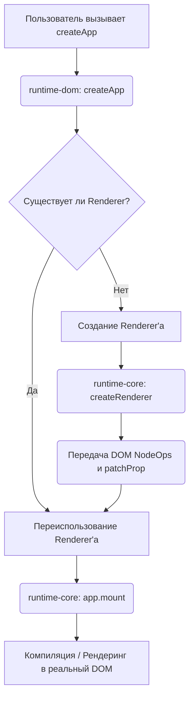

# 00. Архитектура DOM-рендерера (DOM Renderer Architecture)

## Концепция и Архитектура (Mental Model)
В основе Vue лежит принцип платформонезависимости. Пакет `runtime-core` предоставляет движок VDOM, алгоритмы diffing'а и компонентную модель, но абсолютно ничего не знает о браузере, DOM-дереве или событиях. 

`runtime-dom` — это связующее звено. Его главная цель: инициализировать универсальный рендерер из `runtime-core`, скормив ему специфичные для браузера функции (Node Ops) и логику работы с атрибутами (Patch Prop). Таким образом, `runtime-dom` создает "экземпляр" рендерера, заточенный под веб.

Проблемы, которые это решает:
1. **Кроссплатформенность:** Позволяет легко создавать кастомные рендереры (NativeScript, WebGL, Canvas, терминал) просто подменяя Node Ops.
2. **Разделение ответственности:** Ядро не засоряется грязными хаками для конкретных браузеров.

## Визуализация (Mermaid)


## Ссылки на исходный код
- Точка входа для браузера: `packages/runtime-dom/src/index.ts`
- Инициализация рендерера: `packages/runtime-core/src/renderer.ts`
- Фабрика приложений: `packages/runtime-core/src/apiCreateApp.ts`

## Разбор реализации (Code Deep Dive)

Ключевой паттерн здесь — ленивая инициализация (Lazy Initialization) рендерера и расширение (Override) базового метода `createApp`.

```typescript
// packages/runtime-dom/src/index.ts

// 1. Объект со всеми DOM-специфичными операциями
const rendererOptions = /* #__PURE__ */ extend({ patchProp }, nodeOps)

// Лениво храним инстанс рендерера
let renderer: Renderer<Element | ShadowRoot> | HydrationRenderer

// Фабрика для получения или создания рендерера
function ensureRenderer() {
  return (
    renderer ||
    (renderer = createRenderer<Node, Element | ShadowRoot>(rendererOptions))
  )
}

// 2. Публичный API, который мы вызываем в main.ts
export const createApp = ((...args) => {
  // Получаем базовый метод createApp от Core-рендерера
  const app = ensureRenderer().createApp(...args)

  // Кэшируем оригинальный метод mount (который ничего не знает про DOM)
  const { mount } = app
  
  // 3. Переопределяем (Override) метод mount под браузерные нужды
  app.mount = (containerOrSelector: Element | ShadowRoot | string): any => {
    // Нормализация контейнера (поиск по строке-селектору)
    const container = normalizeContainer(containerOrSelector)
    if (!container) return

    const component = app._component
    // Очищаем контейнер перед маунтом, если не настроен гидратационный рендеринг
    container.innerHTML = ''
    
    // Вызываем оригинальный метод mount от runtime-core
    const proxy = mount(container, false, resolveRootNamespace(container))
    
    return proxy
  }

  return app
}) as CreateAppFunction<Element>
```

**Разбор:**
1. **`rendererOptions`**: Объединяет `nodeOps` (создание, удаление элементов) и `patchProp` (установка классов, стилей, событий). Это словарь методов, которые ядро будет дергать в процессе патчинга.
2. **`ensureRenderer()`**: Рендерер создается лениво. Если мы вызываем только API реактивности и не используем `createApp`, код рендерера может быть выброшен при Tree-Shaking'е. Комментарий `/* #__PURE__ */` подсказывает бандлерам (Rollup/Webpack), что вызов `extend` можно безопасно удалить, если результат нигде не используется.
3. **`app.mount` Override**: `runtime-core` `mount` принимает только объект `Element`. `runtime-dom` добавляет удобство: позволяет передать строку селектора (например, `'#app'`), сам находит элемент и очищает его `innerHTML`.

## Оптимизации и Edge Cases
1. **Tree-Shaking через ленивую инициализацию:** В Vue 3 функции `createRenderer` и `createApp` разделены. `createApp` в `runtime-dom` лениво создает рендерер. Это позволяет разработчикам кастомных рендереров или пользователям, которым нужна только реактивность, не тащить в бандл весь тяжелый алгоритм патчинга.
2. **Инкапсуляция платформы:** Благодаря передаче словаря `nodeOps`, `runtime-core` оперирует дженериками `HostNode` и `HostElement`. На уровне TypeScript ядро не знает о типе `HTMLElement`, что делает типизацию чистой и переносимой.
3. **Обход ограничений браузера:** Переопределенный метод `mount` берет на себя ответственность за "грязную" работу с браузером: поиск элемента по селектору и проверку того, что мы не пытаемся примонтировать приложение к `<body>` или `<html>` (что чревато конфликтами с плагинами браузеров, которые любят вставлять туда свои скрипты).
