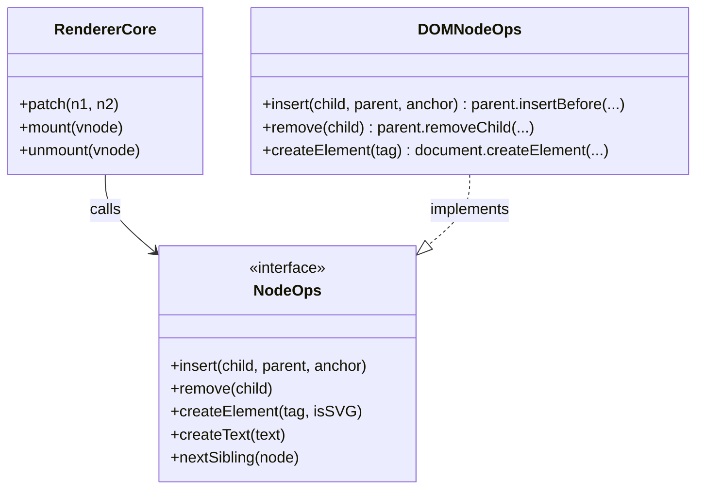

# 01. Реализация Node Ops (Node Operations Implementation)

## Концепция и Архитектура (Mental Model)
`Node Ops` (Node Operations) — это адаптер (по паттерну Adapter/Facade), скрывающий за собой нативные API браузера для управления DOM-деревом. `runtime-core` (ядро фреймворка) манипулирует абстрактными виртуальными узлами (VNodes). Когда VNode должен быть превращен в реальный пиксель на экране или удален, ядро обращается к предоставленному словарю `Node Ops`.

Проблема, которую это решает:
Прямой вызов `document.createElement` или `parent.removeChild` намертво привязывает ядро к среде браузера (DOM API). Вынося эти вызовы в абстрактный объект, Vue легко поддерживает кастомные рендереры (для мобилок, WebGL) и серверный рендеринг (SSR).

## Визуализация (Mermaid)


## Ссылки на исходный код
- Реализация для браузера: `packages/runtime-dom/src/nodeOps.ts`
- Интерфейс для ядра: `packages/runtime-core/src/renderer.ts` (тип `RendererOptions`)

## Разбор реализации (Code Deep Dive)

`nodeOps` — это простой JavaScript-объект, содержащий чистые функции-обертки над стандартными DOM-методами.

```typescript
// packages/runtime-dom/src/nodeOps.ts

export const nodeOps: Omit<RendererOptions<Node, Element>, 'patchProp'> = {
  // Вставка элемента. Если есть anchor (якорь), вставляем ПЕРЕД ним.
  insert: (child, parent, anchor) => {
    parent.insertBefore(child, anchor || null)
  },

  // Удаление элемента
  remove: child => {
    const parent = child.parentNode
    if (parent) {
      parent.removeChild(child)
    }
  },

  // Создание элемента с поддержкой SVG и MathML (Edge case!)
  createElement: (tag, namespace, is, props): Element => {
    const el =
      namespace === 'svg'
        ? document.createElementNS('http://www.w3.org/2000/svg', tag)
        : namespace === 'mathml'
          ? document.createElementNS('http://www.w3.org/1998/Math/MathML', tag)
          : document.createElement(tag, is ? { is } : undefined)

    // Обработка специального атрибута <select multiple> в момент создания
    if (tag === 'select' && props && props.multiple != null) {
      ;(el as HTMLSelectElement).setAttribute('multiple', props.multiple)
    }

    return el
  },

  createText: text => document.createTextNode(text),

  createComment: text => document.createComment(text),

  setText: (node, text) => {
    node.nodeValue = text
  },

  setElementText: (el, text) => {
    el.textContent = text
  },

  parentNode: node => node.parentNode as Element | null,

  nextSibling: node => node.nextSibling,

  querySelector: selector => document.querySelector(selector),
}
```

**Разбор:**
1. **Универсальный `insert`**: Обратите внимание, что нет отдельного метода `append`. В браузере вызов `parentNode.insertBefore(child, null)` полностью эквивалентен `parentNode.appendChild(child)`. Это сокращает API `nodeOps`.
2. **Пространства имен (Namespaces)**: Метод `createElement` принимает `namespace`. Если это SVG или MathML, необходимо использовать `document.createElementNS`. Иначе браузер отрендерит SVG-теги как неизвестные HTML-элементы, и они не отобразятся.
3. **Хак для `select[multiple]`**: Это яркий пример browser quirk'а (причуды браузера), который исправляется прямо в момент создания ноды. В некоторых старых браузерах (и специфичных случаях) установка `multiple` через свойства после создания элемента может не сработать корректно, если опции добавляются динамически.

## Оптимизации и Edge Cases (Подводные камни)

1. **Клонирование (Node Cloning Optimization) в компиляторе:**
   Vue Compiler генерирует специальный флаг `hoisted` для статических VNodes. Если дерево полностью статично, вместо вызова `createElement` и сборки дерева каждый раз через `nodeOps`, `runtime-dom` может использовать `el.cloneNode(true)`. `cloneNode` работает значительно быстрее (иногда в 2-3 раза) нативных последовательных вызовов `createElement` + `appendChild` в C++ движке браузера.
2. **textContent vs innerHTML:**
   Метод `setElementText` использует `el.textContent`. Он безопасен (защита от XSS, так как экранирует HTML) и быстр (не вызывает парсер HTML в браузере, в отличие от `innerHTML`). `innerHTML` обрабатывается отдельной веткой в ядре (для директивы `v-html`).
3. **`node.nodeValue` для текстовых узлов:**
   Для обновления текстового узла (TextNode) используется прямое изменение `node.nodeValue`. Это самая дешевая и быстрая операция в DOM, не затрагивающая структуру дерева. Ядро (VNode diffing) максимально старается свести изменения текста именно к этой операции.
