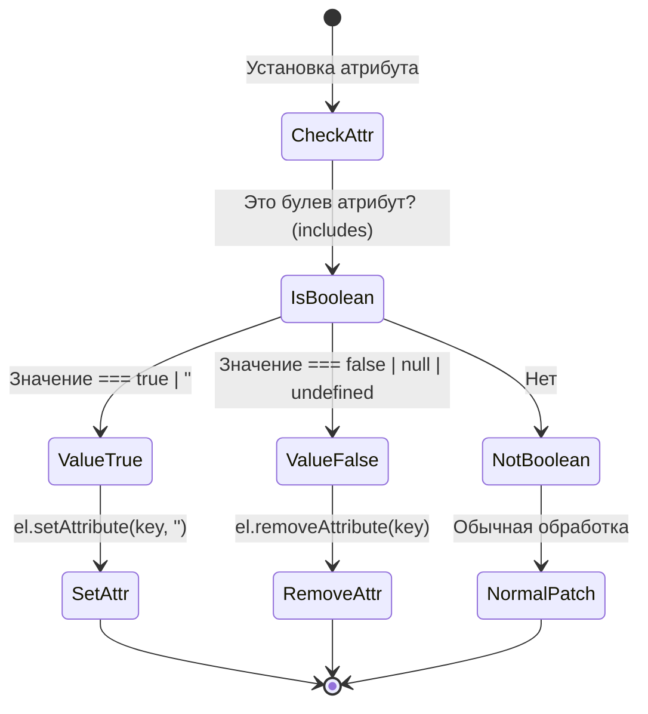

# Приведение булевых атрибутов (Boolean Attributes Casting)

## Концепция и Архитектура (Mental Model)
В HTML существует специфика работы с булевыми атрибутами, такими как `disabled`, `checked`, `readonly`, `hidden`. По спецификации W3C само присутствие атрибута (даже если он пуст `disabled=""` или равен чему угодно `disabled="false"`) расценивается браузером как истинное значение (`true`). 

Чтобы сделать элемент активным, необходимо полностью удалить атрибут из DOM-дерева через `removeAttribute`. 

Проблема заключается в том, что в JavaScript разработчики ожидают интуитивного поведения: привязка `:disabled="false"` должна делать элемент доступным. Vue берет на себя ответственность за "приведение типов" (casting) значений JavaScript к правильным мутациям DOM (удалению или установке атрибутов).

## Визуализация (Mermaid)


## Ссылки на исходный код
- Конфигурация атрибутов: `packages/shared/src/domAttrConfig.ts`
- Патчинг свойств: `packages/runtime-dom/src/modules/props.ts`

## Разбор реализации (Code Deep Dive)

Ядро Vue (`shared`) содержит строго заданный список всех известных булевых атрибутов (через запятую). Компилятор и рендерер используют его для быстрой проверки.

```typescript
// packages/shared/src/domAttrConfig.ts

// Создает быстрый словарь/функцию-предикат для проверки
export const isSpecialBooleanAttr = /*#__PURE__*/ makeMap(
  'itemscope,allowfullscreen,formnovalidate,ismap,nomodule,novalidate,readonly'
)

export const isBooleanAttr = /*#__PURE__*/ makeMap(
  'async,autofocus,autoplay,controls,default,defer,disabled,formnovalidate,' +
    'hidden,loop,open,required,reversed,scoped,seamless,' +
    'checked,muted,multiple,selected'
)
```

Логика в `runtime-dom` (упрощенная выдержка из `patchDOMProp` и `patchAttr`):

```typescript
// В процессе патчинга:
if (isBooleanAttr(key)) {
  // Обработка JavaScript значений, которые должны означать "убрать атрибут"
  // false, null, undefined
  if (value === false || value == null) {
    el.removeAttribute(key)
  } else {
    // Любое true-подобное значение, пустая строка, или строка, равная имени атрибута
    // e.g. disabled="disabled", disabled="true", disabled="" -> приводятся к стандартному
    el.setAttribute(key, '')
  }
}
```

## Оптимизации и Edge Cases (Подводные камни)

1. **Производительность через `makeMap`**:
   Поиск по строке атрибутов реализован через функцию `makeMap`, которая превращает разделенную запятыми строку в словарь (объект-хэштаблицу). Проверка `map[key]` имеет сложность `O(1)`. Это намного быстрее, чем использование регулярных выражений (`RegExp.test`) или `Array.prototype.includes`, которые имеют линейную сложность, что критично в горячем цикле рендеринга.
   
2. **Особый случай `true-value` / `false-value` для чекбоксов**:
   У директивы `v-model` на `<input type="checkbox">` есть дополнительный слой абстракции над этой системой. В браузере у инпута всегда есть свойство `checked` (boolean), но Vue позволяет привязывать пользовательские значения (`<input v-model="val" true-value="yes" false-value="no">`). Это обрабатывается не на уровне `patchProp`, а на уровне сгенерированного кода директивы `v-model` в компиляторе, которая прослушивает событие `change` и мутирует данные.

3. **Сломанные атрибуты в спецификациях (`contenteditable`)**:
   Атрибут `contenteditable` логически кажется булевым, но на самом деле он является перечисляемым (enumerated) — он может принимать значения `"true"`, `"false"` или `""`. Если попытаться обработать его как классический булев атрибут (удалив при `false`), браузер унаследует редактируемость от родителя. Vue знает об этих исключениях и *не* включает `contenteditable` в список `isBooleanAttr`, обрабатывая его как обычную строку.
