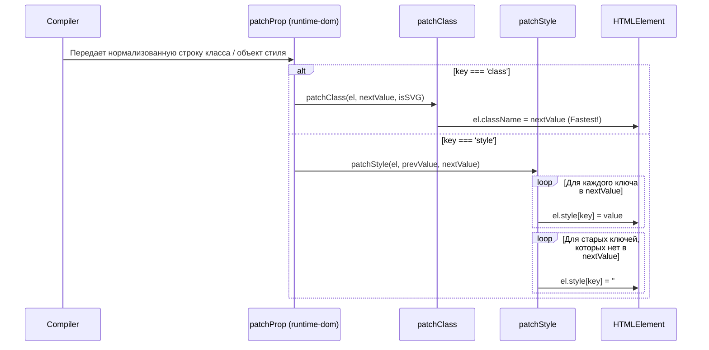

# Классы и Стили (Class and Style Binding)

## Концепция и Архитектура (Mental Model)
Динамический биндинг классов (`:class`) и стилей (`:style`) — одни из самых частых операций в любом UI. Vue реализует для них так называемые **Fast Paths (Быстрые пути)**. 

Вместо того чтобы пропускать классы и стили через общий медленный механизм нормализации атрибутов, компилятор (`runtime-core`) и рендерер (`runtime-dom`) выделяют их в специальные высокоприоритетные операции. 

Для классов это сводится к поиску самого быстрого способа записи строки в DOM. Для стилей — к грамотной манипуляции объектом `CSSStyleDeclaration` (`el.style`) и поддержке CSS-переменных (`--var`).

## Визуализация (Mermaid)


## Ссылки на исходный код
- Патчинг классов: `packages/runtime-dom/src/modules/class.ts`
- Патчинг стилей: `packages/runtime-dom/src/modules/style.ts`
- Нормализация: `packages/shared/src/normalizeProp.ts`

## Разбор реализации (Code Deep Dive)

### 1. Обработка Классов (patchClass)

На уровне компилятора (`@vue/compiler-core`) сложные биндинги вроде `:class="{ active: true, 'text-red': true }"` нормализуются в единую строку: `"active text-red"`. В `runtime-dom` приходит уже готовая строка.

```typescript
// packages/runtime-dom/src/modules/class.ts

export function patchClass(el: Element, value: string | null, isSVG: boolean) {
  // Переход от null/undefined к пустой строке
  const transitionClasses = (el as any)._vtc
  if (transitionClasses) {
    value = (
      value ? [value, ...transitionClasses] : [...transitionClasses]
    ).join(' ')
  }
  if (value == null) {
    el.removeAttribute('class')
  } else if (isSVG) {
    el.setAttribute('class', value)
  } else {
    // ВАЖНО: Прямое присвоение className - самый быстрый путь
    el.className = value
  }
}
```

**Оптимизация className:** 
Изменение `el.className` — это микро-оптимизация, которая дает существенный прирост производительности по сравнению с `el.classList.add/remove` или `el.setAttribute('class', value)`. Единственное исключение — SVG-элементы, свойство `className` которых возвращает объект `SVGAnimatedString`, поэтому для них приходится использовать медленный `setAttribute`.

### 2. Обработка Стилей (patchStyle)

Для стилей Vue манипулирует объектом `el.style`.

```typescript
// packages/runtime-dom/src/modules/style.ts

export function patchStyle(el: Element, prev: any, next: any) {
  const style = (el as HTMLElement).style
  const isCssString = isString(next)
  
  if (next && !isCssString) {
    // 1. Установка новых свойств
    for (const key in next) {
      setStyle(style, key, next[key])
    }
    // 2. Удаление старых свойств
    if (prev && !isString(prev)) {
      for (const key in prev) {
        if (next[key] == null) {
          setStyle(style, key, '')
        }
      }
    }
  } else {
    // ... логика для строковых стилей
  }
}

function setStyle(style: CSSStyleDeclaration, name: string, val: string | string[]) {
  if (Array.isArray(val)) {
    // Поддержка фоллбеков: { display: ['-webkit-box', 'flex'] }
    val.forEach(v => setStyle(style, name, v))
  } else {
    if (val == null) val = ''
    if (name.startsWith('--')) {
      // Нативная установка кастомных CSS свойств (переменных)
      style.setProperty(name, val)
    } else {
      // Установка обычных стилей
      const prefixed = autoPrefix(style, name)
      if (importantRE.test(val)) {
        // Поддержка !important
        style.setProperty(
          hyphenate(prefixed),
          val.replace(importantRE, ''),
          'important'
        )
      } else {
        style[prefixed as any] = val
      }
    }
  }
}
```

## Оптимизации и Edge Cases (Подводные камни)

1. **Auto-Prefixing (Автоматическое префиксирование)**:
   Функция `autoPrefix` кэширует результаты проверок префиксов. Она проверяет наличие свойства (например, `transform`) в объекте стилей пустого `div`. Если его нет, она пробует `webkitTransform`, `MozTransform` и т.д. Если префикс найден, он кэшируется в памяти браузера, чтобы при следующих рендерах больше не вызывать проверку. Это избавляет от необходимости использовать Autoprefixer в runtime.
2. **CSS Custom Properties (CSS-переменные)**:
   Присвоение стилей через свойства объекта (например, `el.style.backgroundColor = 'red'`) работает быстрее, но этот способ не работает для CSS-переменных (`--color-primary`). Для переменных Vue вынужден использовать более тяжелый метод `style.setProperty('--var', value)`.
3. **Поддержка массивов (Fallbacks)**:
   Специальная обработка массивов значений `display: ['-webkit-box', '-ms-flexbox', 'flex']`. Vue будет применять их последовательно; браузер проигнорирует неизвестные ему значения, оставив последнее валидное (например, `flex` для современных браузеров).
4. **Интеграция с Transition**: Объект `_vtc` (Vue Transition Classes) хранит классы анимации, накладываемые компонентом `<transition>`. `patchClass` знает об этом внутреннем контракте и объединяет классы пользователя с классами анимации ядра, чтобы они не затерли друг друга в момент патчинга.
