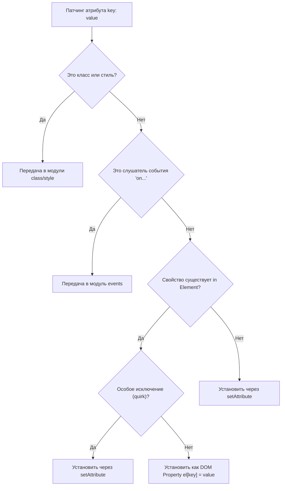

# 02. Свойства DOM против Атрибутов (DOM Properties vs Attributes)

## Концепция и Архитектура (Mental Model)
В спецификации веб-стандартов существует вечная путаница между **Атрибутами (Attributes)** (то, что написано в HTML строкой) и **Свойствами (IDL Properties)** (то, что является свойствами JavaScript-объекта `HTMLElement` в памяти).

Например: 
- HTML: `<input value="hello">` (Атрибут `value` инициализирует начальное значение).
- JS: `inputElement.value` (Свойство хранит текущее значение).
При изменении пользователем текста в инпуте, *свойство* `value` меняется, а *атрибут* (который мы получим через `getAttribute('value')`) — нет. 

Задача модуля `patchProp` в `runtime-dom` — сгладить эту разницу для разработчика. Vue старается всегда устанавливать значения как DOM **Свойства** (properties), так как это работает быстрее (не дергает HTML-парсер) и поддерживает сложные типы данных (объекты, массивы — атрибуты могут быть только строками). Но делает он это умно, обходя бесконечные исключения браузеров.

## Визуализация (Mermaid)


## Ссылки на исходный код
- Главная точка входа патчинга: `packages/runtime-dom/src/patchProp.ts`
- Логика свойств (props): `packages/runtime-dom/src/modules/props.ts`
- Логика атрибутов (attrs): `packages/runtime-dom/src/modules/attrs.ts`

## Разбор реализации (Code Deep Dive)

Центральный механизм — это функция `shouldSetAsProp`, которая определяет, нужно ли прибегать к `setAttribute` или можно напрямую писать в свойство объекта.

```typescript
// packages/runtime-dom/src/modules/props.ts

export function patchDOMProp(
  el: any,
  key: string,
  value: any,
  // ...
) {
  // ...
  if (key === 'innerHTML' || key === 'textContent') {
    // Вставка контента напрямую
    el[key] = value == null ? '' : value
    return
  }

  // Значение value для input/select/textarea
  if (
    key === 'value' &&
    el.tagName !== 'PROGRESS' &&
    // custom elements могут иметь нестандартные сеттеры value
    !el.tagName.includes('-')
  ) {
    // Значение устанавливается как свойство
    el._value = value // Кэшируем для внутреннего использования
    const newValue = value == null ? '' : value
    // Избегаем лишних обновлений, если значение не изменилось (сбрасывает каретку в инпутах!)
    if (el.value !== newValue || el.tagName === 'OPTION') {
      el.value = newValue
    }
    return
  }

  // Общий случай для булевых и других свойств
  if (value === '' || value == null) {
    const type = typeof el[key]
    if (type === 'boolean') {
      // e.g. <select multiple> компилируется в multiple=""
      el[key] = value !== null
      return
    } else if (value == null && type === 'string') {
      // e.g. <div :id="null">
      el[key] = ''
      el.removeAttribute(key)
      return
    }
  }

  // Попытка прямого присвоения, обернутая в try/catch из-за причуд браузеров
  try {
    el[key] = value
  } catch (e: any) {
    // Silent fallback
  }
}
```

А вот как определяется само решение в `patchProp`:

```typescript
// packages/runtime-dom/src/patchProp.ts
const shouldSetAsProp = (
  el: Element,
  key: string,
  value: unknown,
  isCustomElement: boolean
) => {
  // Исключения для полей форм (read-only свойства)
  if (key === 'form') return false
  if (key === 'list' && el.tagName === 'INPUT') return false
  if (key === 'type' && el.tagName === 'TEXTAREA') return false

  // <input type="file" value="..."> бросает ошибку DOMException
  if (key === 'type' && el.tagName === 'INPUT') return false
  
  // Проверка через оператор 'in' - главный критерий!
  return key in el
}
```

## Оптимизации и Edge Cases (Подводные камни)

1. **Главная оптимизация — оператор `in`**: Проверка `key in el` работает молниеносно в движках V8/SpiderMonkey. Она позволяет Vue автоматически понимать, какие атрибуты являются нативными свойствами (например, `id`, `disabled`), а какие — кастомными HTML-атрибутами (`aria-hidden`, `data-testid`). Если это кастомный атрибут, `key in el` вернет `false`, и Vue использует медленный, но правильный `setAttribute`.
2. **Проблема `<input type="file">`**: Вы не можете программно через свойство `input.value` установить путь к файлу из соображений безопасности браузера. Попытка сделать `el.value = 'C:\\passwords.txt'` выкинет `DOMException`. Поэтому Vue содержит хардкод исключение для `type` инпутов, чтобы всегда патчить его через `setAttribute`.
3. **Прыгающая каретка (Cursor Jump):** При обновлении `el.value = newValue` на каждое нажатие клавиши, большинство браузеров сбросят позицию каретки ввода (курсора) в конец текста. Vue использует строгую проверку `if (el.value !== newValue)` перед сеттингом, чтобы избежать лишних перезаписей свойства и сохранить естественное поведение курсора.
4. **Свойства Read-Only**: Атрибуты типа `form` (указывающий на id формы для инпута) и `list` (для datalist) отражаются в DOM как read-only свойства объекта (например, возвращают ссылку на `HTMLFormElement`). Изменить их через свойство нельзя, только через `setAttribute('form', 'id')`. Vue отслеживает эти исключения.
