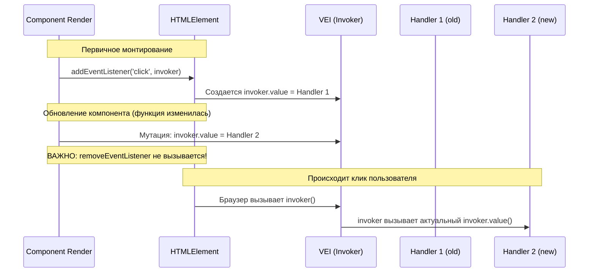

# 03. Делегирование событий и Инвокеры (Event Delegation & Invokers)

## Концепция и Архитектура (Mental Model)
Привязка событий в DOM — операция "дорогая". В классических фреймворках (например, React 16 и старше) используется тотальное **делегирование событий**: на корень документа вешается один глобальный обработчик, который перехватывает все всплывающие события (bubbling) и сам маршрутизирует их нужным компонентам. Это экономит память, но усложняет логику (особенно с событиями типа `focus/blur`, которые не всплывают нативно).

Vue пошел другим путем: он привязывает обработчики **непосредственно к самим DOM-элементам**. Однако, чтобы не вызывать медленные `addEventListener` и `removeEventListener` при каждом обновлении компонента (если функция-хэндлер меняется), Vue использует паттерн **VEI (Vue Event Invokers)**.

**Invoker** — это функция-замыкание, которая прикрепляется к DOM-элементу *один раз*. Внутри себя она содержит ссылку на актуальный обработчик из компонента. При патчинге Vue просто подменяет ссылку внутри Invoker'а, вообще не трогая DOM API.

## Визуализация (Mermaid)


## Ссылки на исходный код
- Патчинг событий и логика VEI: `packages/runtime-dom/src/modules/events.ts`

## Разбор реализации (Code Deep Dive)

В `runtime-dom` каждый элемент получает секретное свойство `_vei` (Vue Event Invokers). Это кэш всех созданных оберток для конкретной ноды.

```typescript
// packages/runtime-dom/src/modules/events.ts

export function patchEvent(
  el: Element & { _vei?: Record<string, Invoker | undefined> },
  rawName: string,
  prevValue: EventValue | null,
  nextValue: EventValue | null,
  instance: ComponentInternalInstance | null = null
) {
  // Кэш инвокеров на DOM-ноде
  const invokers = el._vei || (el._vei = {})
  const existingInvoker = invokers[rawName]

  if (nextValue && existingInvoker) {
    // ПАТЧИНГ: Быстрый путь (Fast Path)
    // Функция-обработчик изменилась, но инвокер уже висит.
    // Просто подменяем ссылку на новую функцию, не трогая DOM.
    existingInvoker.value = nextValue
  } else {
    // Парсим имя: 'onClick' -> 'click' (обработка capture/once модификаторов скрыта)
    const [name, options] = parseName(rawName)
    
    if (nextValue) {
      // ДОБАВЛЕНИЕ: Создаем новый инвокер
      const invoker = (invokers[rawName] = createInvoker(nextValue, instance))
      el.addEventListener(name, invoker, options)
    } else if (existingInvoker) {
      // УДАЛЕНИЕ: Очищаем, если nextValue = null (слушатель убрали)
      el.removeEventListener(name, existingInvoker, options)
      invokers[rawName] = undefined
    }
  }
}

// Создание функции-замыкания (Invoker)
function createInvoker(initialValue: EventValue, instance: ComponentInternalInstance | null) {
  const invoker: Invoker = (e: Event & { _vts?: number }) => {
    // ... проверка времени срабатывания (микротаск-хак, см. ниже)
    if (e.timeStamp >= invoker.attached - 1) {
      // Вызов актуальной функции. Поддержка массивов обработчиков.
      callWithAsyncErrorHandling(
        patchStopImmediatePropagation(e, invoker.value),
        instance,
        ErrorCodes.NATIVE_EVENT_HANDLER,
        [e]
      )
    }
  }
  // Храним актуальный хэндлер в свойстве
  invoker.value = initialValue
  // Храним время прикрепления
  invoker.attached = getNow()
  return invoker
}
```

## Оптимизации и Edge Cases (Подводные камни)

1. **Экономия вызовов движка браузера:**
   Паттерн Invoker кардинально снижает нагрузку на C++ биндинги браузера (где происходят переходы из JS-контекста в нативный контекст браузера). Мутация `invoker.value = newHandler` — это просто присвоение ссылки в JavaScript памяти, что выполняется практически за `0 мс`.
   
2. **Проблема Timestamp (The Microtask Bubbling Issue):**
   Это знаменитый edge-case, решенный во Vue 3. Представьте: клик по элементу "A" вызывает обновление реактивного стейта, который синхронно (или в микротаске) рендерит элемент "B" (выше по дереву DOM) и вешает на него обработчик клика. 
   Поскольку нативное событие клика всё ещё находится в фазе "Всплытия" (bubbling), оно долетит до свежесозданного элемента "B" и вызовет его обработчик в рамках *одного и того же* физического клика пользователя.
   **Решение:** В `createInvoker` Vue сохраняет время прикрепления обработчика (`invoker.attached`). При срабатывании инвокера он сравнивает время события (`e.timeStamp`) с временем прикрепления. Если событие произошло *раньше*, чем был прикреплен обработчик, инвокер игнорирует его.

3. **Поддержка массивов обработчиков:**
   Vue поддерживает синтаксис `@click="[handler1, handler2]"`. Значение `invoker.value` может быть массивом. Функция `callWithAsyncErrorHandling` умеет разворачивать этот массив и вызывать функции по очереди, оборачивая всё в `try/catch`, чтобы ошибка в одном хэндлере не убила всё приложение (ошибки отправляются в `app.config.errorHandler`).
