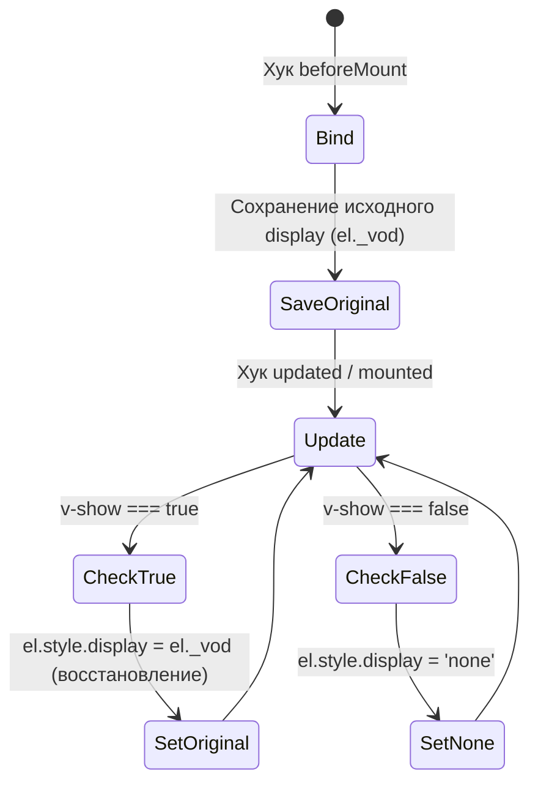

# 04. DOM Директивы: v-show и v-model

## Концепция и Архитектура (Mental Model)
В экосистеме Vue есть директивы, встроенные в ядро (`v-if`, `v-for`, `v-bind`, `v-on`). Они настолько важны, что компилятор преобразует их прямо в JS-код рендеринга (VDOM-ноды и пропсы). Их логика находится в `compiler-core` / `runtime-core`.

Однако существуют специфичные директивы, которые имеют смысл только в браузере. Главные из них — `v-show` (манипуляция стилем `display`) и `v-model` (двустороннее связывание с полями ввода). Архитектурно они реализованы как **пользовательские директивы** (с хуками жизненного цикла `mounted`, `updated`, и т.д.), но их код "вшит" в `runtime-dom` и экспортируется для автоимпорта компилятором.

## Визуализация (Mermaid)

`v-show` State Machine:


`v-model` на `<input type="text">` Flow:


```mermaid
sequenceDiagram
    participant User
    participant DOM as <input>
    participant vModel as vModelText (Directive)
    participant State as Reactivity (Ref)

    Note over vModel,DOM: Хук created: el.addEventListener('input')
    User->>DOM: Вводит текст
    DOM->>vModel: input event
    vModel->>State: state.value = el.value
    State-->>vModel: Реактивное обновление (VNode patch)
    vModel->>DOM: Хук updated: el.value = state.value (если отличается)
```

## Ссылки на исходный код
- `v-show`: `packages/runtime-dom/src/directives/vShow.ts`
- `v-model` абстракции: `packages/runtime-dom/src/directives/vModel.ts`

## Разбор реализации (Code Deep Dive)

### 1. Как работает v-show

Директива `v-show` предельно проста и эффективна. Она оперирует исключительно инлайн-стилем `display`.

```typescript
// packages/runtime-dom/src/directives/vShow.ts

export const vShow: ObjectDirective<VShowElement> = {
  beforeMount(el, { value }, { transition }) {
    // Кэшируем оригинальное значение display перед первой мутацией
    // Если исходно был display: flex, мы должны вернуться к нему, а не к block
    el._vod = el.style.display === 'none' ? '' : el.style.display
    if (transition && value) {
      // Интеграция с компонентом <Transition>
      transition.beforeEnter(el)
    } else {
      setDisplay(el, value)
    }
  },
  mounted(el, { value }, { transition }) {
    if (transition && value) {
      transition.enter(el)
    }
  },
  updated(el, { value, oldValue }, { transition }) {
    // Избегаем лишних DOM-операций
    if (!value === !oldValue) return
    if (transition) {
      // Анимация появления/скрытия
      if (value) {
        transition.beforeEnter(el)
        setDisplay(el, true)
        transition.enter(el)
      } else {
        transition.leave(el, () => {
          setDisplay(el, false)
        })
      }
    } else {
      setDisplay(el, value)
    }
  },
  // ...
}

function setDisplay(el: VShowElement, value: unknown): void {
  // Запись 'none' или восстановление оригинального (el._vod)
  el.style.display = value ? el._vod : 'none'
}
```

### 2. Как работает v-model

Модуль `vModel` экспортирует несколько разных директив: `vModelText` (для обычных текстовых инпутов), `vModelCheckbox`, `vModelRadio`, `vModelSelect`, `vModelDynamic`. Компилятор (SFC) понимает тег элемента и генерирует вызов нужной директивы.

Рассмотрим самый частый — `vModelText`:

```typescript
// packages/runtime-dom/src/directives/vModel.ts

export const vModelText: ObjectDirective<
  HTMLInputElement | HTMLTextAreaElement
> = {
  created(el, { modifiers: { lazy, trim, number } }, vnode) {
    // 1. Определение события для слушания
    // Если указан модификатор .lazy, слушаем change (срабатывает при потере фокуса), иначе input (на каждое нажатие)
    el._assign = getModelAssigner(vnode)
    const castToNumber = number || (vnode.props && vnode.props.type === 'number')
    
    // Внутренняя функция-обработчик (listener)
    addEventListener(el, lazy ? 'change' : 'input', e => {
      // Обработка IME (Input Method Editor) - ввода иероглифов. 
      // Не обновляем стейт, пока пользователь не закончит композицию слова
      if ((e.target as any).composing) return
      
      let domValue: string | number = el.value
      // Применяем модификаторы .trim и .number
      if (trim) {
        domValue = domValue.trim()
      } else if (castToNumber) {
        domValue = looseToNumber(domValue)
      }
      
      // Вызываем обновление реактивной переменной! (Вызывает state.value = domValue под капотом)
      el._assign(domValue)
    })
    
    // Модификатор .trim на потере фокуса очищает само поле ввода
    if (trim) {
      addEventListener(el, 'change', () => {
        el.value = el.value.trim()
      })
    }
  },
  
  // При обновлении компонента (когда стейт прилетел обратно из Vue)
  // Мы должны обновить значение в самом инпуте
  mounted(el, { value }) {
    el.value = value == null ? '' : value
  },
  updated(el, { value, modifiers: { lazy, trim, number } }) {
    el._assign = getModelAssigner(vnode)
    
    if ((el as any).composing) return
    
    // ИЗБЕЖАНИЕ "CURSOR JUMP" (Прыжка каретки)
    // Проверяем, действительно ли значение из стейта отличается от того, что в DOM
    if (document.activeElement === el && el.type !== 'range') {
      if (lazy) return
      if (trim && el.value.trim() === value) return
      if ((number || el.type === 'number') && looseToNumber(el.value) === value) return
    }
    
    const newValue = value == null ? '' : value
    if (el.value !== newValue) {
      el.value = newValue
    }
  }
}
```

## Оптимизации и Edge Cases (Подводные камни)

1. **`el._vod` (Vue Original Display)**: 
   Сохранение оригинального `display` в `v-show` критически важно. Если вы скроете элемент `<span style="display: flex" v-show="false">`, а затем покажете его, он должен снова стать `flex`, а не дефолтным для span `inline`. Vue кэширует это на самом DOM-элементе в свойстве `_vod`.

2. **IME Composition (Иероглифы)**: 
   В Азии (Японский, Китайский) набор символов происходит через IME (Input Method Editor). Пользователь набирает латиницу, она подчеркивается, и по нажатию Enter превращается в иероглиф. Событие `input` стреляет на каждое нажатие латиницы. Vue прослушивает события `compositionstart` и `compositionend` (настраиваются глобально), чтобы устанавливать флаг `el.composing = true`. Директива `v-model` блокирует синхронизацию стейта, пока этот флаг активен, предотвращая мусорные обновления и сломанный ввод.

3. **Борьба с прыгающей кареткой**: 
   В `v-model` огромный блок логики в хуке `updated` посвящен тому, чтобы не перезаписать `el.value`, если пользователь сейчас находится в фокусе (`document.activeElement === el`) и вводит данные (например, `2.0` для поля `.number` — строка в стейте будет `2`, но в DOM должно остаться `2.0`, пока фокус не уйдет). Любое безусловное присвоение `el.value = ...` немедленно отбросит курсор пользователя в конец строки.
