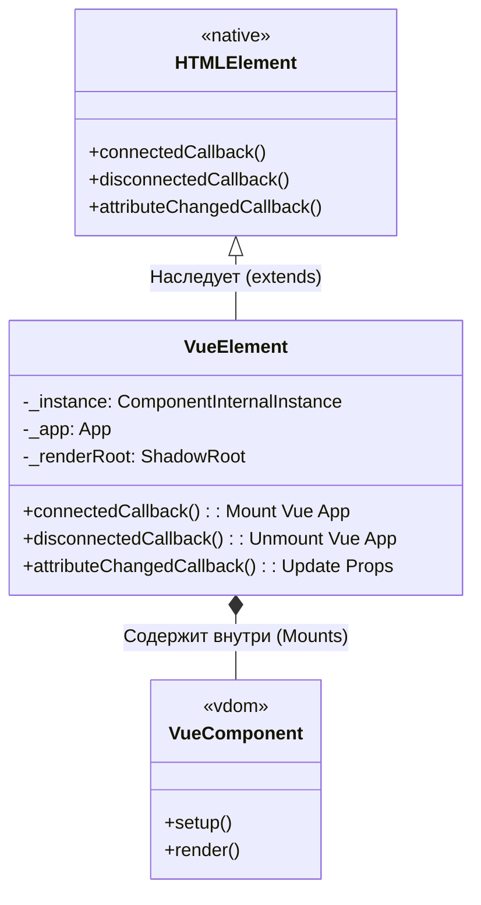

# 05. Web Components и Кастомные Элементы (Custom Elements API)

## Концепция и Архитектура (Mental Model)
Vue 3 обеспечивает первоклассную поддержку стандарта Web Components (Custom Elements API). Эта поддержка делится на два вектора:

1. **Использование Web Components внутри Vue:** Фреймворк должен понимать, что тег `<my-web-comp>` — это не отсутствующий Vue-компонент, а нативный элемент браузера. Vue должен прокидывать данные как свойства (properties) или атрибуты (attributes) в зависимости от внутреннего устройства этого Custom Element'а.
2. **Создание Web Components на базе Vue (`defineCustomElement`):** Vue позволяет скомпилировать любой SFC (Single-File Component) в нативный Web Component, который можно использовать вообще без Vue на странице. Vue оборачивает свой реактивный цикл и VDOM внутрь нативного класса `HTMLElement` и использует Shadow DOM.

## Визуализация (Mermaid)

Архитектура `defineCustomElement` Wrapper'а:


## Ссылки на исходный код
- Точка входа API: `packages/runtime-dom/src/apiCustomElement.ts`
- Поддержка чужих компонентов (Compiler options): `packages/compiler-dom/src/index.ts` (`isCustomElement`)

## Разбор реализации (Code Deep Dive)

Рассмотрим, как работает `defineCustomElement`. Это функция, которая принимает опции компонента Vue и возвращает класс (constructor), наследующий нативный `HTMLElement`.

```typescript
// packages/runtime-dom/src/apiCustomElement.ts

export const defineCustomElement = (
  options: any,
  hydratable?: boolean,
  plugins?: any[]
) => {
  const Comp = defineComponent(options)

  // Возвращаем класс, который браузер будет использовать для создания ноды
  class VueCustomElement extends VueElement {
    static def = Comp
    constructor(initialProps?: Record<string, any>) {
      super(Comp, initialProps, hydratable, plugins)
    }
  }

  return VueCustomElement
}

// Базовый класс-обертка
export class VueElement extends HTMLElement {
  public _instance: ComponentInternalInstance | null = null
  private _renderRoot!: ShadowRoot

  constructor(
    private _def: ComponentOptions,
    // ...
  ) {
    super()
    // 1. Создаем Shadow DOM. Инкапсуляция стилей!
    this._renderRoot = this.attachShadow({ mode: 'open' })
  }

  // Хук нативного Web Component API: элемент вставлен в DOM
  connectedCallback() {
    if (!this._instance) {
      // Лениво создаем приложение Vue внутри Custom Element'а
      const app = createApp(this._def)
      
      // Связываем стили (вставляем внутрь ShadowRoot)
      this._injectStyles(app, this._def.styles)
      
      // Монтируем Vue приложение прямо в свой ShadowRoot
      this._instance = app.mount(this._renderRoot).$
    }
  }

  // Хук нативного Web Component API: элемент удален из DOM
  disconnectedCallback() {
    // Оптимизация: мы не уничтожаем инстанс сразу. 
    // Элемент могут перенести в другое место DOM дерева (сработает connected -> disconnected -> connected).
    // Поэтому используем микротаск.
    nextTick(() => {
      if (!this.isConnected && this._instance) {
        this._app!.unmount()
        this._instance = null
      }
    })
  }

  // Хук нативного Web Component API: изменился атрибут
  attributeChangedCallback(name: string, oldValue: string, newValue: string | null) {
    if (this._instance) {
      // Синхронизируем HTML-атрибут с реактивными props Vue-компонента
      this._resolveProps(name, newValue)
    }
  }
}
```

## Оптимизации и Edge Cases (Подводные камни)

1. **Shadow DOM и инкапсуляция СТИЛЕЙ**:
   Компоненты, собранные через `defineCustomElement`, всегда используют `ShadowRoot`. Это означает, что глобальные стили страницы (даже Tailwind или Bootstrap) **не проникают** внутрь компонента. Чтобы стили работа SFC (`<style>`) работали, vue-loader/vite-plugin-vue трансформируют CSS в строки и передают их в свойство `options.styles` компонента. `VueElement` вставляет эти строки через `<style>` теги прямо внутрь ShadowRoot при `connectedCallback`.

2. **Отложенный Unmount (The Disconnected Flashing Issue)**:
   В DOM часто случаются операции перемещения узлов (например, сортировка списков через Drag & Drop). При перемещении узла браузер синхронно вызывает `disconnectedCallback`, а затем `connectedCallback`. Если бы Vue уничтожал приложение (`app.unmount()`) сразу при `disconnected`, то при простом перемещении ноды всё состояние компонента бы терялось, и он бы перерисовывался с нуля. Поэтому Vue ждет следующего тика (`nextTick`) и проверяет `this.isConnected`. Если элемент уже вставлен обратно, размонтирование отменяется.

3. **Проброс Слотов (Slot Bridging)**:
   Нативные слоты Web Components (`<slot>`) и слоты Vue (`<slot>`) — это разные вещи. `VueElement` содержит сложную логику, которая перехватывает нативные дочерние узлы `HTMLElement` (light DOM) и "оборачивает" их в рендер-функции, чтобы передать внутрь Vue-приложения как обычные VNode слоты, сохраняя семантику Vue.
